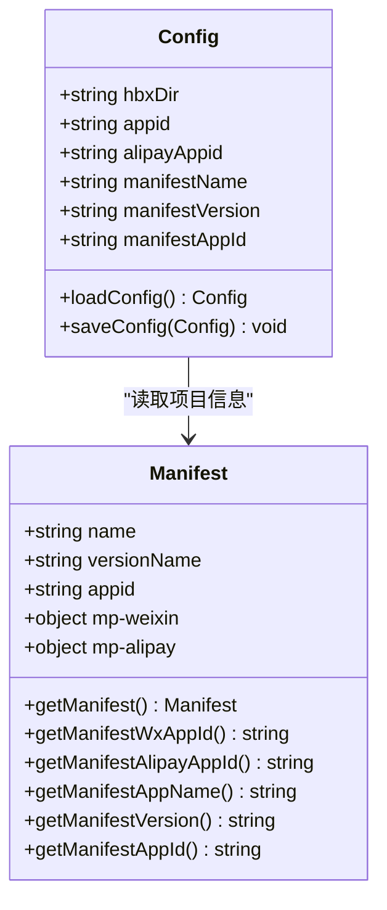
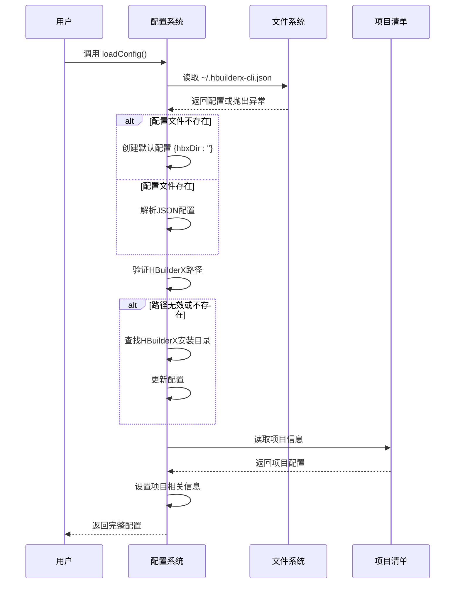
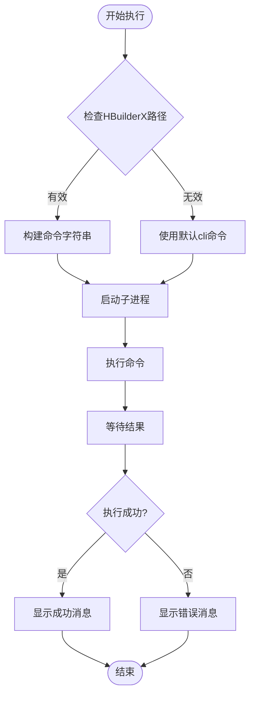
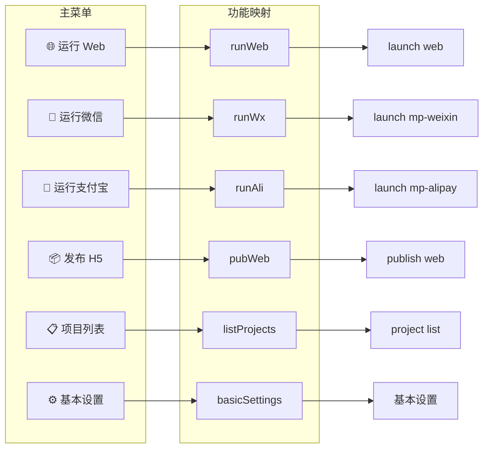
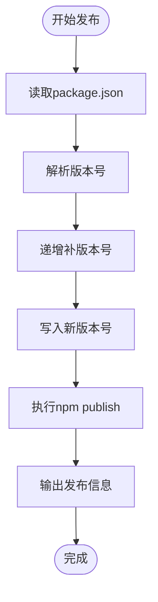

# API 参考

<cite>
**本文档引用的文件**
- [package.json](file://hbuilderx-cli/package.json)
- [index.js](file://hbuilderx-cli/index.js)
- [README.md](file://hbuilderx-cli/README.md)
- [release.js](file://hbuilderx-cli/release.js)
</cite>

## 目录
1. [简介](#简介)
2. [项目结构](#项目结构)
3. [核心组件](#核心组件)
4. [架构概览](#架构概览)
5. [详细组件分析](#详细组件分析)
6. [依赖分析](#依赖分析)
7. [性能考虑](#性能考虑)
8. [故障排除指南](#故障排除指南)
9. [结论](#结论)
10. [附录](#附录)

## 简介

HBuilderX CLI 管理工具是一个全局命令行工具，用于简化 HBuilderX 开发环境的操作流程。该工具通过命令行界面提供了一套完整的开发工作流管理功能，包括项目运行、发布、项目管理和配置设置等核心功能。

该工具的主要特点：
- 提供交互式命令行界面
- 自动检测和配置 HBuilderX 安装路径
- 支持多种平台的小程序开发工作流
- 提供项目清单文件自动解析功能
- 包含完整的配置管理机制

## 项目结构

HBuilderX CLI 工具采用简洁的单文件架构设计，主要包含以下核心文件：

```mermaid
graph TB
subgraph "项目根目录"
HB[package.json<br/>包配置文件]
IDX[index.js<br/>主入口文件]
RLS[release.js<br/>发布脚本]
README[README.md<br/>项目文档]
end
subgraph "配置文件"
CFG[~/.hbuilderx-cli.json<br/>用户配置文件]
end
subgraph "外部依赖"
CHALK[Chalk<br/>终端样式化]
INQ[@inquirer/prompts<br/>交互式提示]
BOXEN[Boxen<br/>文本框装饰]
ORA[Ora<br/>加载动画]
end
HB --> IDX
IDX --> CFG
IDX --> CHALK
IDX --> INQ
IDX --> BOXEN
IDX --> ORA
```

**图表来源**
- [package.json:1-21](file://hbuilderx-cli/package.json#L1-L21)
- [index.js:1-248](file://hbuilderx-cli/index.js#L1-L248)

**章节来源**
- [package.json:1-21](file://hbuilderx-cli/package.json#L1-L21)
- [README.md:1-53](file://hbuilderx-cli/README.md#L1-L53)

## 核心组件

### 全局命令 hb

全局命令 `hb` 是该工具的唯一入口点，通过 npm 全局安装后可在任何 HBuilderX 项目中使用。

**命令语法：**
```bash
hb
```

**使用要求：**
- Node.js >= 14
- HBuilderX 已安装
- 项目根目录包含 `manifest.json` 文件

**执行流程：**
1. 检查当前目录是否为 HBuilderX 项目（存在 `manifest.json`）
2. 加载用户配置文件
3. 启动交互式菜单界面
4. 执行用户选择的功能命令

**章节来源**
- [README.md:11-17](file://hbuilderx-cli/README.md#L11-L17)
- [README.md:30-35](file://hbuilderx-cli/README.md#L30-L35)
- [index.js:16-20](file://hbuilderx-cli/index.js#L16-L20)

### 主要功能命令

该工具提供了以下核心功能命令：

| 命令 | 说明 | 参数 |
|------|------|------|
| 🌐 运行 Web | 在 Chrome 浏览器中运行项目 | 无额外参数 |
| 💬 运行微信 | 运行微信小程序 | 无额外参数 |
| 📎 运行支付宝 | 运行支付宝小程序 | 无额外参数 |
| 📦 发布 H5 | 发布 H5 版本 | 无额外参数 |
| 📋 项目列表 | 显示项目列表 | 无额外参数 |
| ⚙ 基本设置 | 配置 HBuilderX 安装路径 | 无额外参数 |

**章节来源**
- [README.md:21-28](file://hbuilderx-cli/README.md#L21-L28)

## 架构概览

该工具采用模块化架构设计，主要包含以下核心模块：

```mermaid
graph TB
subgraph "入口层"
MAIN[main()<br/>主循环]
HEADER[header()<br/>显示信息]
EXEC[exec()<br/>执行包装器]
end
subgraph "配置管理"
LOAD[loadConfig()<br/>加载配置]
SAVE[saveConfig()<br/>保存配置]
FIND[findHBuilderX()<br/>查找HBuilderX]
end
subgraph "命令执行"
OPEN[openHbx()<br/>启动HBuilderX]
RUN[runCmd()<br/>执行命令]
CMDS[具体命令<br/>pubWeb/runWeb/runWx/runAli/listProjects]
end
subgraph "数据访问"
MAN[getManifest()<br/>读取manifest.json]
WX[getManifestWxAppId()<br/>微信AppID]
ALI[getManifestAlipayAppId()<br/>支付宝AppID]
NAME[getManifestAppName()<br/>应用名称]
VER[getManifestVersion()<br/>版本号]
APPID[getManifestAppId()<br/>应用ID]
end
MAIN --> HEADER
MAIN --> LOAD
MAIN --> CMDS
LOAD --> FIND
LOAD --> MAN
CMDS --> OPEN
CMDS --> RUN
RUN --> OPEN
MAN --> WX
MAN --> ALI
MAN --> NAME
MAN --> VER
MAN --> APPID
```

**图表来源**
- [index.js:210-242](file://hbuilderx-cli/index.js#L210-L242)
- [index.js:67-86](file://hbuilderx-cli/index.js#L67-L86)
- [index.js:38-65](file://hbuilderx-cli/index.js#L38-L65)

## 详细组件分析

### 配置系统

配置系统是该工具的核心组件之一，负责管理用户设置和项目信息。

#### 配置文件结构

配置文件保存在用户主目录下的 `.hbuilderx-cli.json` 文件中：



**图表来源**
- [index.js:67-86](file://hbuilderx-cli/index.js#L67-L86)
- [index.js:38-65](file://hbuilderx-cli/index.js#L38-L65)

#### 配置加载流程



**图表来源**
- [index.js:67-86](file://hbuilderx-cli/index.js#L67-L86)

**章节来源**
- [README.md:36-46](file://hbuilderx-cli/README.md#L36-L46)
- [index.js:67-86](file://hbuilderx-cli/index.js#L67-L86)

### 命令执行系统

命令执行系统负责与 HBuilderX CLI 工具进行交互，支持多种开发场景。

#### 命令类型分类



**图表来源**
- [index.js:92-95](file://hbuilderx-cli/index.js#L92-L95)
- [index.js:118-138](file://hbuilderx-cli/index.js#L118-L138)

#### 支持的命令列表

| 命令 | 描述 | 参数 | 示例 |
|------|------|------|------|
| `launch web` | 启动Web项目 | `--project projectName` `--browser Chrome` | `cli launch web --project MyProject --browser Chrome` |
| `launch mp-weixin` | 启动微信小程序 | `--project projectName` | `cli launch mp-weixin --project MyProject` |
| `launch mp-alipay` | 启动支付宝小程序 | `--project projectName` | `cli launch mp-alipay --project MyProject` |
| `publish web` | 发布Web项目 | `--project projectName` | `cli publish web --project MyProject` |
| `project list` | 列出所有项目 | 无 | `cli project list` |
| `open` | 启动HBuilderX | 无 | `cli open` |

**章节来源**
- [index.js:166-189](file://hbuilderx-cli/index.js#L166-L189)
- [index.js:92-95](file://hbuilderx-cli/index.js#L92-L95)

### 交互式菜单系统

菜单系统提供了用户友好的操作界面，支持多种开发场景的选择。

#### 菜单选项设计



**图表来源**
- [index.js:214-227](file://hbuilderx-cli/index.js#L214-L227)
- [index.js:229-241](file://hbuilderx-cli/index.js#L229-L241)

**章节来源**
- [index.js:214-241](file://hbuilderx-cli/index.js#L214-L241)

## 依赖分析

该工具的依赖关系相对简单，主要依赖于几个核心的第三方库：

```mermaid
graph TB
subgraph "核心依赖"
HBCLI[HBuilderX CLI<br/>@a634691481/hb-cli]
end
subgraph "外部库"
CHALK[Chalk ^4.1.2<br/>终端样式化]
INQ[@inquirer/prompts ^3.0.0<br/>交互式提示]
BOXEN[Boxen ^5.1.2<br/>文本框装饰]
ORA[Ora ^5.4.1<br/>加载动画]
end
subgraph "Node.js内置"
FS[fs<br/>文件系统]
PATH[path<br/>路径处理]
OS[os<br/>操作系统]
CHILD[child_process<br/>子进程]
end
HBCLI --> CHALK
HBCLI --> INQ
HBCLI --> BOXEN
HBCLI --> ORA
HBCLI --> FS
HBCLI --> PATH
HBCLI --> OS
HBCLI --> CHILD
```

**图表来源**
- [package.json:14-19](file://hbuilderx-cli/package.json#L14-L19)

### 依赖特性分析

| 依赖库 | 版本 | 主要功能 | 使用场景 |
|--------|------|----------|----------|
| Chalk | ^4.1.2 | 终端文本样式化 | 输出彩色信息、错误提示 |
| @inquirer/prompts | ^3.0.0 | 交互式命令行界面 | 菜单选择、输入收集 |
| Boxen | ^5.1.2 | 文本框装饰 | 界面美化、信息展示 |
| Ora | ^5.4.1 | 加载动画 | 执行状态指示 |

**章节来源**
- [package.json:14-19](file://hbuilderx-cli/package.json#L14-L19)

## 性能考虑

该工具在设计时充分考虑了性能优化：

### 内存管理
- **缓存机制**：项目清单信息缓存在内存中，避免重复读取
- **延迟初始化**：配置文件仅在需要时才进行解析
- **资源清理**：进程结束后自动清理相关资源

### 执行效率
- **异步操作**：所有长时间运行的操作都采用异步模式
- **进度反馈**：使用加载动画提供即时反馈
- **错误快速响应**：错误发生时立即停止并报告

### 资源优化
- **最小依赖**：仅使用必要的第三方库
- **平台适配**：根据操作系统选择最优执行方式
- **路径缓存**：HBuilderX安装路径缓存避免重复查找

## 故障排除指南

### 常见问题及解决方案

#### 1. 项目目录检测失败

**问题描述：** 工具提示当前目录不是 HBuilderX 项目

**可能原因：**
- 缺少 `manifest.json` 文件
- `manifest.json` 文件损坏
- 当前工作目录不正确

**解决方法：**
```bash
# 检查当前目录
pwd

# 确认 manifest.json 存在
ls -la manifest.json

# 进入正确的项目目录
cd /path/to/your/project
```

**章节来源**
- [index.js:16-20](file://hbuilderx-cli/index.js#L16-L20)

#### 2. HBuilderX 路径配置问题

**问题描述：** 工具无法找到 HBuilderX 安装目录

**可能原因：**
- HBuilderX 未安装
- 安装路径不在默认搜索范围内
- 权限问题

**解决方法：**
1. 首次使用时通过基本设置配置路径
2. 手动指定正确的安装目录
3. 确保有足够的权限访问安装目录

**章节来源**
- [README.md:50-51](file://hbuilderx-cli/README.md#L50-L51)
- [index.js:76-79](file://hbuilderx-cli/index.js#L76-L79)

#### 3. 命令执行失败

**问题描述：** 命令执行后显示失败状态

**可能原因：**
- HBuilderX CLI 工具版本不兼容
- 项目配置错误
- 网络连接问题

**解决方法：**
1. 检查 HBuilderX 版本兼容性
2. 验证项目配置文件
3. 确认网络连接正常
4. 查看详细的错误信息输出

**章节来源**
- [index.js:127-136](file://hbuilderx-cli/index.js#L127-L136)

### 错误码说明

| 错误码 | 含义 | 可能原因 | 解决方案 |
|--------|------|----------|----------|
| 0 | 成功 | 命令执行成功 | 正常完成，无需处理 |
| 1 | 通用错误 | 程序执行过程中发生错误 | 检查日志输出，重新尝试 |
| -1 | 进程错误 | 子进程启动失败 | 检查系统权限和路径配置 |
| 其他正数 | 命令执行失败 | HBuilderX CLI 返回错误 | 检查项目配置和网络连接 |

**章节来源**
- [index.js:127-136](file://hbuilderx-cli/index.js#L127-L136)

## 结论

HBuilderX CLI 管理工具是一个设计精良的命令行辅助工具，它有效地简化了 HBuilderX 开发环境的操作流程。该工具的主要优势包括：

1. **用户友好**：提供直观的交互式界面
2. **功能完整**：覆盖了主要的开发工作流
3. **配置灵活**：支持自定义配置和路径设置
4. **错误处理**：完善的错误检测和处理机制

该工具特别适合需要频繁使用 HBuilderX 进行多平台小程序开发的开发者，能够显著提高开发效率和工作流程的标准化程度。

## 附录

### 安装和使用

**安装命令：**
```bash
npm install -g @a634691481/hb-cli
```

**基本使用：**
```bash
# 在项目根目录运行
hb

# 首次使用需要配置HBuilderX路径
# 通过基本设置菜单进行配置
```

### 最佳实践

1. **项目组织**：确保每个项目都有完整的 `manifest.json` 文件
2. **配置管理**：定期备份配置文件
3. **版本更新**：及时更新 HBuilderX 和 CLI 工具版本
4. **错误记录**：遇到问题时记录详细的错误信息

### 发布和维护

该工具包含一个简单的发布脚本，用于版本管理和发布流程：



**图表来源**
- [release.js:1-19](file://hbuilderx-cli/release.js#L1-L19)

**章节来源**
- [release.js:1-19](file://hbuilderx-cli/release.js#L1-L19)