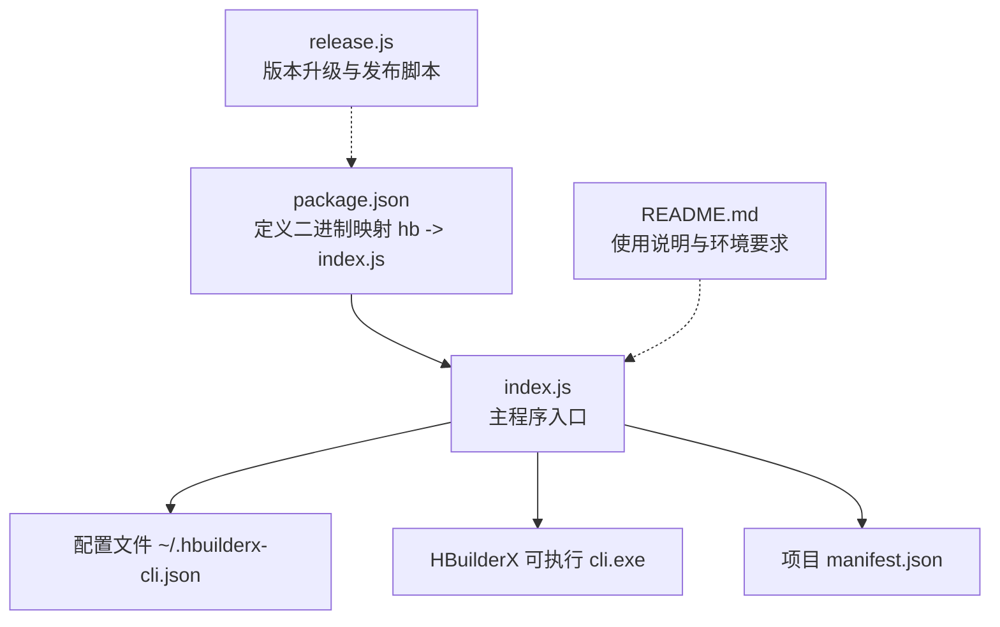
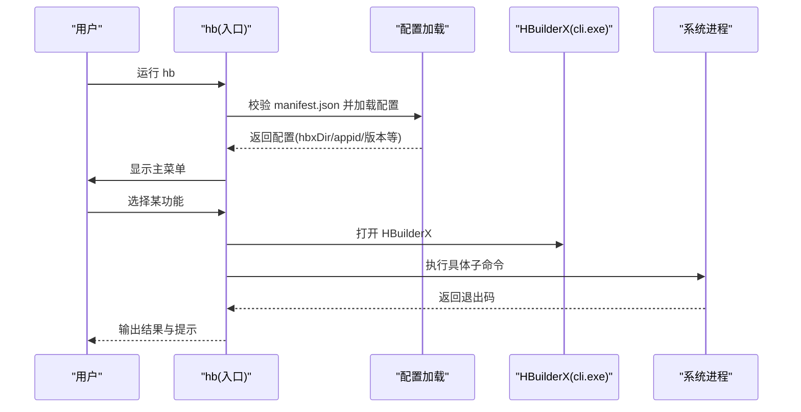
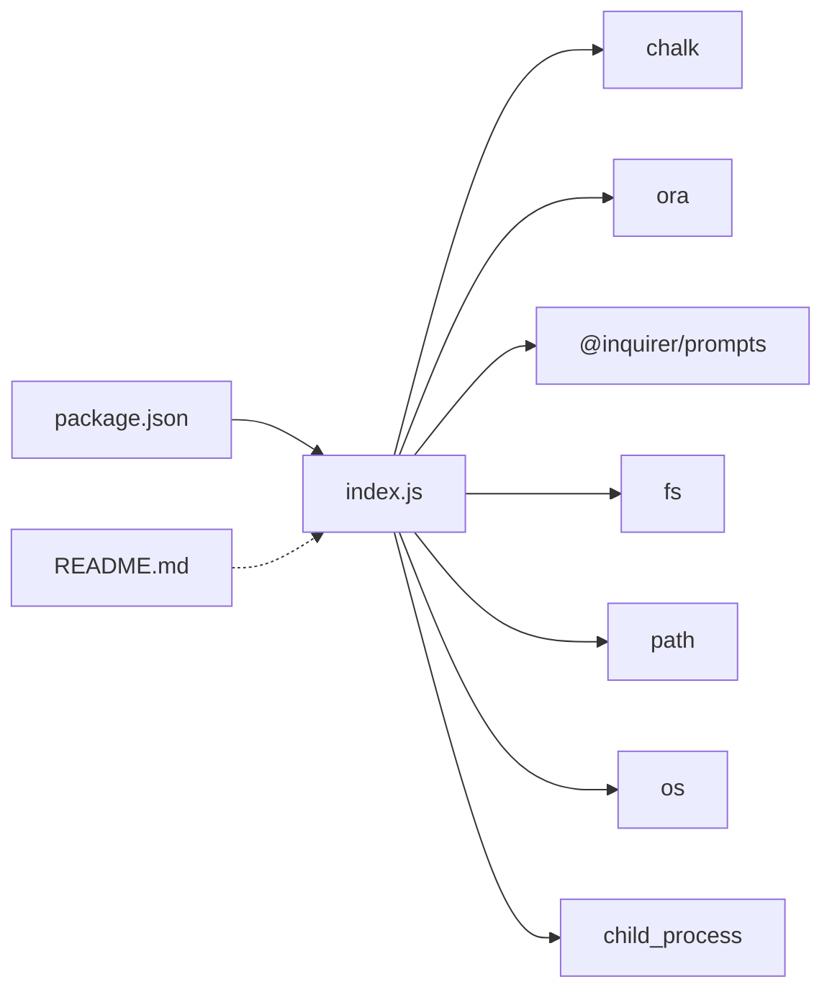

# 命令行接口

<cite>
**本文引用的文件**
- [package.json](file://hbuilderx-cli/package.json)
- [index.js](file://hbuilderx-cli/index.js)
- [README.md](file://hbuilderx-cli/README.md)
- [release.js](file://hbuilderx-cli/release.js)
</cite>

## 目录
1. [简介](#简介)
2. [项目结构](#项目结构)
3. [核心组件](#核心组件)
4. [架构总览](#架构总览)
5. [详细组件分析](#详细组件分析)
6. [依赖关系分析](#依赖关系分析)
7. [性能与可靠性](#性能与可靠性)
8. [故障排查指南](#故障排查指南)
9. [结论](#结论)
10. [附录：命令参考与最佳实践](#附录命令参考与最佳实践)

## 简介
本文件为 HBuilderX CLI 管理工具（全局命令 hb）的命令行接口文档。该工具通过交互式菜单提供常用开发任务：运行 Web、运行微信小程序、运行支付宝小程序、发布 H5、列出项目、基础设置等。hb 会自动检测 HBuilderX 安装位置，并在项目根目录存在 manifest.json 的前提下工作。工具支持 Windows 平台的命令行执行，并通过终端彩色输出与进度提示提升用户体验。

## 项目结构
- 包入口与二进制映射：
  - package.json 中定义了可全局使用的命令名 hb，指向 index.js。
- 核心实现：
  - index.js：包含命令解析、HBuilderX 路径查找、配置管理、命令执行与交互菜单逻辑。
- 文档与辅助脚本：
  - README.md：安装、使用、功能说明与环境要求。
  - release.js：用于版本号递增与发布流程的自动化脚本。

图表来源
- [package.json:5-9](file://hbuilderx-cli/package.json#L5-L9)
- [index.js:12-29](file://hbuilderx-cli/index.js#L12-L29)
- [README.md:11-17](file://hbuilderx-cli/README.md#L11-L17)

章节来源
- [package.json:1-21](file://hbuilderx-cli/package.json#L1-L21)
- [README.md:1-53](file://hbuilderx-cli/README.md#L1-L53)

## 核心组件
- 全局命令 hb
  - 通过 npm 全局安装后，在任意项目根目录（包含 manifest.json）均可直接运行 hb 启动交互菜单。
- 交互菜单与子命令
  - 主菜单包含以下功能项：
    - 运行 Web
    - 运行微信
    - 运行支付宝
    - 发布 H5
    - 项目列表
    - 基础设置
- 配置管理
  - 配置文件位于用户主目录下的 ~/.hbuilderx-cli.json，包含 HBuilderX 安装目录、微信 AppID、支付宝 AppID 等。
- HBuilderX 路径探测
  - 默认搜索常见安装路径，若未找到则可在基础设置中手动输入。
- 命令执行
  - 所有命令均通过 HBuilderX 提供的 cli.exe 执行，Windows 下使用 cmd.exe /c，非 Windows 使用 sh -c。

章节来源
- [package.json:5-9](file://hbuilderx-cli/package.json#L5-L9)
- [index.js:16-20](file://hbuilderx-cli/index.js#L16-L20)
- [index.js:22-36](file://hbuilderx-cli/index.js#L22-L36)
- [index.js:67-90](file://hbuilderx-cli/index.js#L67-L90)
- [README.md:36-46](file://hbuilderx-cli/README.md#L36-L46)

## 架构总览
hb 的整体工作流如下：
- 启动时校验当前目录是否为 HBuilderX 项目（存在 manifest.json）。
- 加载或初始化配置文件，尝试自动定位 HBuilderX 安装目录。
- 展示主菜单，根据用户选择调用对应命令。
- 每个命令先打开 HBuilderX，再执行具体子命令，最后等待用户按键返回。

图表来源
- [index.js:16-20](file://hbuilderx-cli/index.js#L16-L20)
- [index.js:67-90](file://hbuilderx-cli/index.js#L67-L90)
- [index.js:140-153](file://hbuilderx-cli/index.js#L140-L153)
- [index.js:166-189](file://hbuilderx-cli/index.js#L166-L189)

## 详细组件分析

### 1) 项目根目录校验
- 规则：必须存在 manifest.json，否则直接报错并退出。
- 影响：确保 hb 在正确的 HBuilderX 项目中运行。

章节来源
- [index.js:16-20](file://hbuilderx-cli/index.js#L16-L20)

### 2) 配置加载与持久化
- 配置文件位置：~/.hbuilderx-cli.json
- 字段含义：
  - hbxDir：HBuilderX 安装目录
  - appid：微信小程序 AppID（来自 manifest.json）
  - alipayAppid：支付宝小程序 AppID（来自 manifest.json）
  - manifestName、manifestVersion、manifestAppId：项目元数据缓存
- 加载策略：
  - 若配置文件缺失或 hbxDir 不可用，则尝试自动探测常见安装路径；若探测到则写回配置。
- 更新策略：
  - 基础设置中修改 hbxDir 后会重新读取 manifest.json 的相关字段并保存。

章节来源
- [index.js:67-90](file://hbuilderx-cli/index.js#L67-L90)
- [index.js:195-207](file://hbuilderx-cli/index.js#L195-L207)
- [README.md:36-46](file://hbuilderx-cli/README.md#L36-L46)

### 3) HBuilderX 路径探测
- 探测顺序：多个常见安装路径依次检查是否存在 cli.exe。
- 结果：若找到则写入配置；若未找到，后续命令执行将尝试直接调用 cli（取决于系统 PATH）。

章节来源
- [index.js:22-36](file://hbuilderx-cli/index.js#L22-L36)

### 4) 交互菜单与命令分发
- 主菜单项与对应行为：
  - 运行 Web：打开 HBuilderX 并执行 launch web，指定浏览器为 Chrome。
  - 运行微信：打开 HBuilderX 并执行 launch mp-weixin。
  - 运行支付宝：打开 HBuilderX 并执行 launch mp-alipay。
  - 发布 H5：打开 HBuilderX 并执行 publish web。
  - 项目列表：打开 HBuilderX 并执行 project list。
  - 基础设置：允许用户手动输入 HBuilderX 安装目录并保存。
- 退出：当前版本未提供显式“退出”选项，但可按任意键返回菜单。

章节来源
- [index.js:166-189](file://hbuilderx-cli/index.js#L166-L189)
- [index.js:191-207](file://hbuilderx-cli/index.js#L191-L207)
- [index.js:214-242](file://hbuilderx-cli/index.js#L214-L242)

### 5) 命令执行与输出
- 执行方式：
  - Windows：使用 cmd.exe /c 调用 cli.exe 或 cli。
  - 非 Windows：使用 sh -c 调用 cli。
- 进度与状态：
  - 使用 ora 提供加载提示，结束后输出时间戳与执行结果（成功/失败）。
  - 退出码为 0 表示成功，非 0 表示失败。
- 错误处理：
  - 子进程 error 事件发生时，打印错误信息并返回 -1。

章节来源
- [index.js:118-138](file://hbuilderx-cli/index.js#L118-L138)
- [index.js:140-153](file://hbuilderx-cli/index.js#L140-L153)

### 6) 命令封装与拼接
- 封装函数：将用户选择转换为具体的 cli.exe 参数字符串。
- 参数规则：
  - 项目名通过当前目录名注入。
  - 运行 Web 时额外指定浏览器为 Chrome。
- 优先级：若配置中已有有效 hbxDir，则优先使用绝对路径调用 cli.exe；否则尝试系统 PATH 中的 cli。

章节来源
- [index.js:92-95](file://hbuilderx-cli/index.js#L92-L95)
- [index.js:166-189](file://hbuilderx-cli/index.js#L166-L189)

### 7) 版本发布脚本
- release.js：读取 package.json 版本，将补丁号加一，写回并执行 npm publish。
- 用途：便于维护者快速迭代版本并发布。

章节来源
- [release.js:1-19](file://hbuilderx-cli/release.js#L1-L19)

## 依赖关系分析

图表来源
- [index.js:1-9](file://hbuilderx-cli/index.js#L1-L9)
- [package.json:14-19](file://hbuilderx-cli/package.json#L14-L19)

章节来源
- [index.js:1-9](file://hbuilderx-cli/index.js#L1-L9)
- [package.json:14-19](file://hbuilderx-cli/package.json#L14-L19)

## 性能与可靠性
- 性能特性
  - 命令执行由 HBuilderX cli.exe 实际完成，hb 仅负责拼接参数与展示进度。
  - 交互菜单基于 @inquirer/prompts，响应迅速且占用资源低。
- 可靠性保障
  - 项目根目录校验避免误用。
  - 配置文件持久化减少重复输入。
  - 自动探测 HBuilderX 安装路径降低配置成本。
  - 统一的错误处理与退出码反馈，便于问题定位。

[本节为通用建议，不直接分析具体文件]

## 故障排查指南
- 无法识别为 HBuilderX 项目
  - 现象：启动即报错并退出。
  - 原因：当前目录缺少 manifest.json。
  - 处理：切换到包含 manifest.json 的 HBuilderX 项目根目录。
  - 参考
    - [index.js:16-20](file://hbuilderx-cli/index.js#L16-L20)
- 未找到 HBuilderX 安装目录
  - 现象：工具显示“未找到”。
  - 原因：默认路径均不存在，或未在基础设置中配置。
  - 处理：进入“基础设置”，手动输入正确安装目录。
  - 参考
    - [index.js:22-36](file://hbuilderx-cli/index.js#L22-L36)
    - [index.js:67-90](file://hbuilderx-cli/index.js#L67-L90)
    - [index.js:191-207](file://hbuilderx-cli/index.js#L191-L207)
- 命令执行失败
  - 现象：输出“失败 (exit: N)”。
  - 原因：HBuilderX 子命令返回非零退出码。
  - 处理：检查项目配置、网络连接、HBuilderX 版本与插件状态。
  - 参考
    - [index.js:118-138](file://hbuilderx-cli/index.js#L118-L138)
- 进程错误
  - 现象：输出错误消息并返回 -1。
  - 原因：spawn 失败（如权限、PATH 问题）。
  - 处理：确认系统 PATH 是否包含 HBuilderX 安装目录，或在基础设置中指定 hbxDir。
  - 参考
    - [index.js:132-137](file://hbuilderx-cli/index.js#L132-L137)

章节来源
- [index.js:16-20](file://hbuilderx-cli/index.js#L16-L20)
- [index.js:22-36](file://hbuilderx-cli/index.js#L22-L36)
- [index.js:67-90](file://hbuilderx-cli/index.js#L67-L90)
- [index.js:118-138](file://hbuilderx-cli/index.js#L118-L138)
- [index.js:132-137](file://hbuilderx-cli/index.js#L132-L137)

## 结论
hb 提供了一个简洁高效的 HBuilderX 项目管理入口，通过交互式菜单覆盖日常开发的关键流程。其设计重点在于：
- 最小化配置成本（自动探测与缓存）
- 统一的命令执行与反馈
- 跨平台兼容（Windows 与类 Unix 系统）

对于更细粒度的命令行参数控制，当前版本主要通过交互菜单完成，如需更灵活的 CLI 参数，可在后续版本中扩展。

[本节为总结，不直接分析具体文件]

## 附录：命令参考与最佳实践

### 命令参考
- 全局命令
  - hb：启动交互菜单（需在包含 manifest.json 的项目根目录运行）
- 环境要求
  - Node.js 版本：≥ 14
  - HBuilderX 已安装
  - 项目根目录包含 manifest.json
- 配置文件
  - 位置：~/.hbuilderx-cli.json
  - 字段：hbxDir、appid、alipayAppid、manifestName、manifestVersion、manifestAppId
- 默认搜索路径
  - D:\HBuilderX、C:\Program Files\HBuilderX、C:\Program Files (x86)\HBuilderX 等

章节来源
- [README.md:30-34](file://hbuilderx-cli/README.md#L30-L34)
- [README.md:36-46](file://hbuilderx-cli/README.md#L36-L46)
- [index.js:22-36](file://hbuilderx-cli/index.js#L22-L36)

### 使用示例
- 基本用法
  - 在 HBuilderX 项目根目录运行 hb，出现主菜单后选择所需功能。
- 高级用法
  - 首次使用：进入“基础设置”，输入 HBuilderX 安装目录并保存。
  - 多项目管理：通过“项目列表”查看与切换项目。
  - 快速发布：选择“发布 H5”，完成后在 HBuilderX 中查看构建结果。

章节来源
- [README.md:11-17](file://hbuilderx-cli/README.md#L11-L17)
- [index.js:166-189](file://hbuilderx-cli/index.js#L166-L189)
- [index.js:186-189](file://hbuilderx-cli/index.js#L186-L189)
- [index.js:191-207](file://hbuilderx-cli/index.js#L191-L207)

### 执行流程与返回值
- 流程概览
  - 校验项目根目录 → 加载配置 → 展示菜单 → 执行命令 → 输出结果 → 返回退出码
- 返回值
  - 成功：0
  - 失败：非 0（通常为 HBuilderX 子命令的退出码）
  - 异常：-1（spawn error）

章节来源
- [index.js:16-20](file://hbuilderx-cli/index.js#L16-L20)
- [index.js:67-90](file://hbuilderx-cli/index.js#L67-L90)
- [index.js:118-138](file://hbuilderx-cli/index.js#L118-L138)

### 跨平台兼容性
- Windows：使用 cmd.exe /c 调用 cli.exe 或 cli。
- 类 Unix：使用 sh -c 调用 cli。
- 注意：若系统 PATH 未包含 HBuilderX 安装目录，应在基础设置中手动配置 hbxDir。

章节来源
- [index.js:121-124](file://hbuilderx-cli/index.js#L121-L124)
- [index.js:140-153](file://hbuilderx-cli/index.js#L140-L153)
- [index.js:191-207](file://hbuilderx-cli/index.js#L191-L207)

### 最佳实践
- 首次使用务必在“基础设置”中确认 HBuilderX 安装目录。
- 保持项目 manifest.json 与实际 AppID 一致，以便自动读取。
- 在多项目环境中，优先使用“项目列表”进行切换。
- 如遇命令失败，先检查 HBuilderX 日志与网络状态，再重试。

章节来源
- [index.js:67-90](file://hbuilderx-cli/index.js#L67-L90)
- [README.md:48-53](file://hbuilderx-cli/README.md#L48-L53)