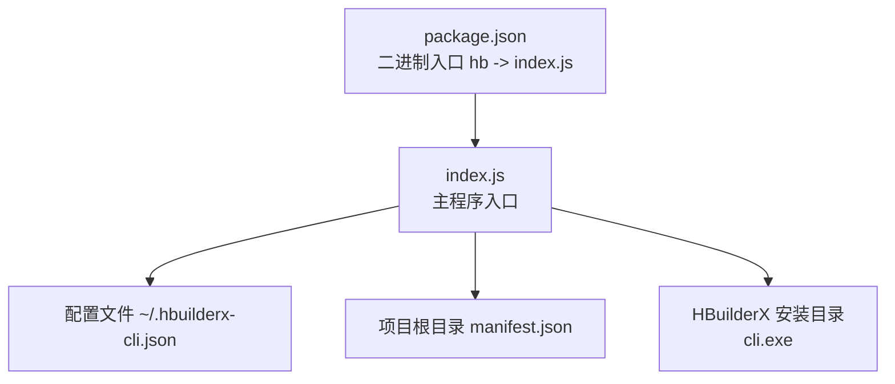
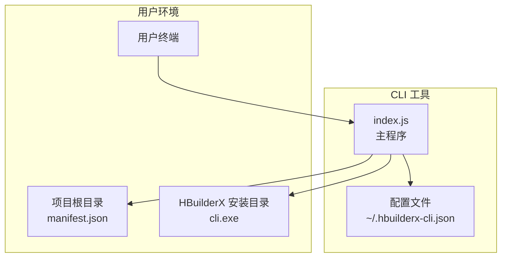
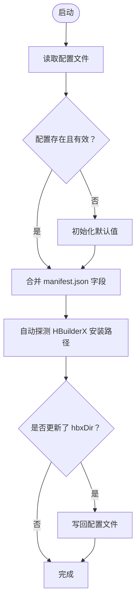
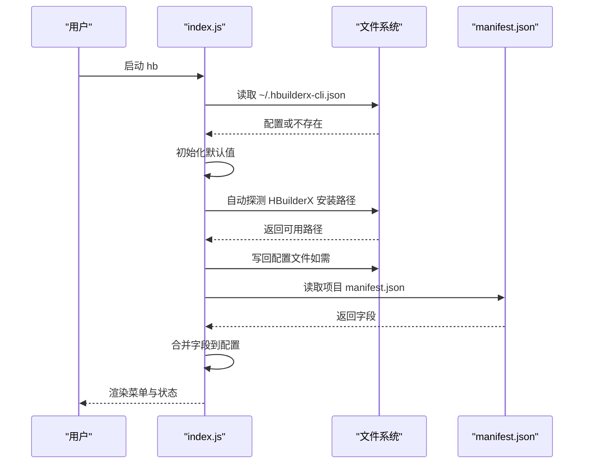
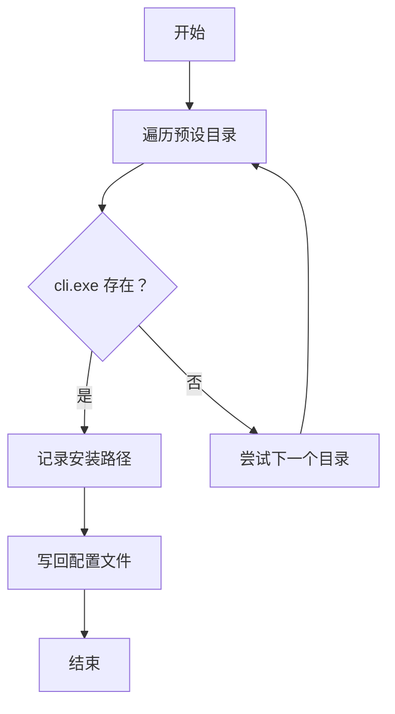
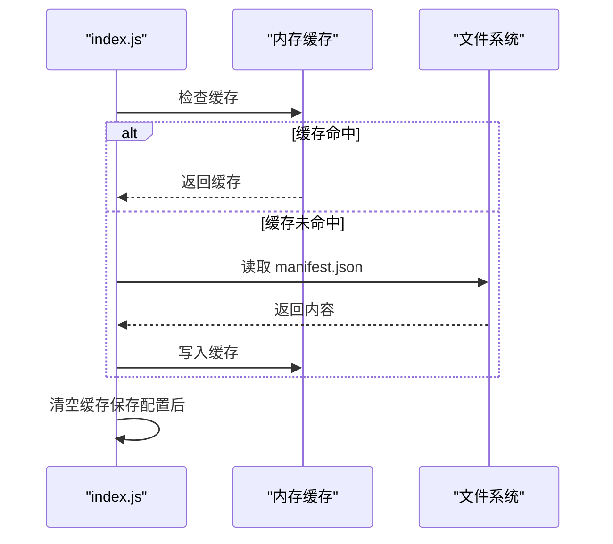
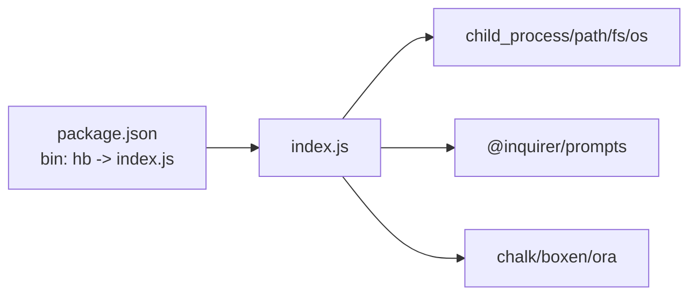

# 配置文件 API

<cite>
**本文引用的文件**
- [package.json](file://package.json)
- [index.js](file://index.js)
- [README.md](file://README.md)
- [AGENTS.md](file://AGENTS.md)
- [release.js](file://release.js)
</cite>

## 目录
1. [简介](#简介)
2. [项目结构](#项目结构)
3. [核心组件](#核心组件)
4. [架构总览](#架构总览)
5. [详细组件分析](#详细组件分析)
6. [依赖分析](#依赖分析)
7. [性能考虑](#性能考虑)
8. [故障排除指南](#故障排除指南)
9. [结论](#结论)
10. [附录](#附录)

## 简介
本文件面向 HBuilderX CLI 工具的使用者与维护者，系统化地说明配置文件 API 的设计与行为，重点覆盖以下内容：
- 配置文件路径与格式
- 配置项的数据类型、默认值与验证规则
- 配置文件的加载与保存机制
- 自动检测 HBuilderX 安装路径的策略
- 配置项优先级与来源
- 配置缓存机制与 manifest.json 的关联
- 配置迁移与故障排除建议

该工具通过单文件入口实现交互式菜单，提供运行 Web/微信/支付宝小程序、发布 H5、项目列表等功能，并将配置持久化至用户主目录下的配置文件。

**章节来源**
- [README.md:1-53](file://README.md#L1-L53)
- [AGENTS.md:1-76](file://AGENTS.md#L1-L76)

## 项目结构
- 入口文件：index.js（包含全部业务逻辑）
- 包描述：package.json（定义二进制入口名、依赖）
- 文档：README.md、AGENTS.md
- 发布脚本：release.js（版本号自增与发布）

**图表来源**
- [package.json:5-7](file://package.json#L5-L7)
- [index.js:14](file://index.js#L14)
- [index.js:17](file://index.js#L17)

**章节来源**
- [package.json:1-21](file://package.json#L1-L21)
- [index.js:1-248](file://index.js#L1-L248)
- [README.md:1-53](file://README.md#L1-L53)
- [AGENTS.md:16-25](file://AGENTS.md#L16-L25)

## 核心组件
- 配置文件 API：负责配置的加载、保存、合并与校验
- HBuilderX 安装路径探测：自动扫描常见安装目录
- manifest.json 读取：从项目根目录读取小程序 AppID 与项目元数据
- 命令执行：通过 HBuilderX CLI（cli.exe）执行具体任务

关键职责与行为：
- 加载配置：读取用户主目录下的配置文件；若不存在则初始化默认值
- 合并来源：将 manifest.json 中的微信/支付宝 AppID、项目名称、版本、AppId 合并入配置
- 自动探测：当配置中的安装路径缺失或不可用时，自动扫描常见安装目录并写回
- 保存配置：用户修改后保存至配置文件
- 缓存策略：对 manifest.json 的解析结果进行缓存，避免重复 IO

**章节来源**
- [index.js:67-90](file://index.js#L67-L90)
- [index.js:38-45](file://index.js#L38-L45)
- [index.js:47-65](file://index.js#L47-L65)
- [index.js:75-85](file://index.js#L75-L85)

## 架构总览
下图展示配置文件 API 在整体架构中的位置与交互关系。

**图表来源**
- [index.js:14](file://index.js#L14)
- [index.js:31-36](file://index.js#L31-L36)
- [index.js:67-90](file://index.js#L67-L90)

## 详细组件分析

### 配置文件 API 设计
- 配置文件路径：用户主目录下的 .hbuilderx-cli.json
- 配置项与来源：
  - hbxDir：HBuilderX 安装目录（字符串），用于定位 cli.exe
  - appid：微信小程序 AppID（字符串），来源于 manifest.json 的 mp-weixin.appid
  - alipayAppid：支付宝小程序 AppID（字符串），来源于 manifest.json 的 mp-alipay.appid
  - manifestName：项目名称（字符串），来源于 manifest.json 的 name
  - manifestVersion：版本名（字符串），来源于 manifest.json 的 versionName
  - manifestAppId：应用 AppId（字符串），来源于 manifest.json 的 appid

加载与保存流程：
- 加载：读取配置文件；若不存在则初始化 hbxDir 为空字符串；若 hbxDir 不存在或不可用，则自动探测并写回
- 合并：从 manifest.json 读取上述字段，若配置中已有值则保留，否则使用 manifest.json 的值
- 保存：用户修改后写回配置文件

**图表来源**
- [index.js:67-90](file://index.js#L67-L90)
- [index.js:75-85](file://index.js#L75-L85)

**章节来源**
- [index.js:67-90](file://index.js#L67-L90)
- [index.js:47-65](file://index.js#L47-L65)
- [README.md:36-46](file://README.md#L36-L46)

### 配置项定义与约束
- 字段与类型
  - hbxDir：字符串；用于拼接 cli.exe 路径
  - appid：字符串；微信小程序 AppID
  - alipayAppid：字符串；支付宝小程序 AppID
  - manifestName：字符串；项目名称
  - manifestVersion：字符串；版本名
  - manifestAppId：字符串；应用 AppId
- 默认值与初始状态
  - 若配置文件不存在，hbxDir 初始为空字符串
  - 若 manifest.json 中对应字段缺失，相应配置项为空字符串
- 验证规则
  - hbxDir 必须指向包含 cli.exe 的目录；否则视为无效并触发自动探测
  - 若 manifest.json 中存在对应字段，则优先使用 manifest.json 的值
  - 用户可通过“基本设置”界面手动覆盖 hbxDir；其他字段由 manifest.json 自动填充

**章节来源**
- [index.js:67-90](file://index.js#L67-L90)
- [index.js:75-85](file://index.js#L75-L85)
- [index.js:47-65](file://index.js#L47-L65)
- [README.md:36-46](file://README.md#L36-L46)

### 配置加载与保存机制
- 加载流程
  - 读取配置文件；若失败则初始化默认值
  - 若 hbxDir 无效（不存在或不包含 cli.exe），则自动探测常见安装路径并写回
  - 从 manifest.json 读取字段并合并到配置对象
- 保存流程
  - 用户在“基本设置”中修改 hbxDir 后保存
  - 保存后刷新缓存并重新合并 manifest.json 字段

**图表来源**
- [index.js:67-90](file://index.js#L67-L90)
- [index.js:31-36](file://index.js#L31-L36)
- [index.js:47-65](file://index.js#L47-L65)

**章节来源**
- [index.js:67-90](file://index.js#L67-L90)
- [index.js:31-36](file://index.js#L31-L36)
- [index.js:47-65](file://index.js#L47-L65)

### 自动检测 HBuilderX 安装路径
- 探测策略
  - 预设常见安装目录（包括 Program Files、Program Files (x86)、LocalAppData 下 Programs 等）
  - 检查每个目录下是否存在 cli.exe
  - 成功找到后写回配置文件
- 触发条件
  - 配置中 hbxDir 为空
  - 配置中 hbxDir 存在但不包含 cli.exe

**图表来源**
- [index.js:22-36](file://index.js#L22-L36)
- [index.js:75-79](file://index.js#L75-L79)

**章节来源**
- [index.js:22-36](file://index.js#L22-L36)
- [index.js:75-79](file://index.js#L75-L79)

### 配置项优先级规则
- 来源优先级（从高到低）
  1) 用户手动设置（来自“基本设置”界面）
  2) manifest.json（微信/支付宝 AppID、项目名称、版本、AppId）
  3) 自动探测的 HBuilderX 安装路径（仅在配置缺失或无效时生效）
- 行为说明
  - 用户修改 hbxDir 后，后续不再自动覆盖
  - 其他字段（appid、alipayAppid、manifestName、manifestVersion、manifestAppId）始终优先使用 manifest.json 的值

**章节来源**
- [index.js:75-85](file://index.js#L75-L85)
- [index.js:195-206](file://index.js#L195-L206)
- [index.js:47-65](file://index.js#L47-L65)

### 配置缓存机制与 manifest.json 关联
- 缓存策略
  - 对 manifest.json 的解析结果进行内存缓存，避免重复读取
  - 用户保存配置后会清空缓存，确保下次读取最新值
- 关联关系
  - 通过 manifest.json 提供小程序 AppID、项目名称、版本、AppId 等信息
  - 配置文件仅存储 HBuilderX 安装路径与从 manifest.json 合并后的字段

**图表来源**
- [index.js:38-45](file://index.js#L38-L45)
- [index.js:198](file://index.js#L198)

**章节来源**
- [index.js:38-45](file://index.js#L38-L45)
- [index.js:198](file://index.js#L198)

### 配置迁移与兼容性
- 版本升级与发布
  - 通过 release.js 实现 patch 版本号自增与发布
  - 该流程不影响配置文件格式，但建议在升级前后备份配置文件
- 迁移建议
  - 若新增字段，旧配置文件将被自动补齐默认值（hbxDir 为空）
  - 建议在升级后手动确认 HBuilderX 安装路径是否正确

**章节来源**
- [release.js:1-19](file://release.js#L1-L19)
- [index.js:73-75](file://index.js#L73-L75)

## 依赖分析
- 依赖关系
  - index.js 直接依赖 Node 核心模块（child_process、path、fs、os）与第三方库（chalk、@inquirer/prompts、boxen、ora）
  - package.json 定义二进制入口名为 hb，指向 index.js
- 耦合度
  - 配置文件 API 与 manifest.json 解析紧密耦合，但通过缓存降低耦合影响
  - 命令执行依赖 HBuilderX 安装路径，路径变更会影响后续命令

**图表来源**
- [package.json:5-7](file://package.json#L5-L7)
- [index.js:1-10](file://index.js#L1-L10)

**章节来源**
- [package.json:1-21](file://package.json#L1-L21)
- [index.js:1-10](file://index.js#L1-L10)

## 性能考虑
- 缓存策略：对 manifest.json 的解析结果进行内存缓存，减少重复 IO
- 自动探测：仅在配置缺失或无效时触发，避免每次启动都进行磁盘扫描
- 文件写入：仅在必要时写回配置文件（例如首次探测到安装路径或用户修改 hbxDir）

[本节为通用性能建议，无需特定文件引用]

## 故障排除指南
- 无法找到 HBuilderX 安装路径
  - 现象：工具提示未找到 HBuilderX
  - 处理：在“基本设置”中手动输入正确的安装目录；或确保 HBuilderX 安装在预设目录之一
  - 参考：自动探测逻辑与保存机制
- 配置文件损坏或格式错误
  - 现象：启动时报错或配置未生效
  - 处理：删除或重命名配置文件，工具会在下次启动时重建默认配置
  - 参考：加载配置时的容错处理
- manifest.json 字段缺失导致 AppID 为空
  - 现象：微信/支付宝 AppID 显示未设置
  - 处理：在项目 manifest.json 中补充对应字段
  - 参考：从 manifest.json 合并字段的逻辑
- 权限问题
  - 现象：无法写入配置文件或执行 cli.exe
  - 处理：以管理员权限运行终端或调整用户主目录权限
- 平台限制
  - 说明：工具仅支持 Windows（基于 cli.exe 与 cmd.exe 的调用）
  - 参考：平台判断与命令执行逻辑

**章节来源**
- [index.js:17-20](file://index.js#L17-L20)
- [index.js:67-90](file://index.js#L67-L90)
- [index.js:75-85](file://index.js#L75-L85)
- [index.js:118-138](file://index.js#L118-L138)
- [AGENTS.md:74-75](file://AGENTS.md#L74-L75)

## 结论
本配置文件 API 以简洁的方式实现了 HBuilderX CLI 工具的配置管理：通过用户主目录下的配置文件持久化安装路径，结合项目 manifest.json 的自动合并，提供开箱即用的体验。其核心特性包括：
- 自动探测与容错加载
- 以 manifest.json 为权威来源的字段合并
- 内存缓存优化与最小化写入
- 明确的优先级与故障排除路径

[本节为总结性内容，无需特定文件引用]

## 附录

### 配置文件格式与示例
- 路径：用户主目录下的 .hbuilderx-cli.json
- 示例（来自文档）：
  - hbxDir：HBuilderX 安装目录（字符串）
  - appid：微信小程序 AppID（字符串）
  - alipayAppid：支付宝小程序 AppID（字符串）

**章节来源**
- [README.md:36-46](file://README.md#L36-L46)

### 配置项来源与默认值对照
- hbxDir
  - 来源：用户设置或自动探测
  - 默认值：空字符串
  - 验证：必须包含 cli.exe
- appid
  - 来源：manifest.json 的 mp-weixin.appid
  - 默认值：空字符串
- alipayAppid
  - 来源：manifest.json 的 mp-alipay.appid
  - 默认值：空字符串
- manifestName
  - 来源：manifest.json 的 name
  - 默认值：空字符串
- manifestVersion
  - 来源：manifest.json 的 versionName
  - 默认值：空字符串
- manifestAppId
  - 来源：manifest.json 的 appid
  - 默认值：空字符串

**章节来源**
- [index.js:47-65](file://index.js#L47-L65)
- [index.js:75-85](file://index.js#L75-L85)