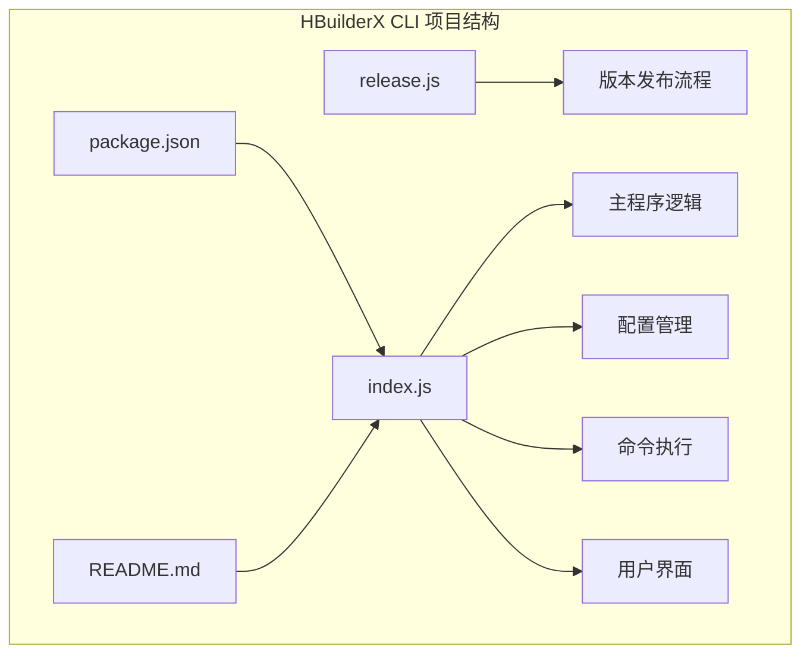
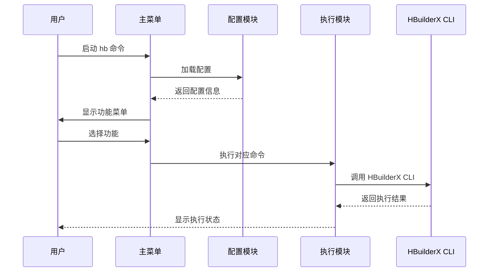
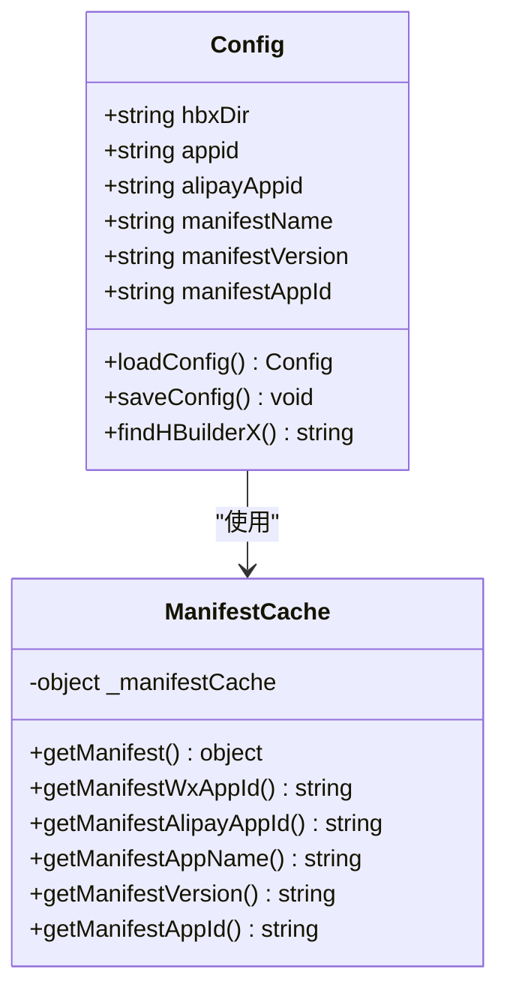
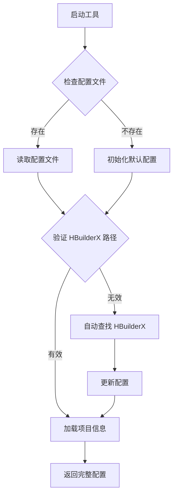
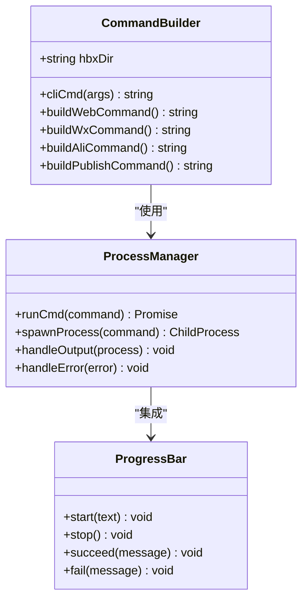
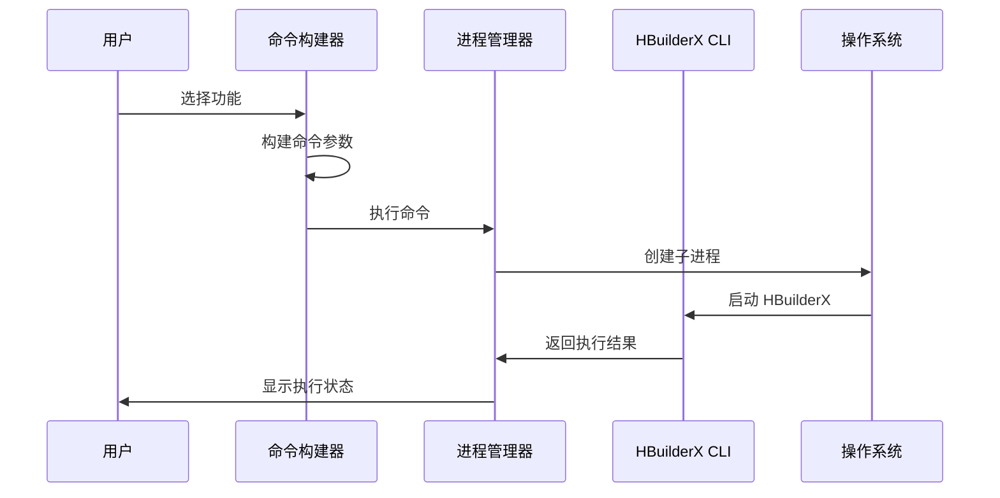
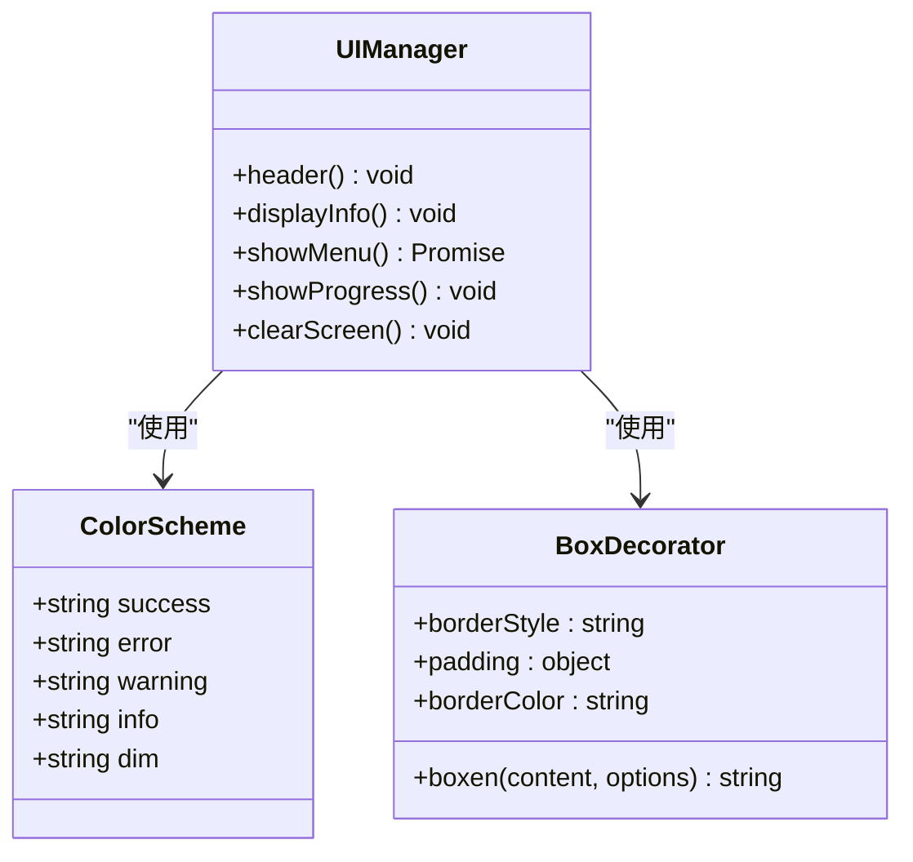
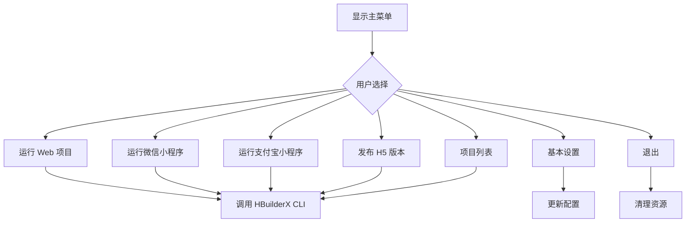
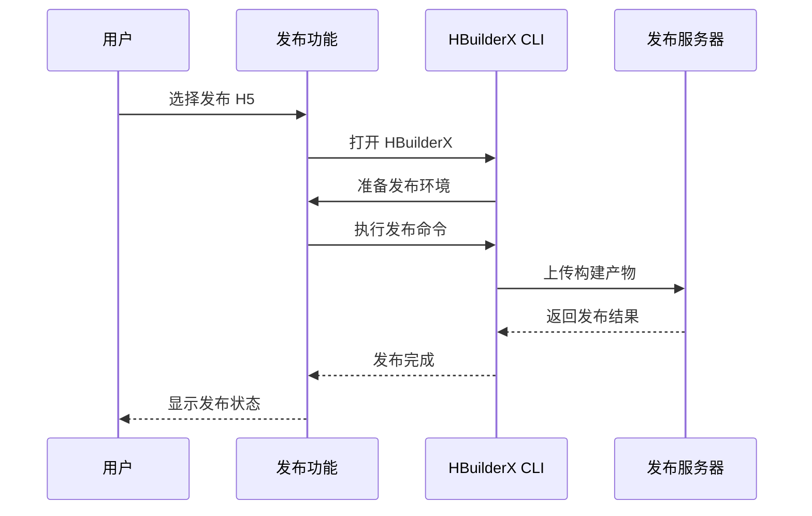
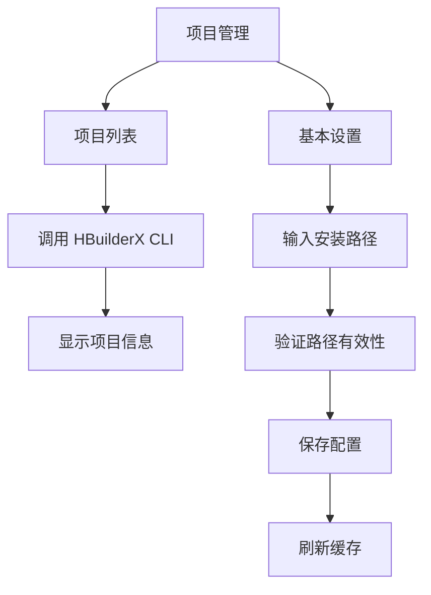

# 功能详解

<cite>
**本文档引用的文件**
- [package.json](file://hbuilderx-cli/package.json)
- [index.js](file://hbuilderx-cli/index.js)
- [README.md](file://hbuilderx-cli/README.md)
- [release.js](file://hbuilderx-cli/release.js)
</cite>

## 目录
1. [简介](#简介)
2. [项目结构](#项目结构)
3. [核心组件](#核心组件)
4. [架构概览](#架构概览)
5. [详细组件分析](#详细组件分析)
6. [依赖分析](#依赖分析)
7. [性能考虑](#性能考虑)
8. [故障排除指南](#故障排除指南)
9. [结论](#结论)

## 简介

HBuilderX CLI 是一个专门为 HBuilderX 开发环境设计的命令行管理工具。该工具通过提供简化的交互式界面，帮助开发者快速执行常见的开发任务，包括项目运行、发布和管理功能。该工具支持多种平台，特别是针对 Windows 系统进行了优化，能够自动检测 HBuilderX 的安装位置并提供统一的命令行接口。

该工具的核心价值在于简化了 HBuilderX 的日常使用流程，让开发者能够在不离开终端的情况下完成大部分开发工作，从而提高开发效率和工作流程的连贯性。

## 项目结构

该项目采用简洁的单文件架构设计，主要包含以下核心文件：



**图表来源**
- [package.json:1-21](file://hbuilderx-cli/package.json#L1-L21)
- [index.js:1-248](file://hbuilderx-cli/index.js#L1-L248)

**章节来源**
- [package.json:1-21](file://hbuilderx-cli/package.json#L1-L21)
- [README.md:1-53](file://hbuilderx-cli/README.md#L1-L53)

## 核心组件

### 主要功能模块

该工具实现了六个核心功能模块，每个模块都针对特定的开发场景进行了优化：

1. **项目运行模块**：支持 Web 项目、微信小程序、支付宝小程序的本地运行
2. **项目发布模块**：专门用于 H5 版本的发布流程
3. **项目管理模块**：提供项目列表查看和基本配置管理功能
4. **配置管理模块**：处理 HBuilderX 安装路径和应用 ID 的持久化存储
5. **命令执行模块**：封装系统命令调用和进程管理
6. **用户界面模块**：提供交互式菜单和状态反馈

### 配置系统

工具采用集中式配置管理策略，配置文件存储在用户主目录下的 `.hbuilderx-cli.json` 文件中，包含以下关键配置项：

- `hbxDir`: HBuilderX 安装目录路径
- `appid`: 微信小程序 AppID
- `alipayAppid`: 支付宝小程序 AppID

**章节来源**
- [index.js:67-90](file://hbuilderx-cli/index.js#L67-L90)
- [README.md:36-46](file://hbuilderx-cli/README.md#L36-L46)

## 架构概览

该工具采用了模块化的架构设计，通过清晰的职责分离实现了高内聚、低耦合的系统结构：

```mermaid
graph TB
subgraph "HBuilderX CLI 架构"
A[入口模块] --> B[配置管理模块]
A --> C[命令执行模块]
A --> D[用户界面模块]
B --> E[配置文件读写]
B --> F[HBuilderX 路径检测]
C --> G[子进程管理]
C --> H[命令构建器]
D --> I[交互式菜单]
D --> J[进度显示]
K[外部依赖] --> L[chalk - 颜色输出]
K --> M[@inquirer/prompts - 交互式界面]
K --> N[boxen - 边框输出]
K --> O[ora - 进度指示器]
end
```

**图表来源**
- [index.js:11-13](file://hbuilderx-cli/index.js#L11-L13)
- [index.js:92-95](file://hbuilderx-cli/index.js#L92-L95)
- [package.json:14-19](file://hbuilderx-cli/package.json#L14-L19)

### 数据流架构



**图表来源**
- [index.js:210-242](file://hbuilderx-cli/index.js#L210-L242)
- [index.js:155-163](file://hbuilderx-cli/index.js#L155-L163)

## 详细组件分析

### 配置管理组件

配置管理是整个工具的核心基础设施，负责处理用户配置的持久化存储和动态加载。

#### 配置数据结构



**图表来源**
- [index.js:67-86](file://hbuilderx-cli/index.js#L67-L86)
- [index.js:38-65](file://hbuilderx-cli/index.js#L38-L65)

#### 配置加载流程



**图表来源**
- [index.js:67-86](file://hbuilderx-cli/index.js#L67-L86)
- [index.js:31-36](file://hbuilderx-cli/index.js#L31-L36)

**章节来源**
- [index.js:67-90](file://hbuilderx-cli/index.js#L67-L90)
- [index.js:31-36](file://hbuilderx-cli/index.js#L31-L36)

### 命令执行组件

命令执行组件负责将用户选择的功能转换为具体的 HBuilderX CLI 命令，并处理命令的执行过程。

#### 命令构建机制



**图表来源**
- [index.js:92-95](file://hbuilderx-cli/index.js#L92-L95)
- [index.js:118-138](file://hbuilderx-cli/index.js#L118-L138)

#### 命令执行流程



**图表来源**
- [index.js:118-138](file://hbuilderx-cli/index.js#L118-L138)
- [index.js:166-184](file://hbuilderx-cli/index.js#L166-L184)

**章节来源**
- [index.js:92-95](file://hbuilderx-cli/index.js#L92-L95)
- [index.js:118-138](file://hbuilderx-cli/index.js#L118-L138)

### 用户界面组件

用户界面组件提供了现代化的交互体验，包括彩色输出、进度指示和响应式菜单。

#### 界面设计模式



**图表来源**
- [index.js:105-116](file://hbuilderx-cli/index.js#L105-L116)
- [index.js:214-227](file://hbuilderx-cli/index.js#L214-L227)

#### 菜单系统架构



**图表来源**
- [index.js:214-242](file://hbuilderx-cli/index.js#L214-L242)

**章节来源**
- [index.js:105-116](file://hbuilderx-cli/index.js#L105-L116)
- [index.js:214-242](file://hbuilderx-cli/index.js#L214-L242)

### 功能模块详解

#### 项目运行功能

项目运行功能支持三种主要的开发场景：

1. **Web 项目运行**：在 Chrome 浏览器中运行 Web 项目
2. **微信小程序运行**：运行微信小程序项目
3. **支付宝小程序运行**：运行支付宝小程序项目

每个运行功能都遵循相同的执行模式：
- 自动启动 HBuilderX
- 构建相应的 CLI 命令
- 执行命令并显示结果

**章节来源**
- [index.js:166-184](file://hbuilderx-cli/index.js#L166-L184)

#### 项目发布功能

项目发布功能专注于 H5 版本的发布流程，提供一键发布能力：



**图表来源**
- [index.js:166-169](file://hbuilderx-cli/index.js#L166-L169)

**章节来源**
- [index.js:166-169](file://hbuilderx-cli/index.js#L166-L169)

#### 项目管理功能

项目管理功能提供两个核心能力：

1. **项目列表查看**：显示当前 HBuilderX 中的所有项目
2. **基本设置管理**：允许用户配置 HBuilderX 安装路径



**图表来源**
- [index.js:186-207](file://hbuilderx-cli/index.js#L186-L207)
- [index.js:186-189](file://hbuilderx-cli/index.js#L186-L189)

**章节来源**
- [index.js:186-207](file://hbuilderx-cli/index.js#L186-L207)

## 依赖分析

该工具的依赖关系相对简单但功能明确，主要依赖于几个关键的第三方库：

```mermaid
graph TB
subgraph "核心依赖"
A[chalk ^4.1.2] --> B[颜色输出]
C[@inquirer/prompts ^3.0.0] --> D[交互式界面]
E[boxen ^5.1.2] --> F[边框输出]
G[ora ^5.4.1] --> H[进度指示器]
end
subgraph "内置模块"
I[child_process] --> J[进程管理]
K[path] --> L[路径处理]
M[fs] --> N[文件系统]
O[os] --> P[操作系统]
Q[console] --> R[标准输出]
end
subgraph "项目依赖"
S[HBuilderX CLI] --> T[外部工具]
U[manifest.json] --> V[项目配置]
end
```

**图表来源**
- [package.json:14-19](file://hbuilderx-cli/package.json#L14-L19)

### 外部依赖特性

| 依赖包 | 版本 | 主要功能 | 使用场景 |
|--------|------|----------|----------|
| chalk | ^4.1.2 | 彩色文本输出 | 错误提示、成功反馈、状态显示 |
| @inquirer/prompts | ^3.0.0 | 交互式命令行界面 | 菜单选择、输入收集 |
| boxen | ^5.1.2 | 边框装饰输出 | 信息面板、状态框 |
| ora | ^5.4.1 | 进度动画显示 | 命令执行状态反馈 |

**章节来源**
- [package.json:14-19](file://hbuilderx-cli/package.json#L14-L19)

## 性能考虑

该工具在设计时充分考虑了性能和用户体验：

### 内存管理
- **配置缓存**：使用 `_manifestCache` 变量缓存 manifest.json 内容，避免重复读取
- **异步处理**：所有长时间运行的操作都采用异步模式，确保界面响应性

### 系统资源优化
- **进程管理**：合理使用子进程，避免僵尸进程产生
- **文件操作**：最小化文件系统访问次数，提高 I/O 效率

### 用户体验优化
- **进度反馈**：使用 ora 提供实时进度指示
- **错误处理**：完善的错误捕获和用户友好的错误消息

## 故障排除指南

### 常见问题及解决方案

#### HBuilderX 路径检测失败
**问题描述**：工具无法自动找到 HBuilderX 安装目录
**解决方法**：
1. 手动配置 HBuilderX 安装路径
2. 确认 HBuilderX 已正确安装
3. 检查权限设置

#### 项目验证失败
**问题描述**：提示当前目录不是 HBuilderX 项目
**解决方法**：
1. 确保项目根目录包含 `manifest.json` 文件
2. 检查项目结构是否完整
3. 验证 manifest.json 格式正确性

#### 命令执行失败
**问题描述**：HBuilderX CLI 命令执行失败
**解决方法**：
1. 检查 HBuilderX 是否正常运行
2. 验证项目配置是否正确
3. 查看详细的错误日志

**章节来源**
- [index.js:17-20](file://hbuilderx-cli/index.js#L17-L20)
- [index.js:31-36](file://hbuilderx-cli/index.js#L31-L36)

### 调试技巧

1. **启用详细日志**：观察命令执行过程中的输出信息
2. **检查配置文件**：验证 `~/.hbuilderx-cli.json` 文件内容
3. **测试独立命令**：直接在终端中运行对应的 HBuilderX CLI 命令

## 结论

HBuilderX CLI 工具通过其简洁而强大的设计，成功地将复杂的 HBuilderX 开发流程简化为直观的命令行操作。该工具的主要优势包括：

1. **易用性**：提供直观的交互式界面，降低学习成本
2. **完整性**：覆盖了开发流程中的主要环节
3. **可靠性**：稳定的错误处理和状态反馈机制
4. **可扩展性**：模块化的架构设计便于功能扩展

该工具特别适合需要频繁进行 HBuilderX 开发工作的开发者，能够显著提高开发效率并改善整体开发体验。通过合理的配置管理和自动化流程，该工具为现代移动应用和 Web 应用开发提供了强有力的支持。