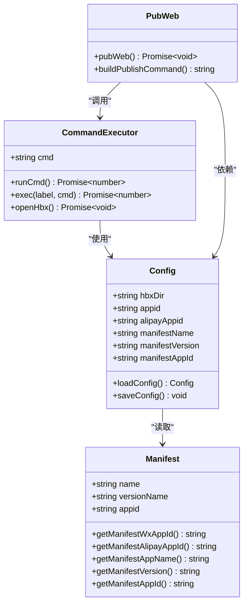
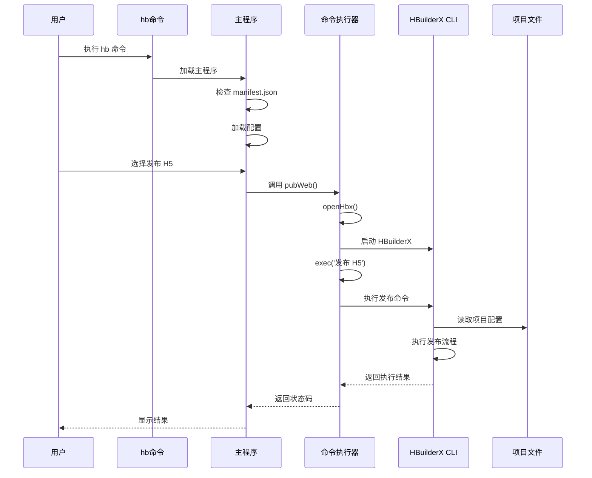
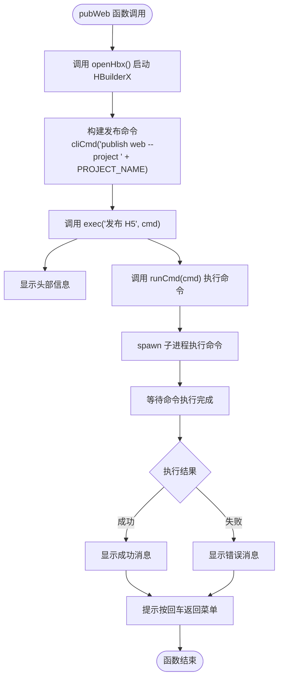
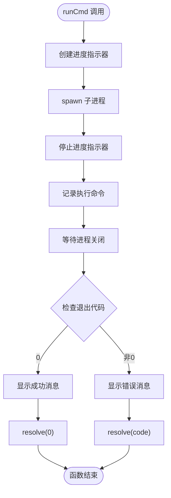
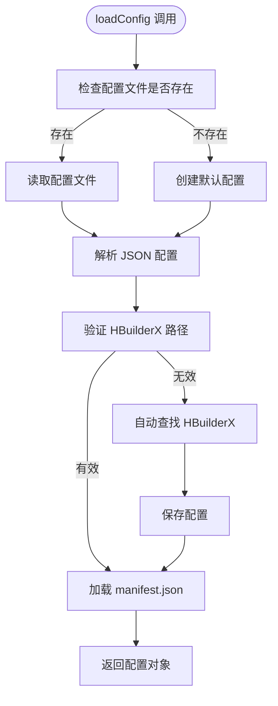
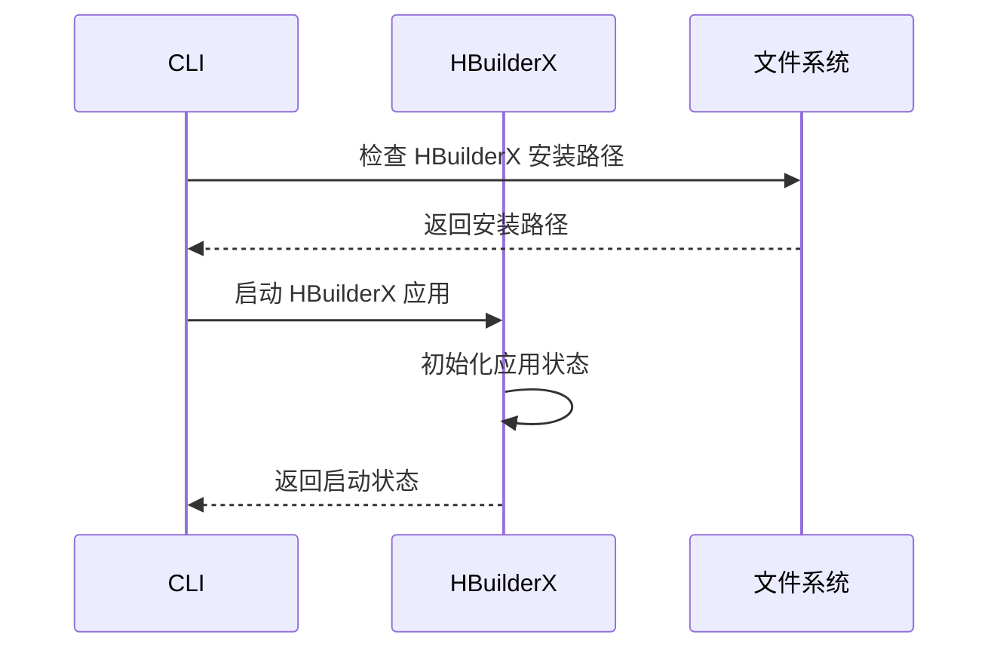
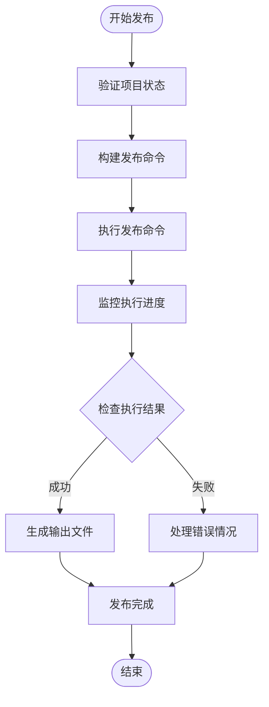
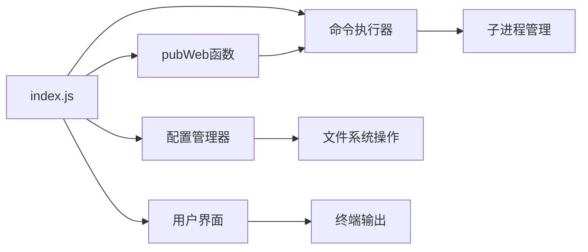
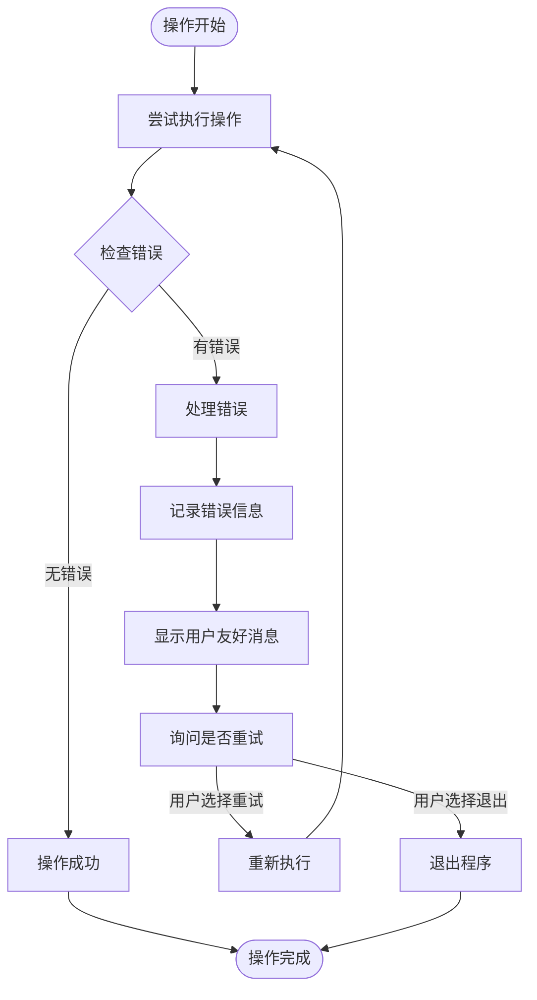

# 项目发布功能

<cite>
**本文档引用的文件**
- [package.json](file://hbuilderx-cli/package.json)
- [index.js](file://hbuilderx-cli/index.js)
- [release.js](file://hbuilderx-cli/release.js)
- [README.md](file://hbuilderx-cli/README.md)
</cite>

## 目录
1. [简介](#简介)
2. [项目结构](#项目结构)
3. [核心组件](#核心组件)
4. [架构概览](#架构概览)
5. [详细组件分析](#详细组件分析)
6. [发布流程详解](#发布流程详解)
7. [依赖分析](#依赖分析)
8. [性能考虑](#性能考虑)
9. [故障排除指南](#故障排除指南)
10. [结论](#结论)

## 简介

HBuilderX CLI 是一个基于 Node.js 的全局命令行工具，专门用于管理 HBuilderX 开发环境的各种操作。该工具提供了完整的项目生命周期管理功能，包括项目运行、调试、发布等操作。

本文档专注于 H5 版本发布的完整流程和实现原理，详细说明了 `pubWeb` 函数的工作机制、发布前的准备工作、HBuilderX CLI 的集成方式以及发布过程中的关键步骤。

## 项目结构

HBuilderX CLI 项目采用简洁的单文件架构设计，主要包含以下核心文件：

```mermaid
graph TB
subgraph "HBuilderX CLI 核心结构"
A[package.json] --> B[index.js]
B --> C[pubWeb函数]
B --> D[命令执行器]
B --> E[配置管理器]
F[release.js] --> G[版本发布脚本]
end
subgraph "外部依赖"
H[chalk] --> B
I[@inquirer/prompts] --> B
J[boxen] --> B
K[ora] --> B
end
subgraph "系统集成"
L[HBuilderX CLI] --> M[cli.exe]
N[操作系统] --> O[Windows/Linux/macOS]
end
B --> L
M --> P[发布命令]
Q[manifest.json] --> B
```

**图表来源**
- [package.json:1-21](file://hbuilderx-cli/package.json#L1-L21)
- [index.js:1-248](file://hbuilderx-cli/index.js#L1-L248)

**章节来源**
- [package.json:1-21](file://hbuilderx-cli/package.json#L1-L21)
- [README.md:1-53](file://hbuilderx-cli/README.md#L1-L53)

## 核心组件

### 主要功能模块

HBuilderX CLI 包含以下核心功能模块：

1. **命令执行模块**：负责与 HBuilderX CLI 交互，执行各种开发任务
2. **配置管理模块**：管理用户配置和项目设置
3. **用户界面模块**：提供友好的命令行交互界面
4. **发布管理模块**：专门处理 H5 版本发布流程

### 关键数据结构



**图表来源**
- [index.js:38-86](file://hbuilderx-cli/index.js#L38-L86)
- [index.js:92-138](file://hbuilderx-cli/index.js#L92-L138)
- [index.js:166-169](file://hbuilderx-cli/index.js#L166-L169)

**章节来源**
- [index.js:38-86](file://hbuilderx-cli/index.js#L38-L86)
- [index.js:92-138](file://hbuilderx-cli/index.js#L92-L138)
- [index.js:166-169](file://hbuilderx-cli/index.js#L166-L169)

## 架构概览

HBuilderX CLI 采用分层架构设计，通过命令行界面与用户交互，然后调用底层的 HBuilderX CLI 工具来执行实际的开发任务。



**图表来源**
- [index.js:166-169](file://hbuilderx-cli/index.js#L166-L169)
- [index.js:140-153](file://hbuilderx-cli/index.js#L140-L153)
- [index.js:155-163](file://hbuilderx-cli/index.js#L155-L163)

## 详细组件分析

### pubWeb 函数实现

`pubWeb` 函数是 H5 版本发布的核心入口点，其工作机制如下：

#### 函数签名和参数
- **函数名**：pubWeb
- **返回值**：Promise<void>
- **作用**：执行 H5 版本发布流程

#### 执行流程



**图表来源**
- [index.js:166-169](file://hbuilderx-cli/index.js#L166-L169)
- [index.js:140-153](file://hbuilderx-cli/index.js#L140-L153)
- [index.js:155-163](file://hbuilderx-cli/index.js#L155-L163)

#### 关键实现细节

1. **异步执行模式**：使用 `await` 关键字确保发布流程的顺序执行
2. **HBuilderX 集成**：通过 `openHbx()` 函数确保 HBuilderX 应用处于活动状态
3. **命令构建**：动态构建发布命令，包含项目名称参数

**章节来源**
- [index.js:166-169](file://hbuilderx-cli/index.js#L166-L169)

### 命令执行器分析

命令执行器负责处理所有与 HBuilderX CLI 的交互，包括命令构建、执行和结果处理。

#### runCmd 函数



**图表来源**
- [index.js:118-138](file://hbuilderx-cli/index.js#L118-L138)

#### openHbx 函数

openHbx 函数负责启动 HBuilderX 应用程序，确保后续命令能够正常执行。

**章节来源**
- [index.js:118-138](file://hbuilderx-cli/index.js#L118-L138)
- [index.js:140-153](file://hbuilderx-cli/index.js#L140-L153)

### 配置管理系统

配置管理系统负责管理用户设置和项目信息，包括 HBuilderX 安装路径、小程序 AppID 等。

#### 配置加载流程



**图表来源**
- [index.js:67-86](file://hbuilderx-cli/index.js#L67-L86)

**章节来源**
- [index.js:67-86](file://hbuilderx-cli/index.js#L67-L86)

## 发布流程详解

### 发布前准备工作

在执行 H5 版本发布之前，系统会进行一系列的准备工作以确保发布流程的顺利进行。

#### 项目检查

1. **manifest.json 验证**：系统会检查当前目录是否包含有效的 `manifest.json` 文件
2. **项目类型确认**：验证项目是否为 HBuilderX 支持的项目类型
3. **配置完整性检查**：确保必要的发布配置已经就绪

#### 环境准备

1. **HBuilderX 安装检测**：自动检测 HBuilderX 是否已正确安装
2. **CLI 可用性验证**：确认 `cli.exe` 可执行文件可用
3. **权限检查**：验证当前用户对项目目录的访问权限

### 发布执行流程

#### 步骤 1：启动 HBuilderX



**图表来源**
- [index.js:140-153](file://hbuilderx-cli/index.js#L140-L153)

#### 步骤 2：构建发布命令

系统会根据当前项目信息动态构建发布命令：

- **命令格式**：`cli publish web --project {PROJECT_NAME}`
- **参数说明**：
  - `publish`：发布子命令
  - `web`：目标平台为 H5
  - `--project`：指定项目名称

#### 步骤 3：执行发布命令



**图表来源**
- [index.js:166-169](file://hbuilderx-cli/index.js#L166-L169)

### 发布结果反馈

发布完成后，系统会提供详细的反馈信息：

1. **执行状态**：显示命令执行的成功或失败状态
2. **时间戳记录**：记录每次操作的时间信息
3. **用户提示**：指导用户进行下一步操作

**章节来源**
- [index.js:166-169](file://hbuilderx-cli/index.js#L166-L169)
- [index.js:155-163](file://hbuilderx-cli/index.js#L155-L163)

## 依赖分析

### 外部依赖关系

HBuilderX CLI 项目依赖于多个 Node.js 模块来提供丰富的功能特性：

```mermaid
graph TB
subgraph "核心依赖"
A[chalk] --> B[颜色输出]
C[@inquirer/prompts] --> D[交互式命令行]
E[boxen] --> F[边框文本框]
G[ora] --> H[进度指示器]
end
subgraph "系统依赖"
I[child_process] --> J[进程管理]
K[path] --> L[路径处理]
M[fs] --> N[文件系统]
O[os] --> P[操作系统信息]
end
subgraph "项目依赖"
Q[package.json] --> R[版本管理]
S[index.js] --> T[功能实现]
U[release.js] --> V[发布脚本]
end
T --> A
T --> C
T --> E
T --> G
T --> I
T --> K
T --> M
T --> O
```

**图表来源**
- [package.json:14-19](file://hbuilderx-cli/package.json#L14-L19)
- [index.js:1-10](file://hbuilderx-cli/index.js#L1-L10)

### 内部模块依赖

项目内部模块之间的依赖关系相对简单，主要通过函数调用来实现：



**图表来源**
- [index.js:166-169](file://hbuilderx-cli/index.js#L166-L169)
- [index.js:118-138](file://hbuilderx-cli/index.js#L118-L138)
- [index.js:67-86](file://hbuilderx-cli/index.js#L67-L86)

**章节来源**
- [package.json:14-19](file://hbuilderx-cli/package.json#L14-L19)
- [index.js:1-10](file://hbuilderx-cli/index.js#L1-L10)

## 性能考虑

### 执行效率优化

1. **异步操作**：所有长时间运行的操作都采用异步模式，避免阻塞主线程
2. **缓存机制**：manifest.json 文件内容会被缓存，减少重复读取
3. **进度指示**：使用 ora 创建进度指示器，提升用户体验

### 资源管理

1. **进程管理**：合理管理子进程的创建和销毁
2. **内存使用**：避免不必要的内存占用
3. **文件操作**：最小化文件系统访问次数

## 故障排除指南

### 常见问题及解决方案

#### 1. 未找到 HBuilderX 安装目录

**问题描述**：系统无法找到 HBuilderX 的安装位置

**解决方法**：
1. 手动配置 HBuilderX 安装路径
2. 确认 HBuilderX 已正确安装
3. 检查 `cli.exe` 文件是否存在

#### 2. manifest.json 文件缺失

**问题描述**：当前目录不是有效的 HBuilderX 项目

**解决方法**：
1. 确保项目根目录包含 `manifest.json` 文件
2. 验证项目文件的完整性
3. 重新初始化项目

#### 3. 发布命令执行失败

**问题描述**：HBuilderX CLI 执行发布命令时出现错误

**解决方法**：
1. 检查网络连接状态
2. 验证项目配置的正确性
3. 查看详细的错误日志信息

### 错误处理机制

系统实现了多层次的错误处理机制：



**图表来源**
- [index.js:118-138](file://hbuilderx-cli/index.js#L118-L138)
- [index.js:244-247](file://hbuilderx-cli/index.js#L244-L247)

**章节来源**
- [index.js:118-138](file://hbuilderx-cli/index.js#L118-L138)
- [index.js:244-247](file://hbuilderx-cli/index.js#L244-L247)

## 结论

HBuilderX CLI 工具为开发者提供了一个强大而易用的命令行界面，用于管理 HBuilderX 开发环境的各种操作。其精心设计的架构和完善的错误处理机制确保了发布流程的稳定性和可靠性。

通过本文档的详细分析，我们可以看到该工具在以下方面表现出色：

1. **架构设计**：清晰的模块分离和职责划分
2. **用户体验**：友好的命令行界面和详细的反馈信息
3. **错误处理**：完善的异常处理和用户引导机制
4. **扩展性**：易于添加新功能和维护现有功能

对于 H5 版本发布功能而言，`pubWeb` 函数作为核心入口，通过与底层 HBuilderX CLI 的紧密集成，为开发者提供了一键式的发布体验。同时，系统的配置管理和环境检测机制确保了发布流程的可靠性和一致性。