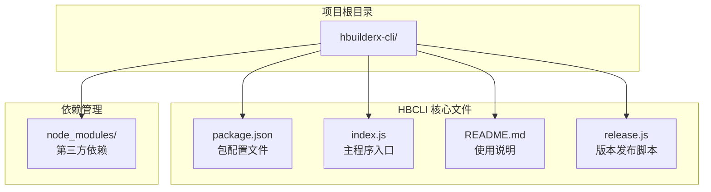
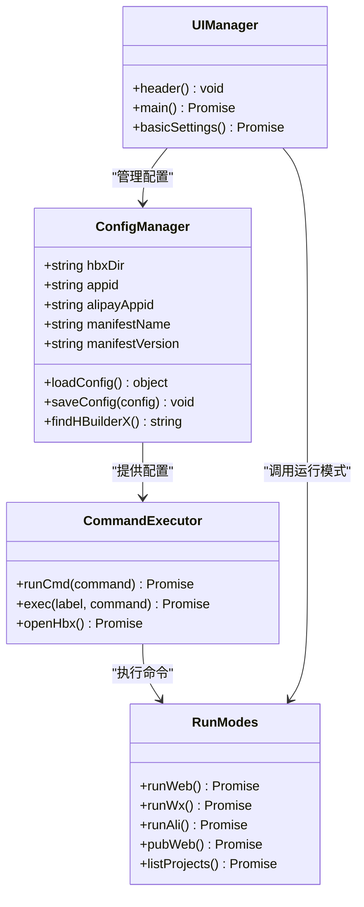
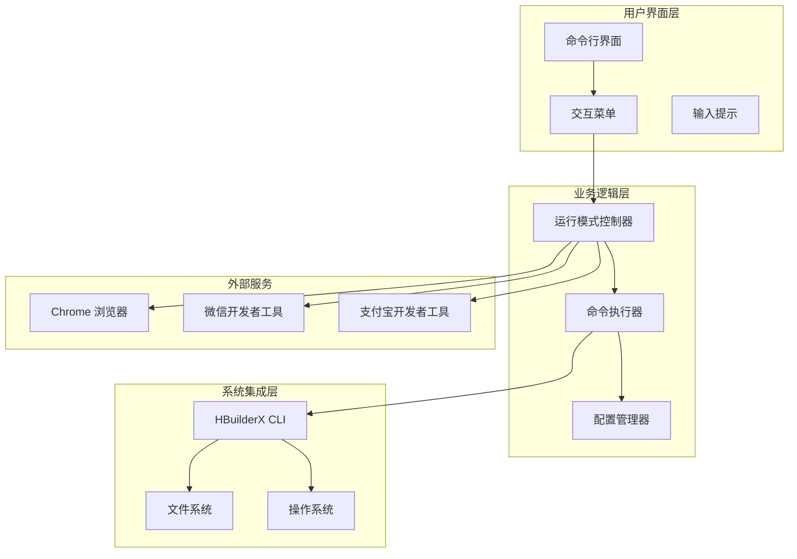
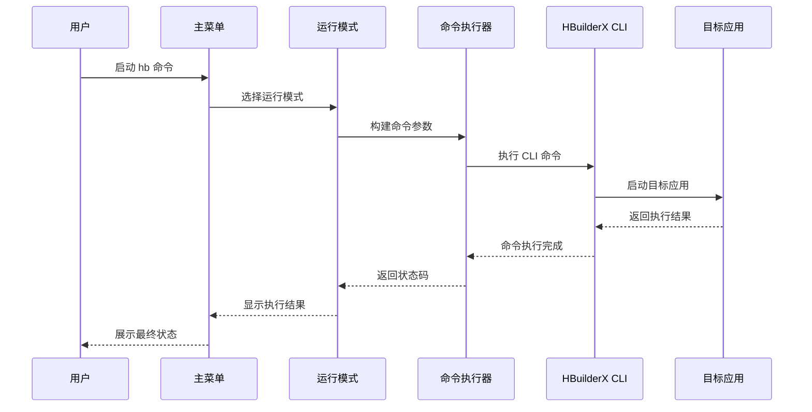
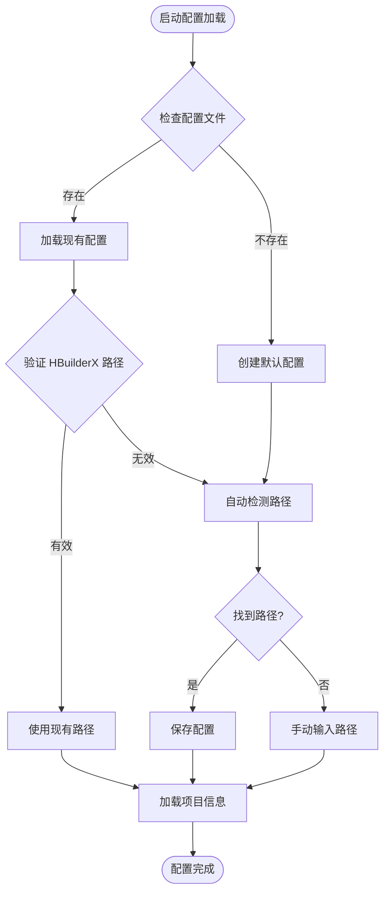
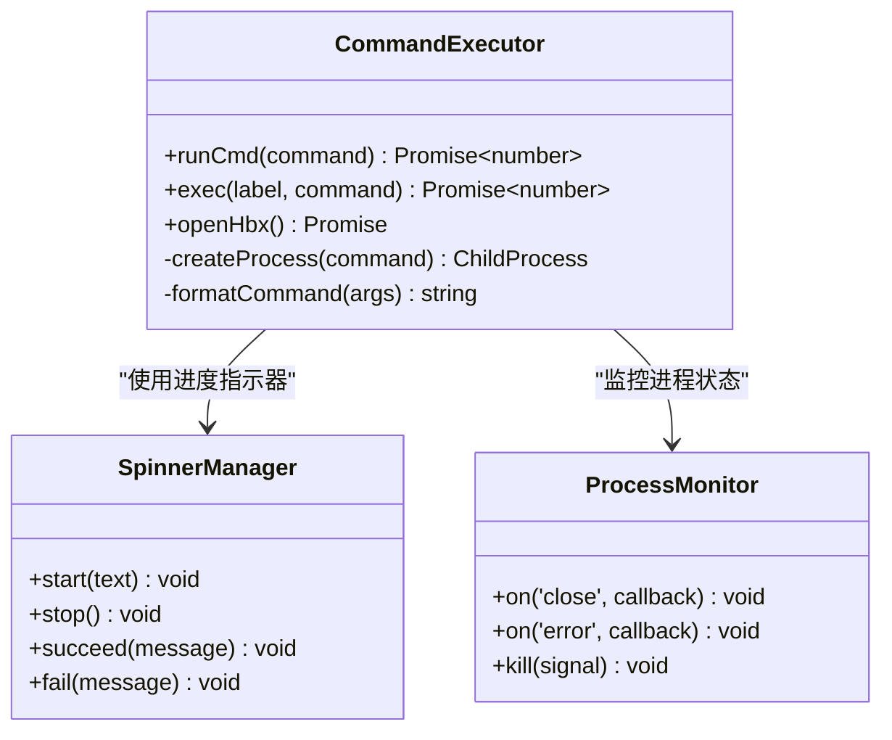
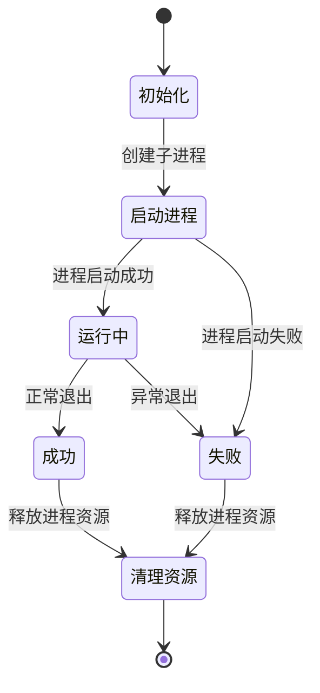
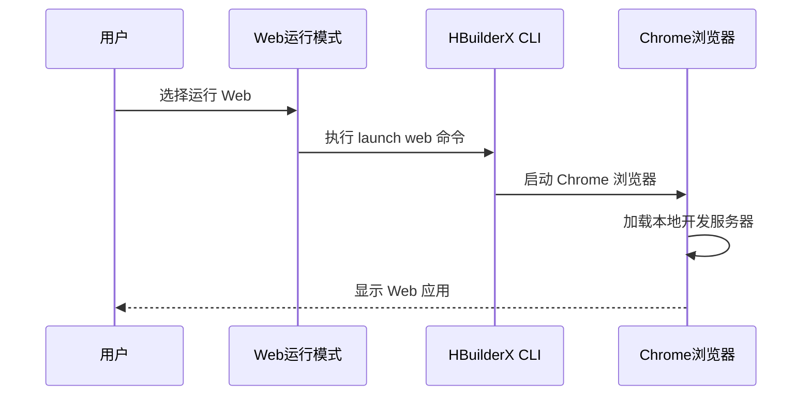
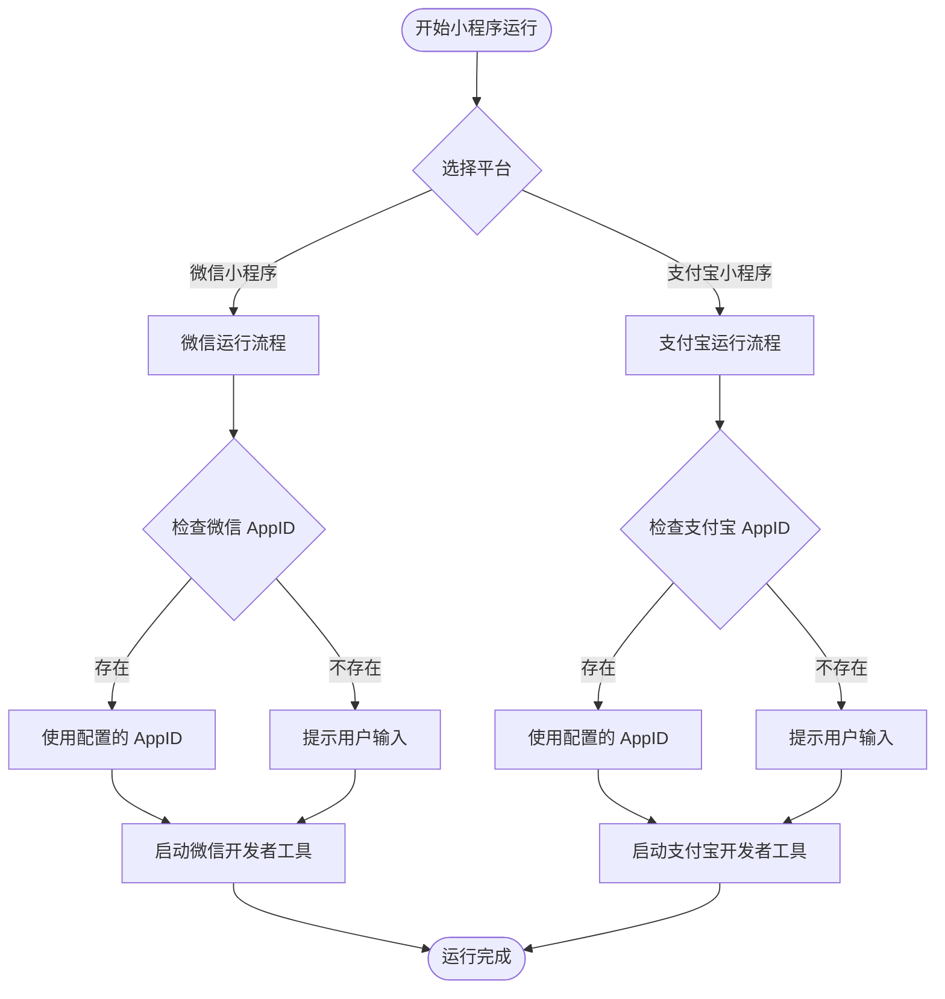
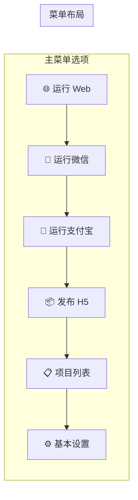

# 项目运行功能

<cite>
**本文档引用的文件**
- [package.json](file://hbuilderx-cli/package.json)
- [index.js](file://hbuilderx-cli/index.js)
- [README.md](file://hbuilderx-cli/README.md)
- [release.js](file://hbuilderx-cli/release.js)
</cite>

## 目录
1. [简介](#简介)
2. [项目结构](#项目结构)
3. [核心组件](#核心组件)
4. [架构概览](#架构概览)
5. [详细组件分析](#详细组件分析)
6. [依赖关系分析](#依赖关系分析)
7. [性能考虑](#性能考虑)
8. [故障排除指南](#故障排除指南)
9. [结论](#结论)
10. [附录](#附录)

## 简介

HBuilderX CLI 工具是一个基于 Node.js 的全局命令行管理工具，专门用于简化 HBuilderX 开发环境的操作流程。该工具提供了直观的交互式界面，支持多种运行模式，包括 Web 项目运行、微信小程序运行和支付宝小程序运行。

该工具的核心价值在于：
- **统一入口**：通过单一命令提供完整的开发工具链访问
- **智能配置**：自动检测和配置 HBuilderX 安装路径
- **多平台支持**：支持 Windows 和类 Unix 系统
- **用户友好**：提供清晰的可视化界面和状态反馈

## 项目结构

该项目采用简洁的单文件架构设计，主要文件组织如下：



**图表来源**
- [package.json:1-21](file://hbuilderx-cli/package.json#L1-L21)
- [index.js:1-248](file://hbuilderx-cli/index.js#L1-L248)

**章节来源**
- [package.json:1-21](file://hbuilderx-cli/package.json#L1-L21)
- [README.md:1-53](file://hbuilderx-cli/README.md#L1-L53)

## 核心组件

### 主要功能模块

该工具包含以下核心功能模块：

1. **配置管理系统**：负责 HBuilderX 路径检测、配置文件管理和项目信息缓存
2. **命令执行系统**：封装子进程调用，提供统一的命令执行接口
3. **用户交互界面**：基于 Inquirer 的交互式菜单系统
4. **运行模式控制器**：专门处理不同类型的项目运行任务

### 关键数据结构



**图表来源**
- [index.js:31-90](file://hbuilderx-cli/index.js#L31-L90)
- [index.js:118-163](file://hbuilderx-cli/index.js#L118-L163)
- [index.js:171-184](file://hbuilderx-cli/index.js#L171-L184)
- [index.js:210-242](file://hbuilderx-cli/index.js#L210-L242)

**章节来源**
- [index.js:31-90](file://hbuilderx-cli/index.js#L31-L90)
- [index.js:118-163](file://hbuilderx-cli/index.js#L118-L163)
- [index.js:171-184](file://hbuilderx-cli/index.js#L171-L184)

## 架构概览

### 整体架构设计

该工具采用分层架构设计，确保了良好的可维护性和扩展性：



**图表来源**
- [index.js:210-242](file://hbuilderx-cli/index.js#L210-L242)
- [index.js:171-184](file://hbuilderx-cli/index.js#L171-L184)
- [index.js:92-95](file://hbuilderx-cli/index.js#L92-L95)

### 数据流架构



**图表来源**
- [index.js:210-242](file://hbuilderx-cli/index.js#L210-L242)
- [index.js:171-184](file://hbuilderx-cli/index.js#L171-L184)
- [index.js:118-138](file://hbuilderx-cli/index.js#L118-L138)

## 详细组件分析

### 配置管理系统

#### 配置文件管理

配置系统采用 JSON 文件存储，支持自动检测和手动配置两种方式：



**图表来源**
- [index.js:67-90](file://hbuilderx-cli/index.js#L67-L90)
- [index.js:31-36](file://hbuilderx-cli/index.js#L31-L36)

#### 项目信息提取

系统能够从 `manifest.json` 中提取关键项目信息：

| 项目信息 | 提取函数 | 来源字段 |
|---------|---------|---------|
| 应用名称 | `getManifestAppName()` | `manifest.name` |
| 版本号 | `getManifestVersion()` | `manifest.versionName` |
| 微信 AppID | `getManifestWxAppId()` | `manifest.mp-weixin.appid` |
| 支付宝 AppID | `getManifestAlipayAppId()` | `manifest.mp-alipay.appid` |
| 应用 ID | `getManifestAppId()` | `manifest.appid` |

**章节来源**
- [index.js:38-65](file://hbuilderx-cli/index.js#L38-L65)
- [index.js:67-90](file://hbuilderx-cli/index.js#L67-L90)

### 命令执行系统

#### 子进程管理

命令执行系统提供了统一的子进程管理接口：



**图表来源**
- [index.js:118-138](file://hbuilderx-cli/index.js#L118-L138)
- [index.js:140-153](file://hbuilderx-cli/index.js#L140-L153)

#### 进程生命周期管理



**图表来源**
- [index.js:118-138](file://hbuilderx-cli/index.js#L118-L138)

**章节来源**
- [index.js:118-153](file://hbuilderx-cli/index.js#L118-L153)

### 运行模式控制器

#### Web 项目运行模式

Web 项目的运行流程相对简单，主要涉及浏览器启动：



**图表来源**
- [index.js:171-174](file://hbuilderx-cli/index.js#L171-L174)

#### 小程序运行模式

小程序运行模式更加复杂，需要处理不同的平台特性：



**图表来源**
- [index.js:176-184](file://hbuilderx-cli/index.js#L176-L184)
- [index.js:67-85](file://hbuilderx-cli/index.js#L67-L85)

**章节来源**
- [index.js:171-184](file://hbuilderx-cli/index.js#L171-L184)

### 用户界面系统

#### 交互式菜单设计

界面系统提供了直观的交互体验：



**图表来源**
- [index.js:214-227](file://hbuilderx-cli/index.js#L214-L227)

#### 实时状态显示

界面系统集成了实时状态反馈机制：

| 状态类型 | 显示样式 | 触发条件 |
|---------|---------|---------|
| 成功状态 | 绿色边框 | 命令执行成功 (code=0) |
| 失败状态 | 红色边框 | 命令执行失败 (code≠0) |
| 进行中 | 蓝色进度条 | 命令执行过程中 |
| 空闲状态 | 灰色背景 | 等待用户输入 |

**章节来源**
- [index.js:105-116](file://hbuilderx-cli/index.js#L105-L116)
- [index.js:127-131](file://hbuilderx-cli/index.js#L127-L131)

## 依赖关系分析

### 第三方依赖管理

项目使用了现代化的 Node.js 生态系统依赖：

```mermaid
graph TB
subgraph "核心依赖"
CHALK[chalk ^4.1.2<br/>彩色输出]
INQUIRER[@inquirer/prompts ^3.0.0<br/>交互式界面]
BOXEN[boxen ^5.1.2<br/>装饰性盒子]
ORA[ora ^5.4.1<br/>进度指示器]
end
subgraph "项目依赖"
HBCLI[hb-cli]
NODE[Node.js >= 14]
end
HBCLI --> CHALK
HBCLI --> INQUIRER
HBCLI --> BOXEN
HBCLI --> ORA
HBCLI --> NODE
```

**图表来源**
- [package.json:14-19](file://hbuilderx-cli/package.json#L14-L19)

### 内部模块依赖

```mermaid
graph TD
INDEX[index.js] --> FS[fs 模块]
INDEX --> PATH[path 模块]
INDEX --> CHILD[child_process 模块]
INDEX --> OS[os 模块]
INDEX --> CHALK[chalk]
INDEX --> BOXEN[boxen]
INDEX --> ORA[ora]
INDEX --> INQUIRER[@inquirer/prompts]
FS --> MANIFEST[manifest.json]
PATH --> CONFIG[~/.hbuilderx-cli.json]
CHILD --> HBXCLI[HBuilderX CLI]
```

**图表来源**
- [index.js:1-10](file://hbuilderx-cli/index.js#L1-L10)

**章节来源**
- [package.json:14-19](file://hbuilderx-cli/package.json#L14-L19)
- [index.js:1-10](file://hbuilderx-cli/index.js#L1-L10)

## 性能考虑

### 启动性能优化

1. **延迟初始化**：配置信息仅在首次需要时加载
2. **缓存机制**：manifest.json 内容缓存避免重复解析
3. **异步操作**：所有 I/O 操作采用异步模式

### 内存使用优化

- **垃圾回收**：及时清理不再使用的变量和缓存
- **流式处理**：大文件操作采用流式处理减少内存占用
- **进程复用**：避免频繁创建和销毁子进程

### 网络和 I/O 优化

- **批量操作**：合并多个相关操作减少系统调用
- **超时控制**：为长时间运行的操作设置合理的超时时间
- **错误恢复**：实现优雅的错误处理和重试机制

## 故障排除指南

### 常见问题诊断

#### HBuilderX 路径检测失败

**症状**：显示 "未找到" 或 "HBuilderX 安装目录未配置"

**解决方案**：
1. 手动配置 HBuilderX 安装路径
2. 确认 HBuilderX 已正确安装
3. 检查 `cli.exe` 文件是否存在

#### 项目配置文件缺失

**症状**：显示 "当前目录不是 HBuilderX 项目（未找到 manifest.json）"

**解决方案**：
1. 确保在正确的项目根目录执行命令
2. 检查 `manifest.json` 文件是否存在于项目根目录
3. 验证项目文件完整性

#### 命令执行失败

**症状**：命令执行后显示 "失败 (exit: code)"

**排查步骤**：
1. 查看详细的错误信息
2. 检查网络连接状态
3. 验证目标应用是否正常运行
4. 确认权限设置是否正确

### 调试技巧

1. **启用详细日志**：观察命令执行过程中的详细输出
2. **检查进程状态**：确认子进程是否正常启动和退出
3. **验证配置文件**：确保配置文件格式正确且内容完整
4. **测试独立命令**：单独执行 HBuilderX CLI 命令验证环境

**章节来源**
- [index.js:17-20](file://hbuilderx-cli/index.js#L17-L20)
- [index.js:132-137](file://hbuilderx-cli/index.js#L132-L137)

## 结论

HBuilderX CLI 工具通过精心设计的架构和用户友好的界面，成功地简化了 HBuilderX 开发环境的操作流程。该工具的主要优势包括：

1. **统一入口**：提供单一命令访问所有 HBuilderX 功能
2. **智能配置**：自动检测和管理复杂的开发环境配置
3. **多平台支持**：支持 Windows 和类 Unix 系统的无缝操作
4. **用户友好**：直观的交互界面和清晰的状态反馈

该工具特别适合需要频繁进行项目运行和调试的开发者，能够显著提高开发效率并减少配置错误的可能性。

## 附录

### 快速开始指南

1. **安装工具**：`npm install -g @a634691481/hb-cli`
2. **进入项目目录**：导航到包含 `manifest.json` 的项目根目录
3. **启动工具**：运行 `hb` 命令
4. **选择运行模式**：根据需要选择相应的运行选项

### 最佳实践建议

1. **定期更新**：保持工具版本最新以获得最佳兼容性
2. **备份配置**：定期备份 `~/.hbuilderx-cli.json` 配置文件
3. **环境隔离**：为不同项目使用独立的开发环境
4. **错误记录**：记录常见问题和解决方案便于快速排查

### 版本发布流程


**图表来源**
- [release.js:5-19](file://hbuilderx-cli/release.js#L5-L19)

**章节来源**
- [README.md:5-17](file://hbuilderx-cli/README.md#L5-L17)
- [release.js:1-19](file://hbuilderx-cli/release.js#L1-L19)