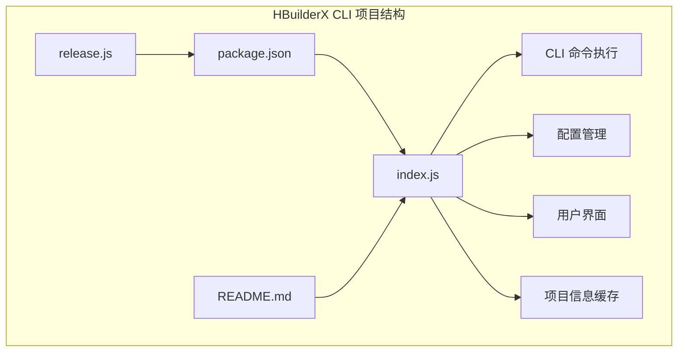
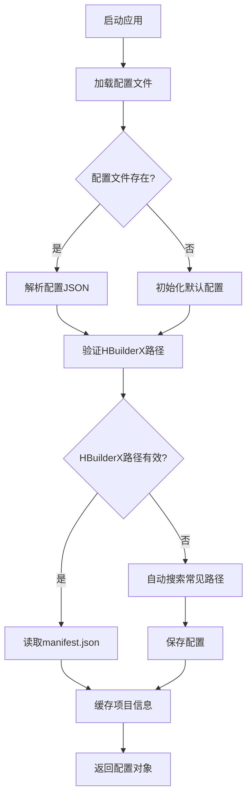
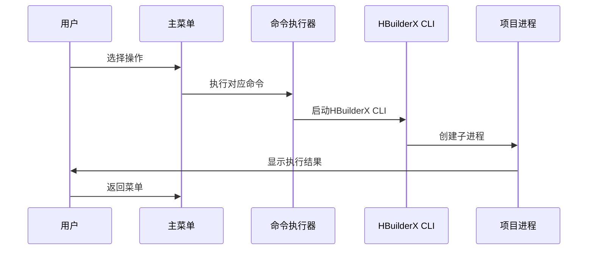
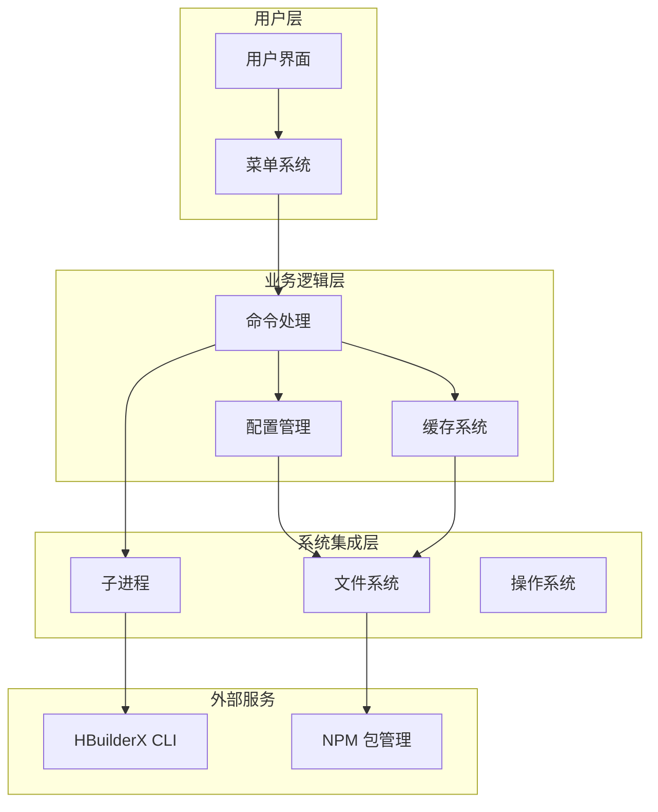
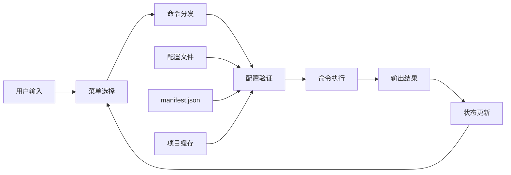
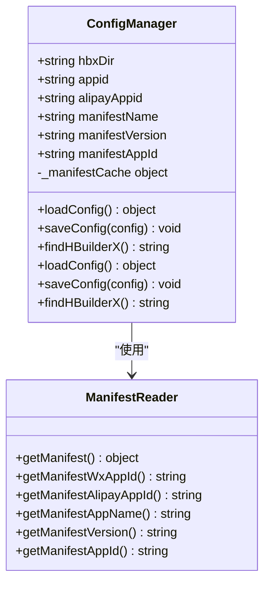
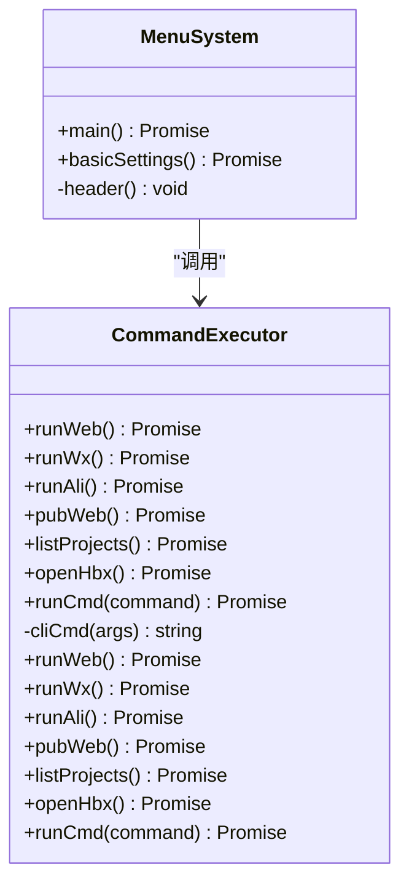
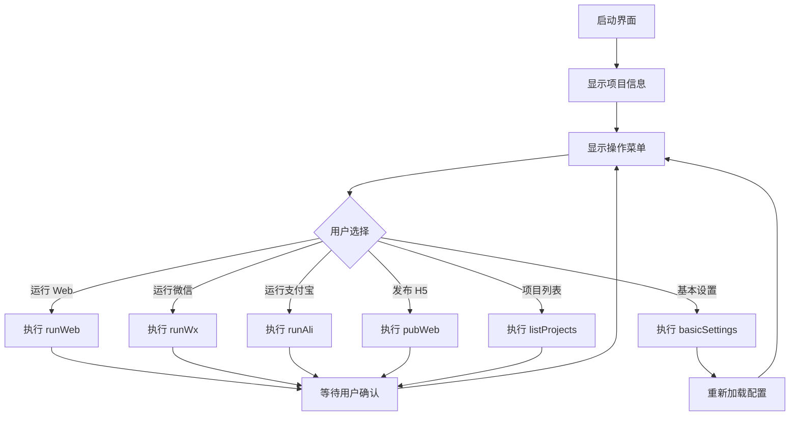
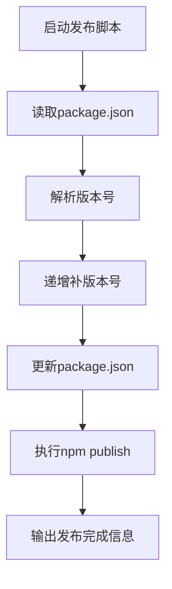

# 开发指南

<cite>
**本文档引用的文件**
- [package.json](file://hbuilderx-cli/package.json)
- [index.js](file://hbuilderx-cli/index.js)
- [README.md](file://hbuilderx-cli/README.md)
- [release.js](file://hbuilderx-cli/release.js)
</cite>

## 目录
1. [简介](#简介)
2. [项目结构](#项目结构)
3. [核心组件](#核心组件)
4. [架构概览](#架构概览)
5. [详细组件分析](#详细组件分析)
6. [依赖分析](#依赖分析)
7. [性能考虑](#性能考虑)
8. [故障排除指南](#故障排除指南)
9. [结论](#结论)
10. [附录](#附录)

## 简介

HBuilderX CLI 是一个用于管理 HBuilderX 开发工具的命令行工具。该工具提供了图形化的交互界面，允许开发者通过简单的菜单操作来执行常见的开发任务，如运行 Web 项目、运行小程序、发布 H5 项目等。

该工具的主要特点：
- 提供基于文本的图形界面（TUI）
- 支持多种平台（Windows/Linux/macOS）
- 自动检测 HBuilderX 安装位置
- 缓存项目配置信息
- 支持微信小程序和支付宝小程序开发

## 项目结构

该项目采用极简的单文件架构设计，所有功能都集中在主入口文件中。



**图表来源**
- [package.json:1-21](file://hbuilderx-cli/package.json#L1-L21)
- [index.js:1-248](file://hbuilderx-cli/index.js#L1-L248)

### 文件职责分工

| 文件名 | 职责 | 主要功能 |
|--------|------|----------|
| package.json | 项目配置 | 定义包信息、依赖、bin 命令映射 |
| index.js | 核心逻辑 | CLI 主程序、命令执行、用户界面 |
| README.md | 文档说明 | 使用指南、功能介绍、配置说明 |
| release.js | 发布脚本 | 自动版本升级和发布 |

**章节来源**
- [package.json:1-21](file://hbuilderx-cli/package.json#L1-L21)
- [index.js:1-248](file://hbuilderx-cli/index.js#L1-L248)
- [README.md:1-53](file://hbuilderx-cli/README.md#L1-L53)

## 核心组件

### 配置管理系统

配置系统负责管理用户设置和项目信息，采用本地文件存储机制。



**图表来源**
- [index.js:67-90](file://hbuilderx-cli/index.js#L67-L90)

### 命令执行引擎

命令执行引擎负责与 HBuilderX CLI 进行交互，支持多种开发场景。



**图表来源**
- [index.js:118-138](file://hbuilderx-cli/index.js#L118-L138)
- [index.js:92-95](file://hbuilderx-cli/index.js#L92-L95)

**章节来源**
- [index.js:38-90](file://hbuilderx-cli/index.js#L38-L90)
- [index.js:118-153](file://hbuilderx-cli/index.js#L118-L153)

## 架构概览

该工具采用事件驱动的循环架构，主要由以下几个核心层次组成：



**图表来源**
- [index.js:1-248](file://hbuilderx-cli/index.js#L1-L248)

### 数据流分析



**图表来源**
- [index.js:210-242](file://hbuilderx-cli/index.js#L210-L242)

## 详细组件分析

### 配置管理组件

配置管理组件负责处理用户设置和项目信息的持久化存储。



**图表来源**
- [index.js:38-90](file://hbuilderx-cli/index.js#L38-L90)

#### 配置文件结构

配置文件采用 JSON 格式存储，位于用户主目录下的隐藏文件中：

| 字段名 | 类型 | 描述 | 示例值 |
|--------|------|------|--------|
| hbxDir | string | HBuilderX 安装目录路径 | `"D:\\HBuilderX"` |
| appid | string | 微信小程序 AppID | `"wx1234567890abcdef"` |
| alipayAppid | string | 支付宝小程序 AppID | `"2021000123456789"` |
| manifestName | string | 项目名称 | `"my-project"` |
| manifestVersion | string | 项目版本 | `"1.0.0"` |
| manifestAppId | string | 应用标识 | `"com.example.app"` |

**章节来源**
- [index.js:67-90](file://hbuilderx-cli/index.js#L67-L90)
- [README.md:36-46](file://hbuilderx-cli/README.md#L36-L46)

### 命令执行组件

命令执行组件负责与 HBuilderX CLI 进行交互，支持多种开发场景。



**图表来源**
- [index.js:165-207](file://hbuilderx-cli/index.js#L165-L207)

#### 支持的命令类型

| 命令 | 功能描述 | 参数说明 |
|------|----------|----------|
| 运行 Web | 在 Chrome 浏览器中运行 Web 项目 | `--project projectName --browser Chrome` |
| 运行微信 | 运行微信小程序 | `--project projectName` |
| 运行支付宝 | 运行支付宝小程序 | `--project projectName` |
| 发布 H5 | 发布 H5 版本 | `--project projectName` |
| 项目列表 | 显示所有项目 | 无参数 |
| 基本设置 | 配置 HBuilderX 安装路径 | 交互式输入 |

**章节来源**
- [index.js:165-207](file://hbuilderx-cli/index.js#L165-L207)

### 用户界面组件

用户界面组件提供了一个基于文本的图形界面，使用现代化的 TUI 设计。



**图表来源**
- [index.js:210-242](file://hbuilderx-cli/index.js#L210-L242)

**章节来源**
- [index.js:105-116](file://hbuilderx-cli/index.js#L105-L116)
- [index.js:210-242](file://hbuilderx-cli/index.js#L210-L242)

## 依赖分析

### 核心依赖关系

```mermaid
graph LR
subgraph "核心依赖"
A[chalk] --> B[颜色输出]
C[@inquirer/prompts] --> D[交互式界面]
E[boxen] --> F[边框输出]
G[ora] --> H[加载动画]
end
subgraph "系统依赖"
I[child_process] --> J[子进程管理]
K[fs] --> L[文件系统操作]
M[path] --> N[路径处理]
O[os] --> P[操作系统信息]
end
subgraph "应用依赖"
Q[package.json] --> R[版本管理]
S[index.js] --> T[主程序逻辑]
end
T --> A
T --> C
T --> E
T --> G
T --> I
T --> K
T --> M
T --> O
```

**图表来源**
- [package.json:14-19](file://hbuilderx-cli/package.json#L14-L19)
- [index.js:1-9](file://hbuilderx-cli/index.js#L1-L9)

### 依赖版本兼容性

| 依赖包 | 当前版本 | 最小版本要求 | 用途 |
|--------|----------|--------------|------|
| chalk | ^4.1.2 | 4.1.2 | 控制台彩色输出 |
| @inquirer/prompts | ^3.0.0 | 3.0.0 | 交互式命令行界面 |
| boxen | ^5.1.2 | 5.1.2 | 创建带边框的文本块 |
| ora | ^5.4.1 | 5.4.1 | 加载动画和状态指示 |
| child_process | 内置 | 无 | 子进程管理 |
| fs | 内置 | 无 | 文件系统操作 |
| path | 内置 | 无 | 路径处理 |
| os | 内置 | 无 | 操作系统信息 |

**章节来源**
- [package.json:14-19](file://hbuilderx-cli/package.json#L14-L19)

## 性能考虑

### 内存管理

- **配置缓存**: 使用 `_manifestCache` 变量缓存 manifest.json 内容，避免重复读取
- **异步操作**: 所有长时间运行的操作都使用 Promise 和 async/await 模式
- **资源清理**: 子进程完成后及时清理，避免内存泄漏

### 执行效率

- **路径查找**: HBuilderX 安装路径搜索采用预定义的常见路径列表
- **命令拼接**: CLI 命令使用模板字符串进行高效拼接
- **进度反馈**: 使用 ora 提供实时进度指示，改善用户体验

### 平台兼容性

- **跨平台支持**: 通过 `process.platform` 判断操作系统，分别使用不同的 shell
- **路径处理**: 使用 `path` 模块处理跨平台路径分隔符
- **权限管理**: 在 Windows 上使用 `windowsHide` 选项隐藏控制台窗口

## 故障排除指南

### 常见问题及解决方案

| 问题类型 | 症状 | 可能原因 | 解决方案 |
|----------|------|----------|----------|
| 未找到 HBuilderX | "未找到"提示 | HBuilderX 未安装或路径不正确 | 在基本设置中手动配置路径 |
| 权限不足 | 执行失败 | 文件权限问题 | 以管理员身份运行或调整文件权限 |
| manifest.json 缺失 | 启动失败 | 项目根目录无配置文件 | 确保在正确的项目目录中运行 |
| 网络连接问题 | 发布失败 | 网络不稳定 | 检查网络连接后重试 |
| 缓存问题 | 配置不生效 | 缓存过期 | 删除配置文件后重启工具 |

### 调试技巧

1. **启用详细日志**: 在命令行中添加调试标志来查看详细执行过程
2. **检查配置文件**: 验证 `~/.hbuilderx-cli.json` 文件格式是否正确
3. **验证路径**: 确认 HBuilderX 安装目录包含 `cli.exe` 文件
4. **测试连接**: 使用简单命令测试与 HBuilderX 的连接

**章节来源**
- [index.js:17-20](file://hbuilderx-cli/index.js#L17-L20)
- [index.js:76-85](file://hbuilderx-cli/index.js#L76-L85)

## 结论

HBuilderX CLI 工具是一个设计精良的命令行开发辅助工具，具有以下优点：

- **简洁高效**: 采用单文件架构，减少了复杂性和维护成本
- **用户友好**: 提供直观的图形化界面和清晰的错误提示
- **功能完整**: 覆盖了日常开发中的主要需求场景
- **易于扩展**: 清晰的模块化设计为功能扩展提供了良好基础

该工具适合希望提高开发效率的 HBuilderX 用户，特别是需要频繁执行常见开发任务的开发者。

## 附录

### 开发环境搭建

1. **系统要求**
   - Node.js >= 14
   - HBuilderX 已安装
   - 项目根目录包含 `manifest.json`

2. **安装步骤**
   ```bash
   npm install -g @a634691481/hb-cli
   ```

3. **基本使用**
   ```bash
   cd 项目根目录
   hb
   ```

### 扩展开发指南

#### 添加新功能的步骤

1. **分析需求**: 确定新功能的具体需求和使用场景
2. **设计接口**: 在菜单系统中添加新的选项
3. **实现逻辑**: 在命令执行部分添加相应的处理函数
4. **测试验证**: 确保新功能在不同平台上正常工作
5. **文档更新**: 更新 README 和相关文档

#### 修改现有命令

1. **定位代码**: 在 `index.js` 中找到对应的命令处理函数
2. **分析影响**: 评估修改对现有功能的影响
3. **编写测试**: 创建单元测试确保功能正确性
4. **提交代码**: 遵循代码规范进行提交

#### 修改用户界面

1. **界面布局**: 在 `header()` 函数中修改显示内容
2. **样式调整**: 使用 chalk 和 boxen 调整颜色和边框
3. **响应式设计**: 确保界面在不同终端大小下正常显示

### 发布流程和版本管理

#### 自动发布脚本

发布脚本提供了完整的自动化发布流程：



**图表来源**
- [release.js:1-19](file://hbuilderx-cli/release.js#L1-L19)

#### 版本管理策略

- **语义化版本控制**: 遵循 MAJOR.MINOR.PATCH 格式
- **自动递增**: 补版本号自动递增，主版本和次版本手动控制
- **发布验证**: 发布前自动更新版本号确保一致性

#### 发布步骤

1. **准备发布**: 确保所有测试通过且代码已合并到主分支
2. **运行发布脚本**: 执行 `npm run release`
3. **验证发布**: 检查 NPM 上的新版本是否可用
4. **更新文档**: 更新相关文档和变更日志

### 代码规范

#### JavaScript 规范

- **ESLint**: 使用标准的 JavaScript 语法规范
- **模块化**: 将功能拆分为独立的模块便于维护
- **注释**: 为复杂逻辑添加详细的注释说明
- **错误处理**: 使用 try-catch 处理可能的异常情况

#### 命名约定

- **变量命名**: 使用驼峰命名法
- **函数命名**: 使用动词开头的动词短语
- **常量命名**: 使用全大写字母和下划线
- **文件命名**: 使用小写和连字符分隔

#### 测试策略

- **单元测试**: 为每个重要函数编写单元测试
- **集成测试**: 测试完整的命令执行流程
- **回归测试**: 确保新功能不影响现有功能
- **跨平台测试**: 在 Windows、Linux 和 macOS 上测试

### 性能优化建议

#### 内存优化

- **及时释放**: 使用完的缓存及时清理
- **批量操作**: 对于大量数据操作使用批量处理
- **延迟加载**: 按需加载非关键功能

#### I/O 优化

- **缓存策略**: 对频繁访问的数据使用缓存
- **异步处理**: 使用异步 I/O 操作避免阻塞
- **文件监控**: 使用文件系统监控减少轮询

#### 网络优化

- **连接复用**: 复用网络连接减少开销
- **超时控制**: 设置合理的超时时间
- **重试机制**: 实现智能的重试策略

### 贡献指南

#### 开发流程

1. **Fork 仓库**: Fork 项目到自己的 GitHub 账户
2. **创建分支**: 基于 main 分支创建功能分支
3. **开发实现**: 实现功能并编写测试
4. **代码审查**: 提交 Pull Request 进行代码审查
5. **合并发布**: 维护者审核通过后合并到主分支

#### 协作规范

- **提交信息**: 使用清晰的提交信息描述变更内容
- **分支命名**: 使用功能或修复相关的分支命名
- **代码风格**: 遵循项目既有的代码风格
- **文档更新**: 更新相关文档说明新功能

#### 问题报告

- **问题模板**: 使用提供的问题模板详细描述问题
- **重现步骤**: 提供完整的重现步骤
- **环境信息**: 包含操作系统、Node.js 版本等信息
- **日志信息**: 提供相关的错误日志