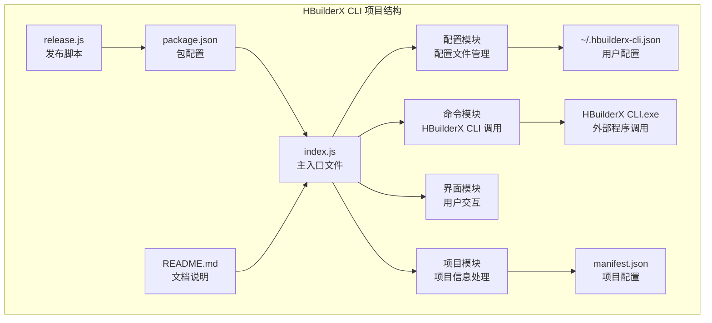
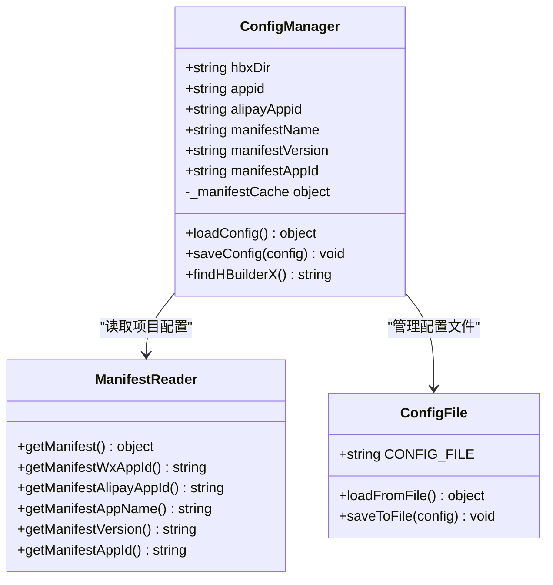
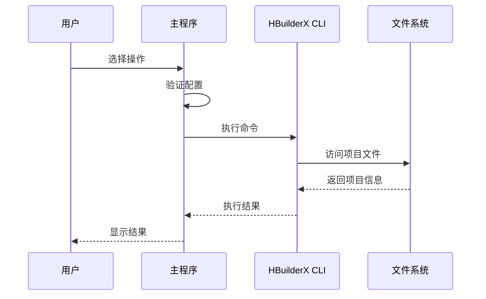
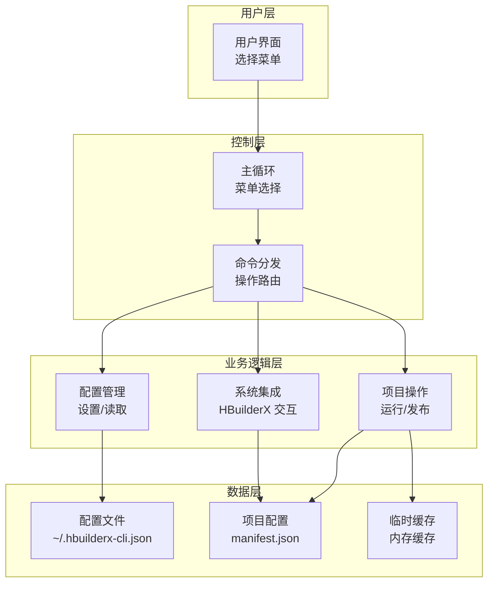
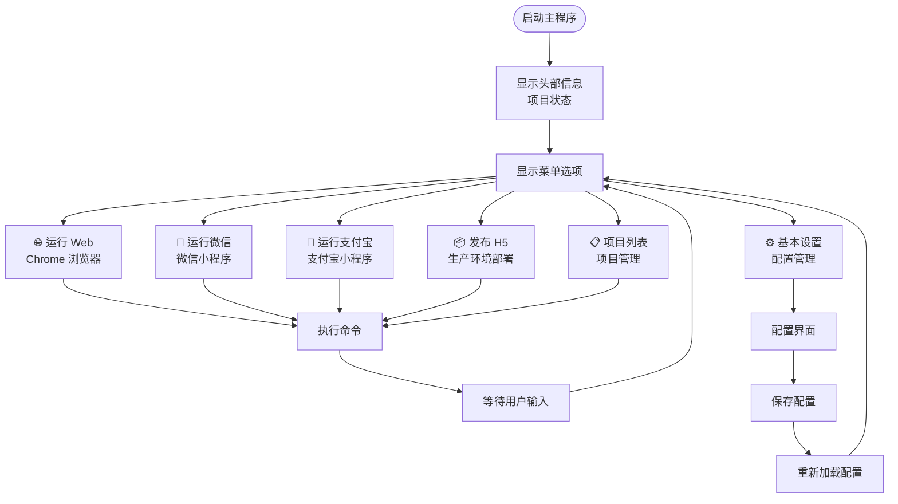
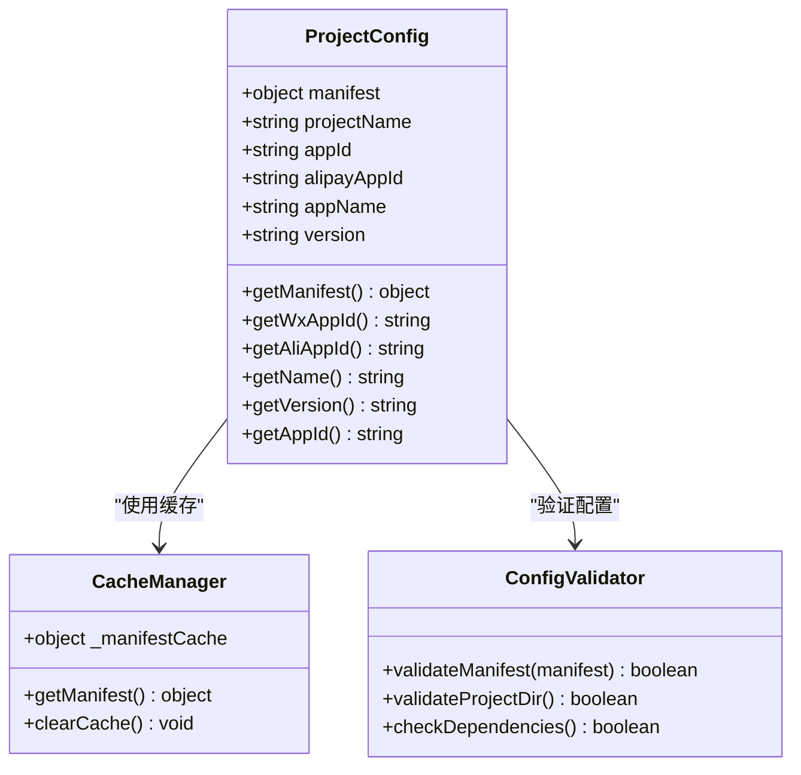
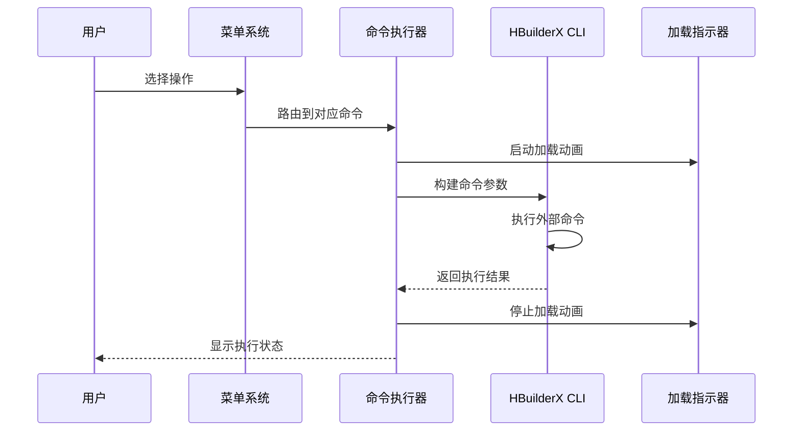
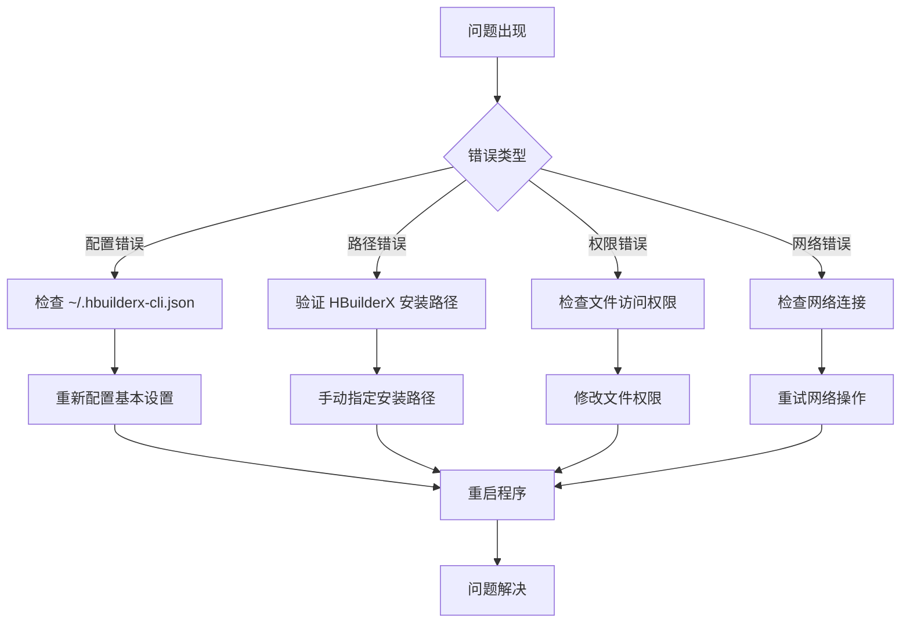

# 扩展开发

<cite>
**本文引用的文件**
- [package.json](file://hbuilderx-cli/package.json)
- [index.js](file://hbuilderx-cli/index.js)
- [README.md](file://hbuilderx-cli/README.md)
- [release.js](file://hbuilderx-cli/release.js)
</cite>

## 目录
1. [简介](#简介)
2. [项目结构](#项目结构)
3. [核心组件](#核心组件)
4. [架构概览](#架构概览)
5. [详细组件分析](#详细组件分析)
6. [依赖关系分析](#依赖关系分析)
7. [性能考虑](#性能考虑)
8. [故障排除指南](#故障排除指南)
9. [结论](#结论)
10. [附录](#附录)

## 简介

HBuilderX CLI 是一个基于 Node.js 的全局命令行工具，用于管理和控制 HBuilderX 开发环境。该工具通过提供图形化的菜单界面，简化了 HBuilderX 的日常操作，包括项目运行、发布、项目管理等功能。

该项目采用模块化设计，具有清晰的功能分离：配置管理、命令执行、用户界面和项目交互。工具会自动检测 HBuilderX 安装位置，并从项目的 manifest.json 文件中读取配置信息。

## 项目结构

项目采用简洁的单文件架构设计，所有功能都集中在主入口文件中：



**图表来源**
- [package.json:1-21](file://hbuilderx-cli/package.json#L1-L21)
- [index.js:1-248](file://hbuilderx-cli/index.js#L1-L248)

**章节来源**
- [package.json:1-21](file://hbuilderx-cli/package.json#L1-L21)
- [README.md:1-53](file://hbuilderx-cli/README.md#L1-L53)

## 核心组件

### 配置管理系统

配置系统是整个工具的核心基础设施，负责管理用户设置和项目信息：



**图表来源**
- [index.js:38-90](file://hbuilderx-cli/index.js#L38-L90)

### 命令执行引擎

命令执行引擎负责与 HBuilderX CLI 进行交互，支持多种操作模式：



**图表来源**
- [index.js:92-138](file://hbuilderx-cli/index.js#L92-L138)

**章节来源**
- [index.js:11-90](file://hbuilderx-cli/index.js#L11-L90)

## 架构概览

系统采用事件驱动的循环架构，主要由以下几个层次组成：



**图表来源**
- [index.js:209-242](file://hbuilderx-cli/index.js#L209-L242)

## 详细组件分析

### 主菜单系统

主菜单系统提供了直观的操作界面，支持多种开发场景：



**图表来源**
- [index.js:210-242](file://hbuilderx-cli/index.js#L210-L242)

### 项目配置管理

项目配置管理模块负责从 manifest.json 中提取和管理项目信息：



**图表来源**
- [index.js:38-65](file://hbuilderx-cli/index.js#L38-L65)

**章节来源**
- [index.js:165-207](file://hbuilderx-cli/index.js#L165-L207)

### 命令执行流程

命令执行系统提供了统一的命令处理机制：



**图表来源**
- [index.js:117-138](file://hbuilderx-cli/index.js#L117-L138)

**章节来源**
- [index.js:92-138](file://hbuilderx-cli/index.js#L92-L138)

## 依赖关系分析

项目依赖关系相对简单但功能明确：

```mermaid
graph LR
subgraph "核心依赖"
A[chalk<br/>彩色输出] --> D[index.js]
B[@inquirer/prompts<br/>交互式界面] --> D
C[boxen<br/>边框文本] --> D
E[ora<br/>加载指示器] --> D
end
subgraph "系统依赖"
F[child_process<br/>进程管理] --> D
G[path<br/>路径处理] --> D
H[fs<br/>文件系统] --> D
I[os<br/>操作系统] --> D
end
subgraph "项目文件"
J[package.json] --> K[发布配置]
L[index.js] --> M[主程序逻辑]
N[README.md] --> O[使用说明]
P[release.js] --> Q[版本管理]
end
D --> R[运行时依赖]
R --> S[Node.js 环境]
```

**图表来源**
- [package.json:14-19](file://hbuilderx-cli/package.json#L14-L19)
- [index.js:1-10](file://hbuilderx-cli/index.js#L1-L10)

**章节来源**
- [package.json:14-19](file://hbuilderx-cli/package.json#L14-L19)

## 性能考虑

### 缓存机制优化

系统实现了智能缓存机制来提升性能：

- **清单缓存**：项目配置信息缓存在内存中，避免重复读取
- **配置持久化**：用户配置保存到本地文件，减少初始化时间
- **路径查找优化**：预定义常见安装路径，减少搜索时间

### 并发处理

系统采用异步编程模型，支持非阻塞操作：
- 使用 Promise 和 async/await 处理异步操作
- 进程间通信使用 child_process 模块
- 用户交互使用 @inquirer/prompts 提供响应式界面

## 故障排除指南

### 常见问题诊断



### 错误处理机制

系统提供了多层次的错误处理：

1. **配置验证**：启动时检查必需文件和路径
2. **命令执行监控**：捕获进程执行异常
3. **用户反馈**：友好的错误消息和恢复建议

**章节来源**
- [index.js:17-20](file://hbuilderx-cli/index.js#L17-L20)
- [index.js:132-137](file://hbuilderx-cli/index.js#L132-L137)

## 结论

HBuilderX CLI 工具展现了优秀的模块化设计和用户体验。其核心优势包括：

- **简洁的架构**：单文件设计便于维护和扩展
- **智能配置**：自动检测和缓存机制提升效率
- **用户友好**：图形化界面和清晰的反馈信息
- **可扩展性**：模块化设计为功能扩展提供了良好基础

该工具为 HBuilderX 开发者提供了高效的命令行解决方案，通过合理的架构设计和错误处理机制，确保了良好的用户体验和稳定性。

## 附录

### 扩展开发最佳实践

#### 添加新命令的步骤

1. **定义命令函数**：在命令模块区域添加新的异步函数
2. **更新菜单选项**：在主菜单中添加对应的选项
3. **实现命令逻辑**：使用现有的命令执行框架
4. **测试集成**：验证新命令与现有系统的兼容性

#### 配置管理扩展

- **新增配置项**：在配置对象中添加新字段
- **配置文件迁移**：处理旧版本配置的兼容性
- **默认值设置**：为新配置项提供合理的默认值

#### 向后兼容性策略

- **渐进式更新**：避免破坏性的 API 变更
- **配置版本管理**：跟踪配置格式的变化
- **错误降级**：在新功能不可用时提供回退方案