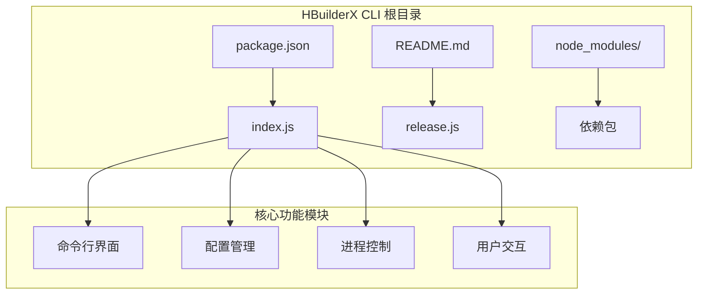
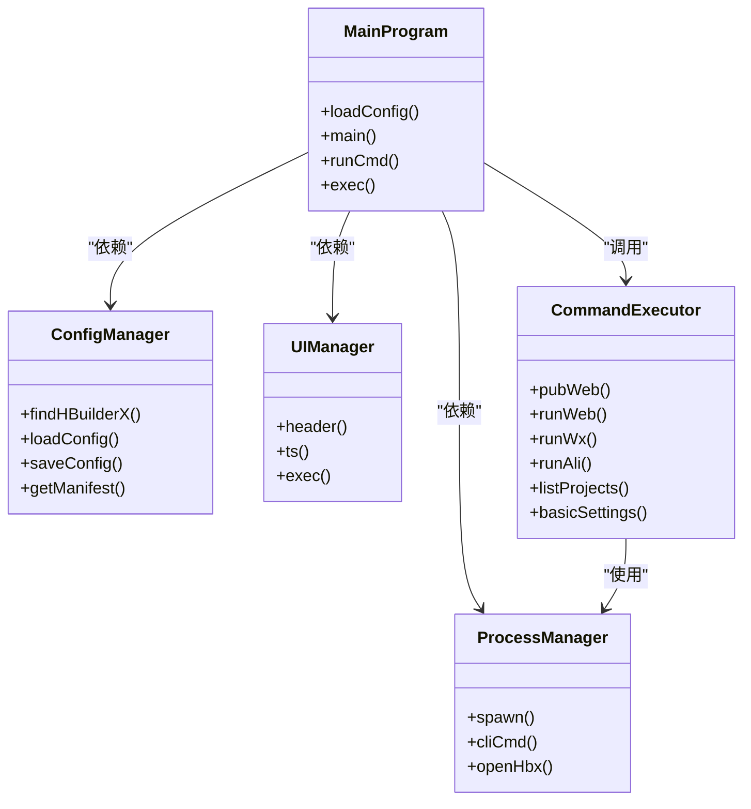
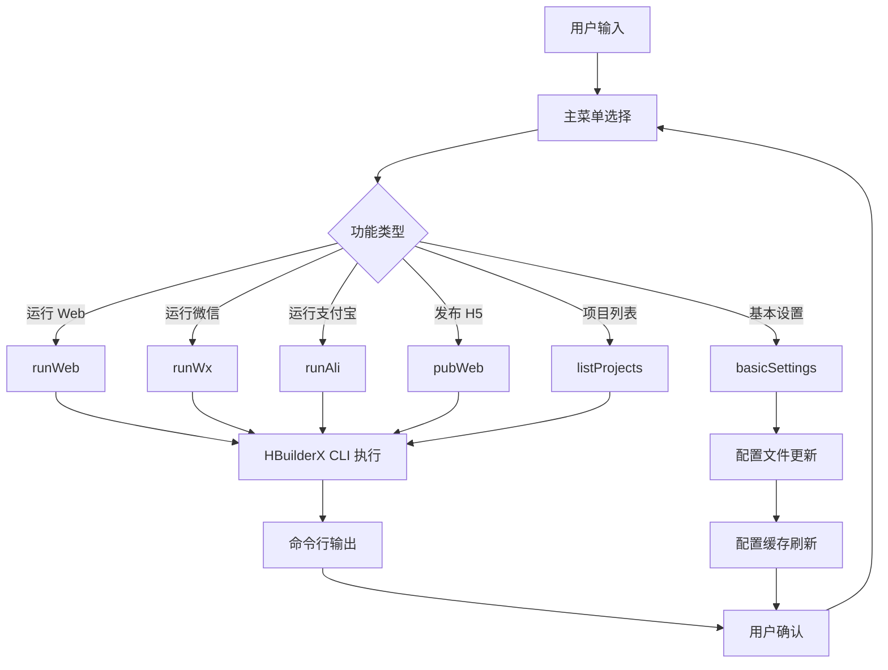
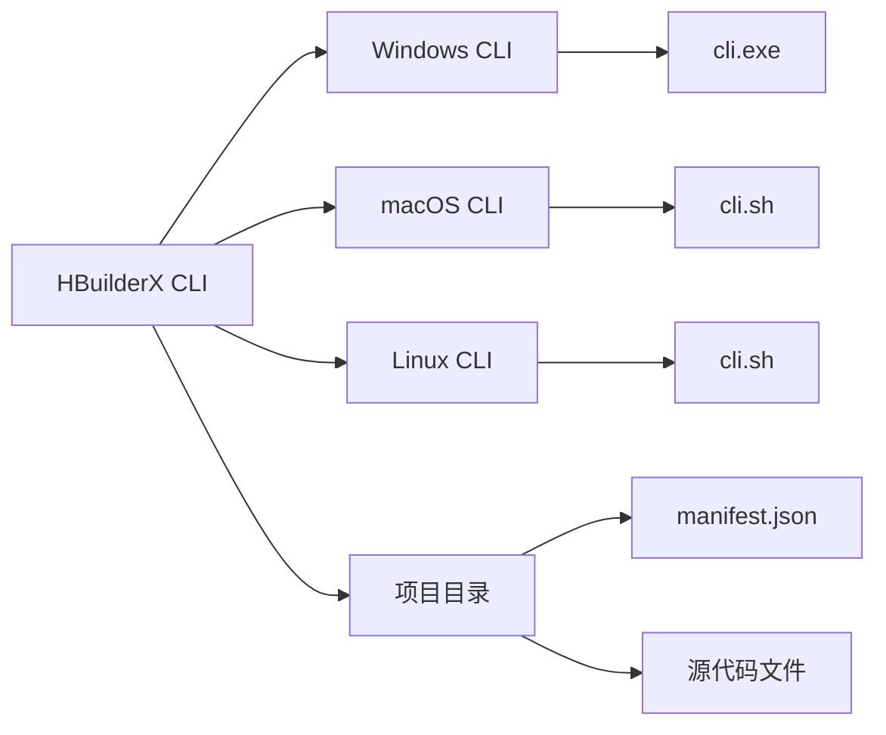
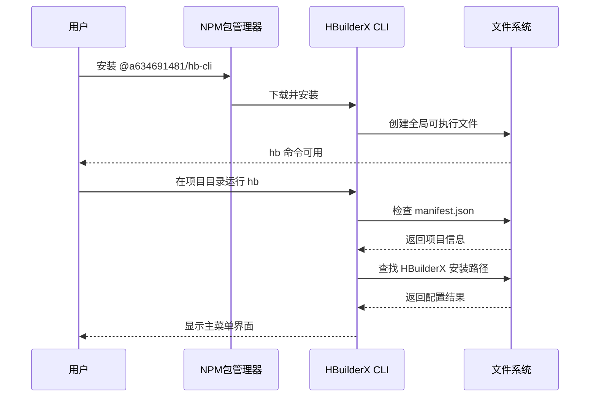

# 项目结构

<cite>
**本文档引用的文件**
- [package.json](file://hbuilderx-cli/package.json)
- [index.js](file://hbuilderx-cli/index.js)
- [README.md](file://hbuilderx-cli/README.md)
- [release.js](file://hbuilderx-cli/release.js)
</cite>

## 目录结构概览

该项目采用简洁的单模块架构，主要包含以下核心文件：

**图表来源**
- [package.json:1-21](file://hbuilderx-cli/package.json#L1-L21)
- [index.js:1-248](file://hbuilderx-cli/index.js#L1-L248)

## 项目结构分析

### 核心文件职责

#### package.json - 项目配置中心
作为 npm 包的核心配置文件，负责定义包的基本信息、依赖关系和发布配置。

**关键配置项解析：**
- **包标识**: `@a634691481/hb-cli` - 使用命名空间的私有包标识
- **版本管理**: `1.0.39` - 当前版本号，支持语义化版本控制
- **二进制入口**: `"bin": {"hb": "index.js"}` - 定义全局命令 `hb` 指向主程序
- **发布配置**: `"publishConfig": {"access": "public"}` - 设置为公开包
- **依赖管理**: 四个核心依赖包，分别处理不同功能领域

#### index.js - 主程序入口
采用模块化设计的单体式主程序，集成了完整的 CLI 功能。

**模块化设计特点：**
- **配置模块** (第11-15行): 定义全局常量和环境变量
- **工具函数模块** (第31-90行): 提供 HBuilderX 路径查找和配置管理
- **显示模块** (第100-116行): 负责界面输出和格式化显示
- **命令执行模块** (第118-138行): 处理命令执行和进程管理
- **业务逻辑模块** (第165-207行): 实现具体的功能命令
- **主循环模块** (第210-242行): 控制程序流程和用户交互

#### release.js - 自动发布工具
提供版本管理和自动发布的辅助脚本。

**发布流程：**
1. 读取当前版本号
2. 自动递增补版本号
3. 更新 package.json
4. 执行 npm 发布

#### README.md - 项目文档
提供完整的使用说明、功能介绍和配置指南。

**文档内容结构：**
- 安装说明和使用示例
- 功能列表和操作指南
- 环境要求和注意事项
- 配置文件格式说明

## 核心组件架构

### 模块化设计模式

**图表来源**
- [index.js:31-90](file://hbuilderx-cli/index.js#L31-L90)
- [index.js:100-138](file://hbuilderx-cli/index.js#L100-L138)
- [index.js:165-207](file://hbuilderx-cli/index.js#L165-L207)

### 数据流架构

**图表来源**
- [index.js:210-242](file://hbuilderx-cli/index.js#L210-L242)
- [index.js:165-207](file://hbuilderx-cli/index.js#L165-L207)

## 依赖关系分析

### 核心依赖包

| 依赖包 | 版本 | 功能用途 | 作用域 |
|--------|------|----------|--------|
| chalk | ^4.1.2 | 命令行颜色输出 | UI 样式 |
| @inquirer/prompts | ^3.0.0 | 交互式用户界面 | 用户交互 |
| boxen | ^5.1.2 | 边框文本框渲染 | 界面美化 |
| ora | ^5.4.1 | 加载动画效果 | 进度指示 |

### 外部系统集成

**图表来源**
- [index.js:22-29](file://hbuilderx-cli/index.js#L22-L29)
- [index.js:92-95](file://hbuilderx-cli/index.js#L92-L95)

## 文件命名规范与最佳实践

### 命名约定

**主程序文件**: `index.js`
- 采用标准的 npm 包入口文件命名
- 支持直接通过 `node index.js` 或全局命令调用

**配置文件**: `.hbuilderx-cli.json`
- 位于用户主目录下的隐藏配置文件
- 使用 JSON 格式存储用户偏好设置

**发布脚本**: `release.js`
- 专用的自动化发布工具
- 便于版本管理和持续集成

### 代码组织最佳实践

1. **模块化分层**: 将功能按职责划分为独立模块
2. **错误处理**: 统一的异常捕获和错误提示机制
3. **配置分离**: 环境配置与业务逻辑分离
4. **异步处理**: 使用 Promise 和 async/await 处理异步操作
5. **资源清理**: 及时释放进程句柄和缓存资源

## 项目初始化与配置步骤

### 环境准备

1. **Node.js 环境**
   - 要求版本: Node.js >= 14
   - 验证命令: `node --version`

2. **HBuilderX 安装**
   - 支持的安装路径:
     - `D:\HBuilderX`
     - `C:\Program Files\HBuilderX`
     - `C:\Program Files (x86)\HBuilderX`
   - CLI 工具检查: `cli.exe` 存在性验证

### 安装与配置流程

**图表来源**
- [README.md:5-17](file://hbuilderx-cli/README.md#L5-L17)
- [index.js:17-20](file://hbuilderx-cli/index.js#L17-L20)
- [index.js:67-86](file://hbuilderx-cli/index.js#L67-L86)

### 基本配置步骤

1. **首次运行**
   - 在包含 `manifest.json` 的项目目录中运行 `hb`
   - 系统检测到缺少 HBuilderX 路径配置

2. **配置 HBuilderX 路径**
   - 选择 "基本设置" 功能
   - 输入正确的 HBuilderX 安装目录
   - 系统自动验证路径有效性

3. **验证配置**
   - 重新运行 `hb` 命令
   - 界面显示 "工具" 字段为绿色状态
   - 可以正常访问所有功能选项

## 性能优化建议

### 内存管理
- **缓存策略**: 使用 `_manifestCache` 缓存 manifest.json 内容
- **资源释放**: 及时清理进程句柄和定时器
- **异步处理**: 避免阻塞主线程的操作

### I/O 优化
- **文件读写**: 合理使用同步和异步文件操作
- **网络请求**: 减少不必要的外部请求
- **磁盘访问**: 最小化频繁的文件系统操作

### 用户体验优化
- **进度反馈**: 使用 ora 提供实时进度指示
- **错误处理**: 提供清晰的错误信息和解决方案
- **响应速度**: 优化命令执行时间和界面响应

## 故障排除指南

### 常见问题及解决方案

**问题1: 未找到 HBuilderX 安装路径**
- 检查 HBuilderX 是否正确安装
- 验证 `cli.exe` 文件是否存在
- 手动配置正确的安装目录

**问题2: manifest.json 文件缺失**
- 确认当前目录是否为 HBuilderX 项目根目录
- 检查项目结构是否完整
- 重新初始化项目或切换到正确目录

**问题3: 权限不足**
- 确认对 HBuilderX 目录的读取权限
- 检查防火墙和安全软件设置
- 以管理员权限运行命令

**问题4: 网络连接问题**
- 检查网络连接状态
- 验证 npm registry 配置
- 尝试使用代理服务器

### 调试方法

1. **启用详细日志**: 在开发环境中添加调试输出
2. **单元测试**: 为关键函数编写测试用例
3. **性能监控**: 使用性能分析工具识别瓶颈
4. **错误追踪**: 实现完善的错误日志记录

## 结论

HBuilderX CLI 工具项目展现了优秀的模块化设计和用户体验设计。通过合理的文件组织、清晰的职责划分和完善的错误处理机制，该工具为 HBuilderX 用户提供了便捷的命令行操作体验。

项目的主要优势包括：
- **简洁的架构**: 单体式设计便于维护和部署
- **强大的功能**: 覆盖 HBuilderX 开发的各个环节
- **友好的界面**: 使用现代化的 CLI 设计理念
- **可靠的稳定性**: 完善的错误处理和配置管理

未来可以考虑的功能扩展包括：
- 添加更多 HBuilderX 功能支持
- 实现插件化架构
- 增强跨平台兼容性
- 提供配置模板和预设方案