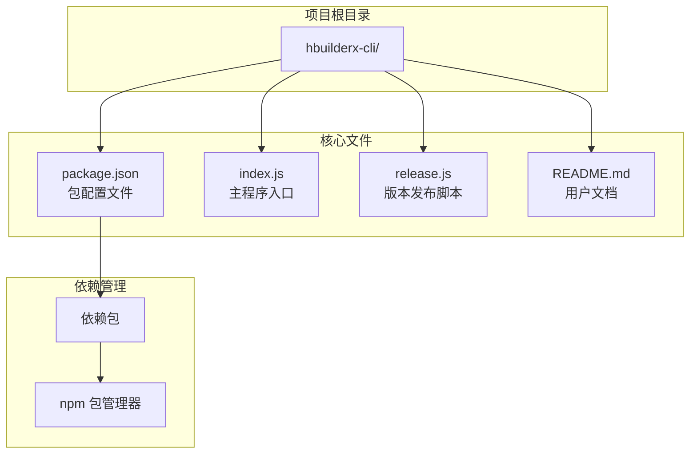
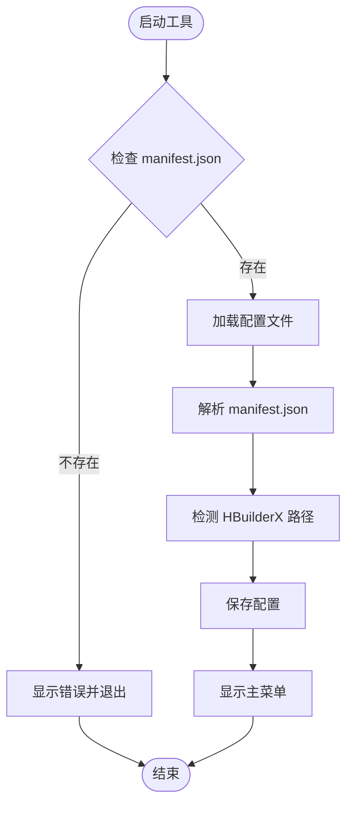
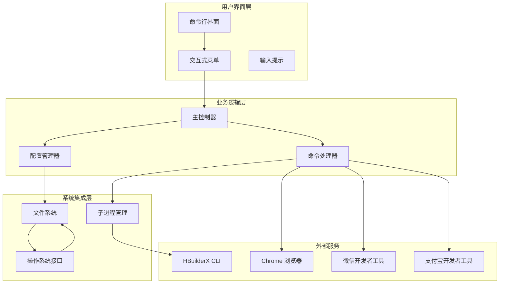
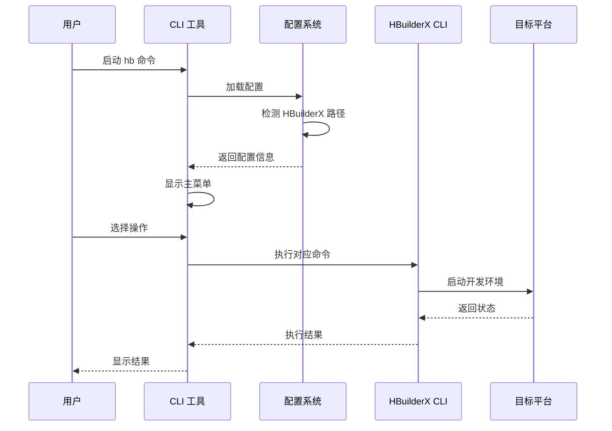
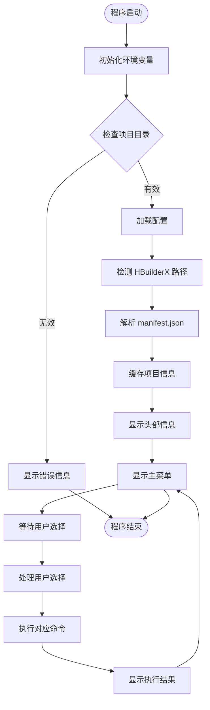
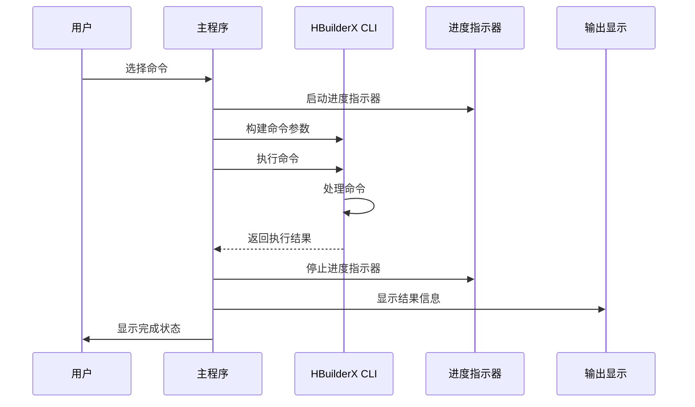
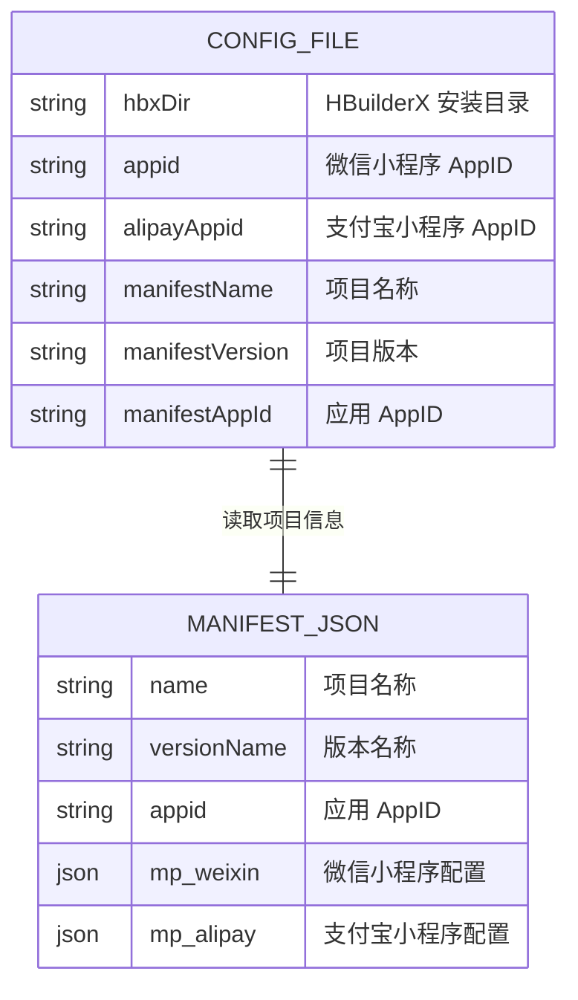
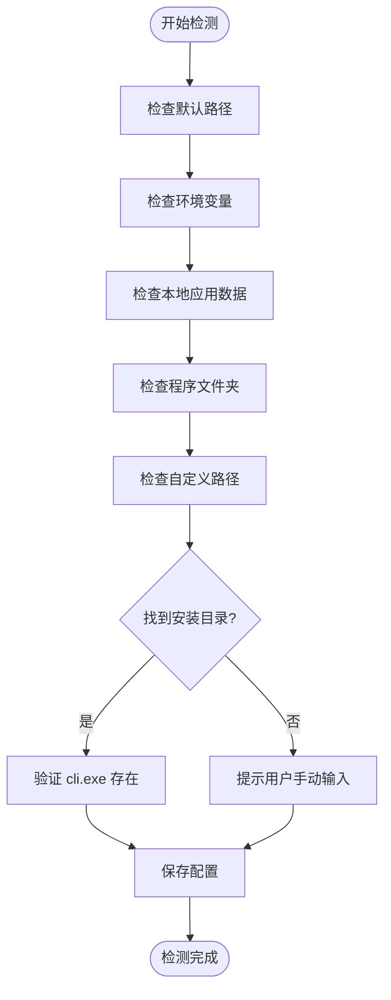
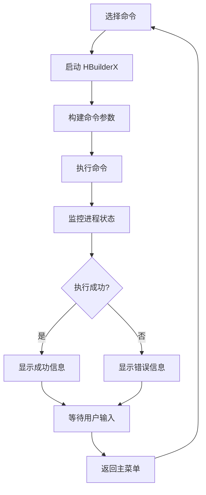
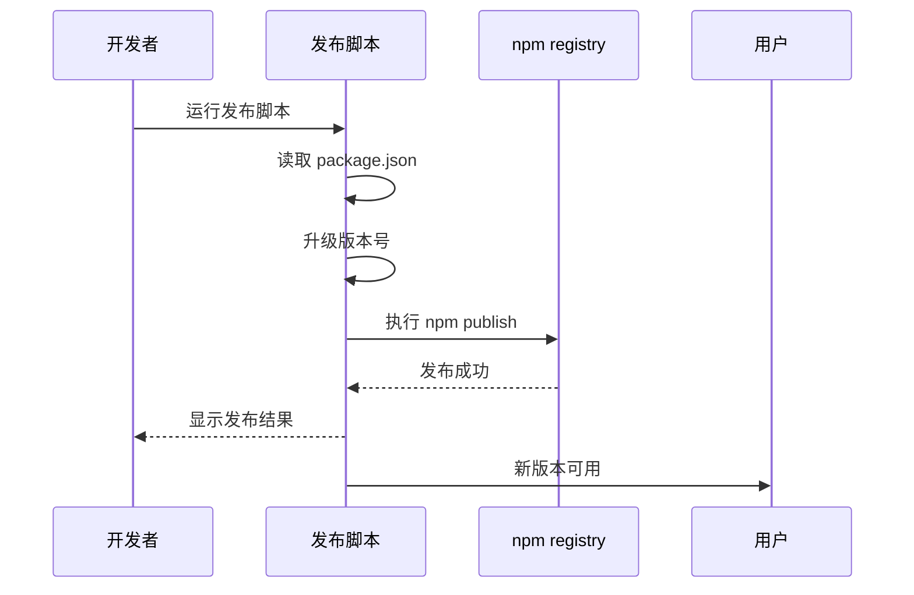

# 快速开始

<cite>
**本文档引用的文件**
- [package.json](file://hbuilderx-cli/package.json)
- [README.md](file://hbuilderx-cli/README.md)
- [index.js](file://hbuilderx-cli/index.js)
- [release.js](file://hbuilderx-cli/release.js)
</cite>

## 目录
1. [简介](#简介)
2. [项目结构](#项目结构)
3. [核心组件](#核心组件)
4. [架构概览](#架构概览)
5. [详细组件分析](#详细组件分析)
6. [依赖分析](#依赖分析)
7. [性能考虑](#性能考虑)
8. [故障排除指南](#故障排除指南)
9. [结论](#结论)

## 简介

HBuilderX CLI 是一个强大的全局命令行工具，专为 HBuilderX 开发者设计。该工具提供了直观的交互式界面，支持多种开发场景，包括 Web 项目运行、微信小程序和支付宝小程序的调试运行，以及项目的发布管理。

该工具的核心优势在于其简化的命令行接口，通过可视化的菜单系统让用户能够轻松地执行各种开发任务，而无需记住复杂的命令参数。

## 项目结构

HBuilderX CLI 项目采用简洁的单文件架构设计：



**图表来源**
- [package.json:1-21](file://hbuilderx-cli/package.json#L1-L21)
- [index.js:1-248](file://hbuilderx-cli/index.js#L1-L248)

**章节来源**
- [package.json:1-21](file://hbuilderx-cli/package.json#L1-L21)
- [README.md:1-53](file://hbuilderx-cli/README.md#L1-L53)

## 核心组件

### 主要功能模块

HBuilderX CLI 提供了完整的开发工作流支持，主要功能包括：

| 功能类别 | 命令标识 | 描述 |
|---------|---------|------|
| Web 项目运行 | 🌐 | 在 Chrome 浏览器中运行项目 |
| 微信小程序运行 | 💬 | 运行微信小程序调试环境 |
| 支付宝小程序运行 | 📎 | 运行支付宝小程序调试环境 |
| H5 项目发布 | 📦 | 发布 H5 版本到目标平台 |
| 项目列表查看 | 📋 | 显示当前工作区的所有项目 |
| 基础设置配置 | ⚙ | 配置 HBuilderX 安装路径 |

### 配置管理系统

工具采用智能配置管理机制，自动检测和缓存项目信息：



**图表来源**
- [index.js:16-86](file://hbuilderx-cli/index.js#L16-L86)

**章节来源**
- [index.js:16-86](file://hbuilderx-cli/index.js#L16-L86)
- [README.md:19-28](file://hbuilderx-cli/README.md#L19-L28)

## 架构概览

### 系统架构图



**图表来源**
- [index.js:1-248](file://hbuilderx-cli/index.js#L1-L248)

### 数据流架构



**图表来源**
- [index.js:210-242](file://hbuilderx-cli/index.js#L210-L242)

## 详细组件分析

### 主程序入口分析

#### 核心执行流程



**图表来源**
- [index.js:11-97](file://hbuilderx-cli/index.js#L11-L97)

#### 命令执行机制

每个命令都遵循统一的执行模式：



**图表来源**
- [index.js:118-138](file://hbuilderx-cli/index.js#L118-L138)

**章节来源**
- [index.js:11-97](file://hbuilderx-cli/index.js#L11-L97)
- [index.js:118-138](file://hbuilderx-cli/index.js#L118-L138)

### 配置管理系统

#### 配置文件结构

配置文件采用 JSON 格式存储，位置位于用户主目录下的隐藏文件中：



**图表来源**
- [index.js:67-86](file://hbuilderx-cli/index.js#L67-L86)

#### 路径检测算法

工具内置了智能的 HBuilderX 安装路径检测机制：



**图表来源**
- [index.js:31-36](file://hbuilderx-cli/index.js#L31-L36)

**章节来源**
- [index.js:31-36](file://hbuilderx-cli/index.js#L31-L36)
- [index.js:67-86](file://hbuilderx-cli/index.js#L67-L86)

### 命令处理系统

#### 命令映射表

| 命令值 | 功能描述 | 对应 HBuilderX 命令 |
|-------|---------|-------------------|
| '1' | 发布 H5 | `publish web --project {项目名}` |
| '3' | 运行 Web | `launch web --project {项目名} --browser Chrome` |
| '4' | 运行微信 | `launch mp-weixin --project {项目名}` |
| '5' | 运行支付宝 | `launch mp-alipay --project {项目名}` |
| '6' | 项目列表 | `project list` |
| 's' | 基础设置 | 配置 HBuilderX 安装路径 |

#### 异步执行流程



**图表来源**
- [index.js:165-189](file://hbuilderx-cli/index.js#L165-L189)

**章节来源**
- [index.js:165-189](file://hbuilderx-cli/index.js#L165-L189)

## 依赖分析

### 核心依赖关系

```mermaid
graph TB
subgraph "外部依赖"
Chalk[chalk@^4.1.2<br/>彩色输出]
Inquirer[@inquirer/prompts@^3.0.0<br/>交互式提示]
Boxen[boxen@^5.1.2<br/>框体装饰]
Ora[ora@^5.4.1<br/>进度指示器]
end
subgraph "内置模块"
FS[fs<br/>文件系统]
Path[path<br/>路径处理]
ChildProc[child_process<br/>子进程]
Os[os<br/>操作系统]
Console[console<br/>控制台]
end
subgraph "主程序"
Index[index.js]
end
Index --> Chalk
Index --> Inquirer
Index --> Boxen
Index --> Ora
Index --> FS
Index --> Path
Index --> ChildProc
Index --> Os
Index --> Console
```

**图表来源**
- [package.json:14-19](file://hbuilderx-cli/package.json#L14-L19)
- [index.js:1-9](file://hbuilderx-cli/index.js#L1-L9)

### 版本发布流程



**图表来源**
- [release.js:1-19](file://hbuilderx-cli/release.js#L1-L19)

**章节来源**
- [package.json:14-19](file://hbuilderx-cli/package.json#L14-L19)
- [release.js:1-19](file://hbuilderx-cli/release.js#L1-L19)

## 性能考虑

### 内存管理策略

工具采用了高效的内存管理策略：

- **缓存机制**：项目配置信息缓存在内存中，避免重复读取
- **延迟加载**：配置文件仅在需要时才进行解析
- **资源清理**：进程结束后自动清理相关资源

### 执行效率优化

- **异步处理**：所有命令执行都是异步的，不会阻塞用户界面
- **进度反馈**：使用进度指示器提供实时执行状态
- **错误处理**：完善的错误捕获和恢复机制

## 故障排除指南

### 常见问题及解决方案

#### 1. 项目目录检测失败

**问题症状**：
- 显示 "当前目录不是 HBuilderX 项目（未找到 manifest.json）"

**解决方法**：
1. 确认当前目录包含 `manifest.json` 文件
2. 检查项目是否为有效的 HBuilderX 项目
3. 使用正确的项目根目录

#### 2. HBuilderX 路径检测失败

**问题症状**：
- 显示 "未找到" 的工具路径
- 基本设置中提示需要配置 HBuilderX 安装路径

**解决方法**：
1. 手动输入 HBuilderX 的安装目录
2. 确认 `cli.exe` 文件存在于指定目录
3. 使用默认推荐路径：`D:\HBuilderX`

#### 3. 命令执行失败

**问题症状**：
- 命令执行后显示失败状态
- 返回非零退出码

**解决方法**：
1. 检查 HBuilderX 是否正常安装
2. 确认项目配置正确
3. 查看具体的错误信息

#### 4. 权限问题

**问题症状**：
- 访问配置文件时出现权限错误
- 无法写入配置文件

**解决方法**：
1. 检查用户权限
2. 确认主目录可写
3. 以管理员身份运行

**章节来源**
- [index.js:17-20](file://hbuilderx-cli/index.js#L17-L20)
- [index.js:76-78](file://hbuilderx-cli/index.js#L76-L78)
- [README.md:48-53](file://hbuilderx-cli/README.md#L48-L53)

## 结论

HBuilderX CLI 工具为开发者提供了一个强大而易用的命令行解决方案。通过其直观的交互式界面和完善的自动化功能，开发者可以高效地管理各种类型的项目。

### 主要优势

1. **简单易用**：通过可视化的菜单系统简化复杂操作
2. **功能全面**：支持 Web、微信小程序、支付宝小程序等多种开发场景
3. **智能配置**：自动检测和缓存配置信息
4. **错误友好**：提供清晰的错误信息和解决方案

### 最佳实践建议

1. **定期更新**：保持工具版本最新以获得最佳体验
2. **正确配置**：首次使用时仔细配置 HBuilderX 路径
3. **项目规范**：确保项目包含完整的 `manifest.json` 文件
4. **权限管理**：确保有足够的文件系统权限

该工具特别适合新手开发者快速上手，同时也为经验丰富的开发者提供了高效的开发辅助。