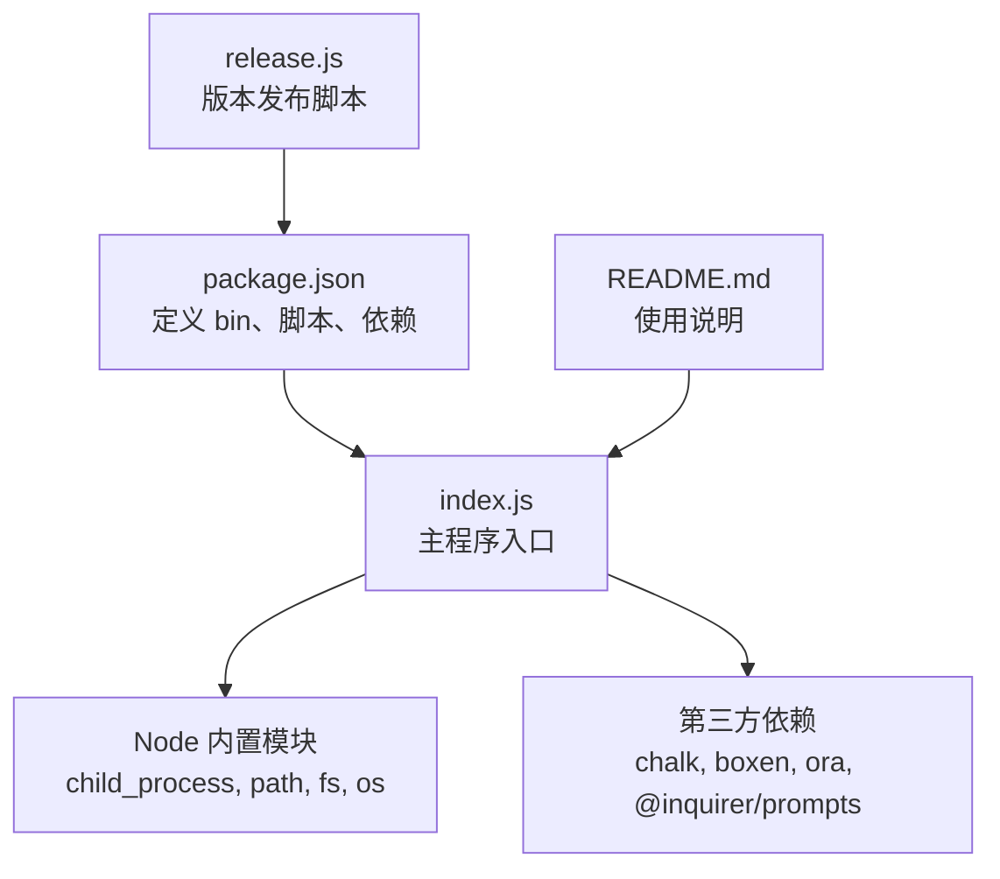
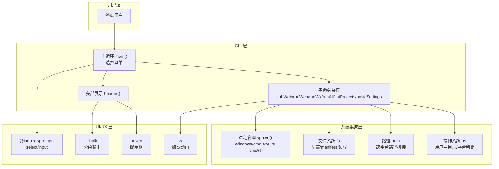
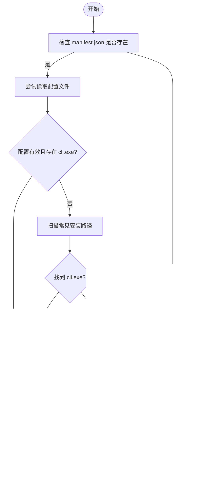
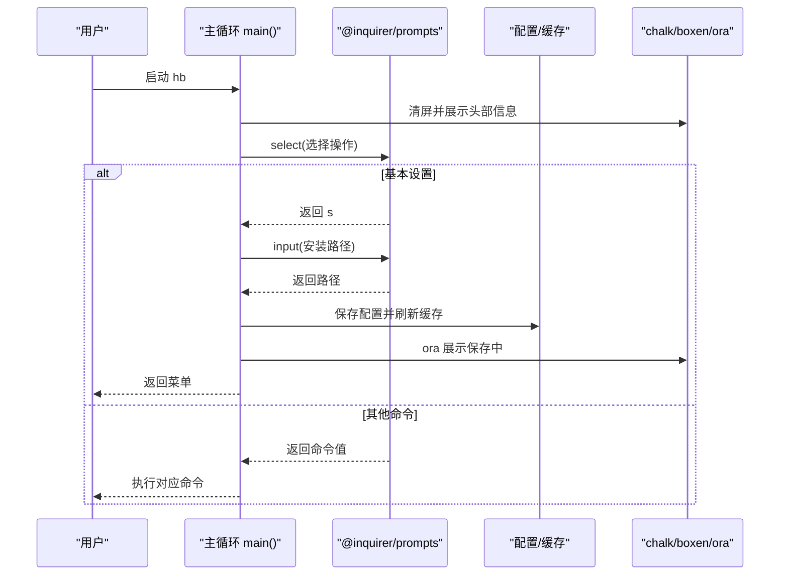
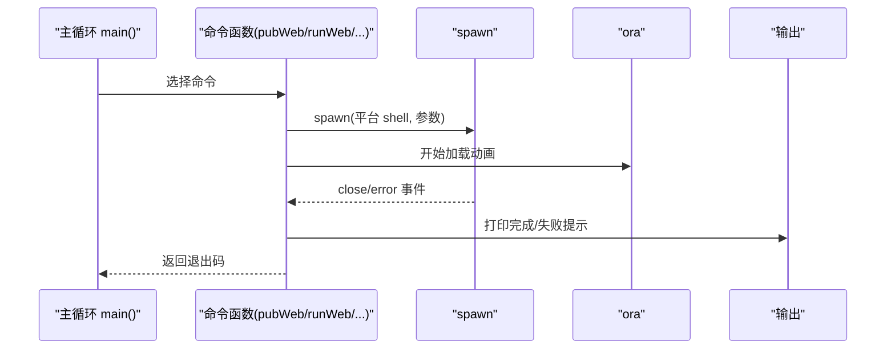
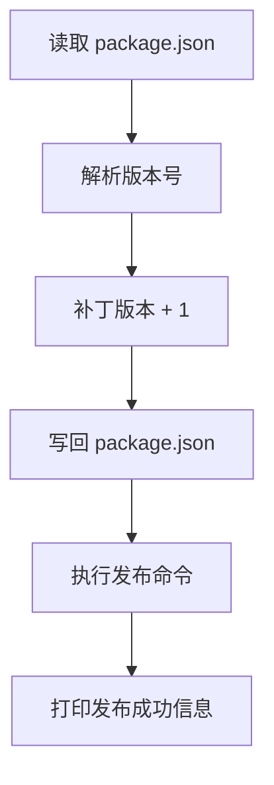
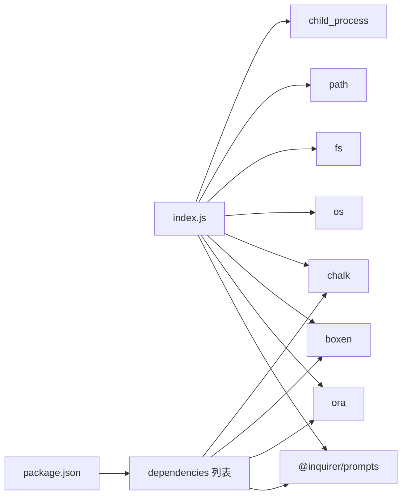

# 技术决策

<cite>
**本文引用的文件**
- [package.json](file://hbuilderx-cli/package.json)
- [index.js](file://hbuilderx-cli/index.js)
- [README.md](file://hbuilderx-cli/README.md)
- [release.js](file://hbuilderx-cli/release.js)
</cite>

## 目录
1. [简介](#简介)
2. [项目结构](#项目结构)
3. [核心组件](#核心组件)
4. [架构总览](#架构总览)
5. [详细组件分析](#详细组件分析)
6. [依赖关系分析](#依赖关系分析)
7. [性能考量](#性能考量)
8. [故障排查指南](#故障排查指南)
9. [结论](#结论)
10. [附录](#附录)

## 简介
本文件针对 HBuilderX CLI 工具的技术决策进行系统化分析，重点覆盖以下方面：
- 运行环境与技术栈选型：Node.js 作为运行时、内置模块与第三方依赖的取舍
- 关键依赖库的动机与边界：chalk、@inquirer/prompts、boxen、ora 等
- 架构决策与权衡：单体应用模式、事件驱动与模块化设计
- 跨平台兼容性：Windows/Linux 差异化处理、路径与进程管理策略
- 性能优化：缓存策略、异步处理、资源管理
- 安全性：路径校验、权限控制、错误隔离
- 技术演进与扩展建议

## 项目结构
该仓库采用极简单体结构，核心文件如下：
- package.json：定义包名、版本、二进制入口、脚本与依赖
- index.js：CLI 主程序，包含配置加载、命令执行、交互式菜单与跨平台进程调用
- README.md：安装、使用、功能与注意事项说明
- release.js：版本号递增与发布脚本

图表来源
- [package.json:1-21](file://hbuilderx-cli/package.json#L1-L21)
- [index.js:1-10](file://hbuilderx-cli/index.js#L1-L10)
- [README.md:1-53](file://hbuilderx-cli/README.md#L1-L53)
- [release.js:1-19](file://hbuilderx-cli/release.js#L1-L19)

章节来源
- [package.json:1-21](file://hbuilderx-cli/package.json#L1-L21)
- [README.md:1-53](file://hbuilderx-cli/README.md#L1-L53)

## 核心组件
- 配置与发现
  - 通过用户主目录下的配置文件持久化 HBuilderX 安装路径，并在缺失时自动扫描常见安装位置
  - 从项目 manifest.json 中读取小程序 AppID、项目名与版本信息，支持缓存以减少重复 IO
- 交互式菜单
  - 使用 @inquirer/prompts 提供可选菜单与输入框，简化用户选择与设置流程
- 输出与提示
  - 使用 chalk 实现彩色输出；使用 boxen 包裹提示框；使用 ora 展示执行状态与进度
- 命令执行
  - 通过 child_process.spawn 启动 HBuilderX CLI 或系统 shell，根据平台选择不同 shell 与参数
- 主循环
  - 无限循环菜单，支持运行 Web/H5、运行微信/支付宝小程序、查看项目列表、基础设置等

章节来源
- [index.js:11-90](file://hbuilderx-cli/index.js#L11-L90)
- [index.js:92-163](file://hbuilderx-cli/index.js#L92-L163)
- [index.js:165-242](file://hbuilderx-cli/index.js#L165-L242)

## 架构总览
该 CLI 采用“单体应用 + 事件驱动”的轻量架构：
- 单体应用模式：所有功能集中在单一入口文件，便于分发与维护
- 事件驱动：基于 Node.js 事件循环与回调，配合 async/await 管理异步流程
- 模块化设计：通过函数拆分职责（配置、菜单、命令执行），提升可读性与可测试性

图表来源
- [index.js:1-10](file://hbuilderx-cli/index.js#L1-L10)
- [index.js:92-163](file://hbuilderx-cli/index.js#L92-L163)
- [index.js:209-242](file://hbuilderx-cli/index.js#L209-L242)

## 详细组件分析

### 配置与发现机制
- 配置文件位置：用户主目录下的固定 JSON 文件，用于持久化 HBuilderX 安装路径与小程序 AppID
- 自动发现：若配置缺失或无效，遍历常见安装路径并检测 HBuilderX CLI 可执行文件是否存在
- 缓存策略：manifest.json 解析结果缓存于内存，避免重复读取
- 项目元数据：从 manifest.json 中提取小程序 AppID、项目名、版本等信息，注入到运行参数

图表来源
- [index.js:16-20](file://hbuilderx-cli/index.js#L16-L20)
- [index.js:67-86](file://hbuilderx-cli/index.js#L67-L86)
- [index.js:38-45](file://hbuilderx-cli/index.js#L38-L45)

章节来源
- [index.js:16-20](file://hbuilderx-cli/index.js#L16-L20)
- [index.js:22-36](file://hbuilderx-cli/index.js#L22-L36)
- [index.js:38-45](file://hbuilderx-cli/index.js#L38-L45)
- [index.js:67-86](file://hbuilderx-cli/index.js#L67-L86)

### 交互式菜单与设置
- 菜单选择：使用 @inquirer/prompts 的 select 提供清晰的选项列表
- 设置项：允许用户手动输入 HBuilderX 安装路径，并即时刷新缓存与项目元数据
- 用户体验：chalk 提供彩色提示，boxen 包裹重要信息，ora 展示保存过程

图表来源
- [index.js:209-242](file://hbuilderx-cli/index.js#L209-L242)
- [index.js:190-207](file://hbuilderx-cli/index.js#L190-L207)
- [index.js:92-163](file://hbuilderx-cli/index.js#L92-L163)

章节来源
- [index.js:209-242](file://hbuilderx-cli/index.js#L209-L242)
- [index.js:190-207](file://hbuilderx-cli/index.js#L190-L207)

### 命令执行与跨平台处理
- 进程管理：根据平台选择不同的 shell（Windows 使用 cmd.exe，Unix 使用 sh），并通过 spawn 启动 HBuilderX CLI
- 执行反馈：使用 ora 展示执行状态，捕获 close 与 error 事件，输出完成/失败提示
- 参数拼接：将项目名与平台特定参数拼接到 HBuilderX CLI 命令中

图表来源
- [index.js:118-138](file://hbuilderx-cli/index.js#L118-L138)
- [index.js:139-153](file://hbuilderx-cli/index.js#L139-L153)
- [index.js:165-189](file://hbuilderx-cli/index.js#L165-L189)

章节来源
- [index.js:118-138](file://hbuilderx-cli/index.js#L118-L138)
- [index.js:139-153](file://hbuilderx-cli/index.js#L139-L153)
- [index.js:165-189](file://hbuilderx-cli/index.js#L165-L189)

### 发布脚本与版本管理
- 版本递增：读取 package.json，对补丁版本号加一并写回
- 发布流程：同步执行发布命令，继承标准输出以便观察发布过程

图表来源
- [release.js:1-19](file://hbuilderx-cli/release.js#L1-L19)

章节来源
- [release.js:1-19](file://hbuilderx-cli/release.js#L1-L19)

## 依赖关系分析
- 运行时与内置模块
  - child_process：用于启动外部进程（HBuilderX CLI 或系统 shell）
  - path：跨平台路径拼接与规范化
  - fs：文件读写（配置与 manifest.json）
  - os：用户主目录与平台判断
- 第三方依赖
  - chalk：彩色终端输出，提升可读性
  - boxen：包裹提示框，增强视觉层次
  - ora：加载动画与状态提示
  - @inquirer/prompts：交互式选择与输入，替代传统 readline

图表来源
- [index.js:1-9](file://hbuilderx-cli/index.js#L1-L9)
- [package.json:14-19](file://hbuilderx-cli/package.json#L14-L19)

章节来源
- [index.js:1-9](file://hbuilderx-cli/index.js#L1-L9)
- [package.json:14-19](file://hbuilderx-cli/package.json#L14-L19)

## 性能考量
- 缓存策略
  - manifest.json 解析结果缓存于内存，避免重复 IO，降低启动与切换命令的等待时间
- 异步处理
  - 使用 Promise 与 async/await 管理命令执行与用户交互，避免阻塞主线程
  - 对进程执行采用事件驱动回调，及时响应完成/失败状态
- 资源管理
  - 进程 spawn 时设置窗口隐藏与继承标准输入输出，减少额外开销
  - 使用定时器与一次性标志避免重复停止加载动画
- I/O 优化
  - 将配置文件写入用户主目录，避免频繁磁盘扫描

章节来源
- [index.js:38-45](file://hbuilderx-cli/index.js#L38-L45)
- [index.js:118-138](file://hbuilderx-cli/index.js#L118-L138)
- [index.js:148-151](file://hbuilderx-cli/index.js#L148-L151)

## 故障排查指南
- 项目根目录无 manifest.json
  - 现象：启动即退出并提示非 HBuilderX 项目
  - 排查：确认项目根目录存在 manifest.json
- 未找到 HBuilderX 安装路径
  - 现象：提示未找到工具或需要手动设置
  - 排查：在“基本设置”中输入正确安装目录，或确保默认扫描路径存在
- 命令执行失败
  - 现象：输出失败提示并显示退出码
  - 排查：检查 HBuilderX CLI 是否正常、网络与项目配置是否正确
- 平台差异导致的命令不生效
  - 现象：Windows/Linux 下命令参数不一致
  - 排查：确认使用 spawn 的平台分支逻辑，必要时手动指定 shell 与参数

章节来源
- [index.js:16-20](file://hbuilderx-cli/index.js#L16-L20)
- [index.js:75-85](file://hbuilderx-cli/index.js#L75-L85)
- [index.js:127-136](file://hbuilderx-cli/index.js#L127-L136)
- [index.js:120-124](file://hbuilderx-cli/index.js#L120-L124)

## 结论
该 CLI 以 Node.js 为运行时，结合少量内置模块与精选第三方依赖，构建出简洁高效的 HBuilderX 管理工具。其技术选型体现了“小而美”的工程哲学：单体应用降低分发与维护成本，事件驱动与异步处理保证交互流畅，跨平台适配通过条件分支与路径抽象实现。建议在未来引入更完善的日志体系、错误分类与重试机制，以及对多项目工作区的支持。

## 附录

### 技术栈与版本要求
- Node.js：>= 14（满足现代 ES 特性与 async/await）
- 依赖库：chalk、boxen、ora、@inquirer/prompts
- 发布脚本：使用 child_process.execSync 与 npm publish

章节来源
- [README.md:30-34](file://hbuilderx-cli/README.md#L30-L34)
- [release.js:1-19](file://hbuilderx-cli/release.js#L1-L19)