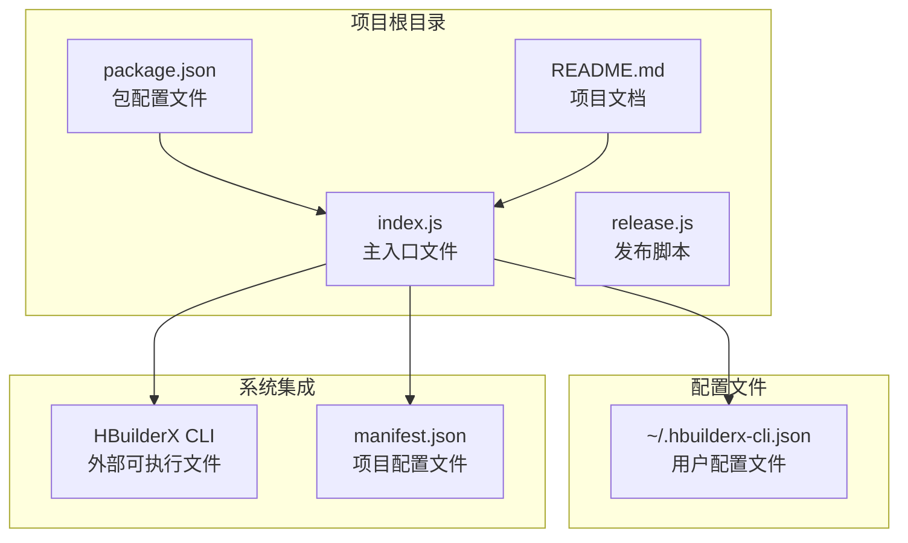
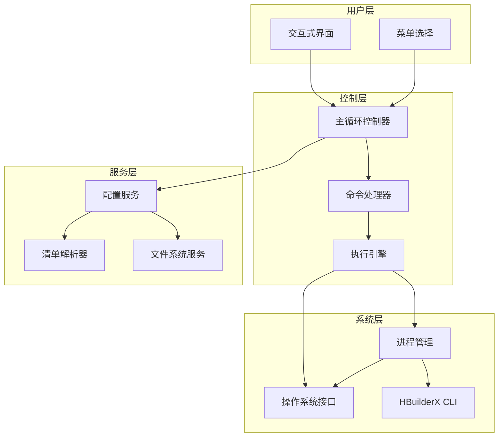
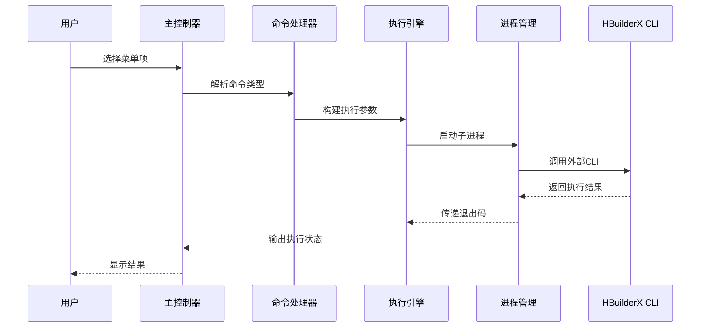
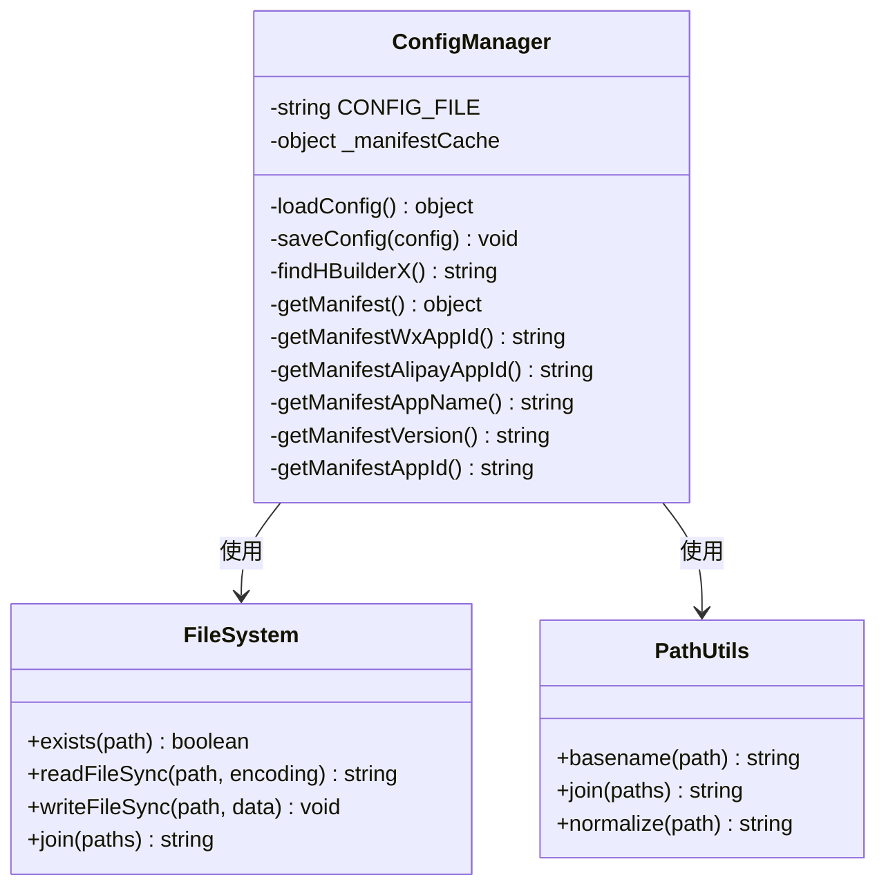
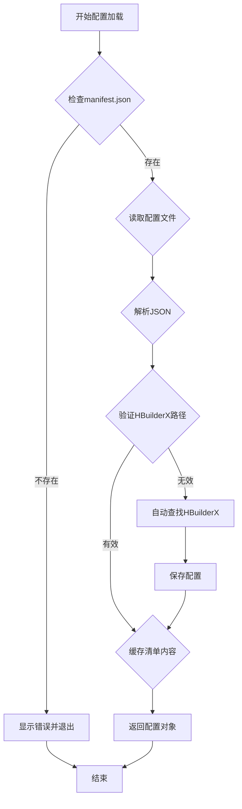
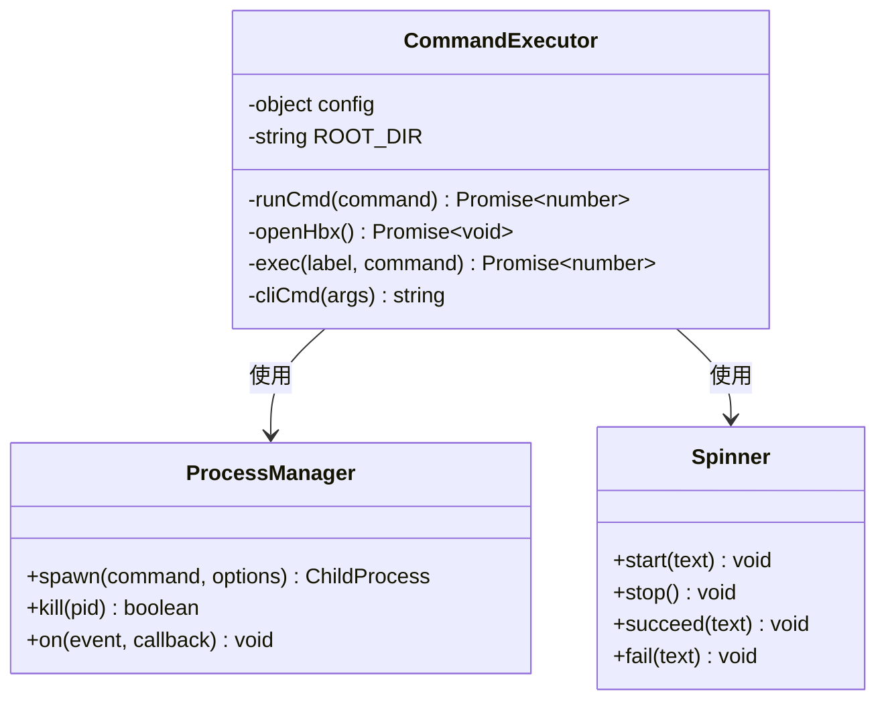
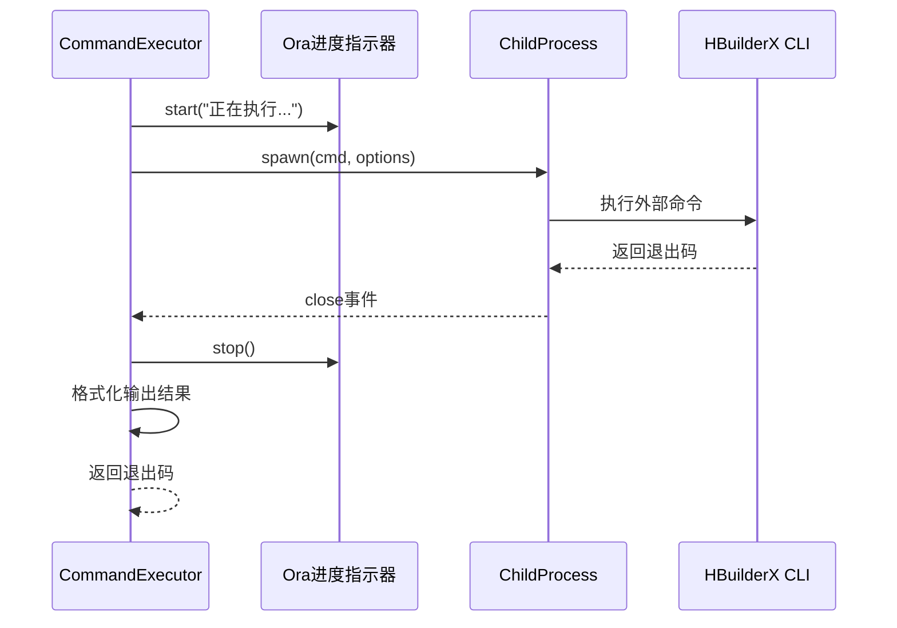
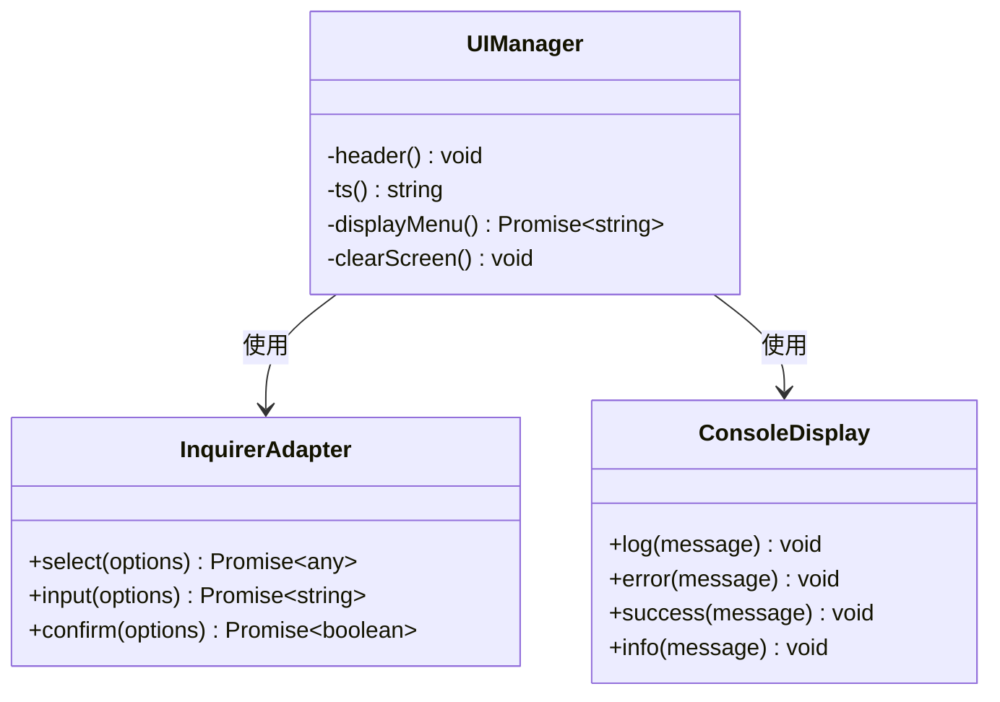
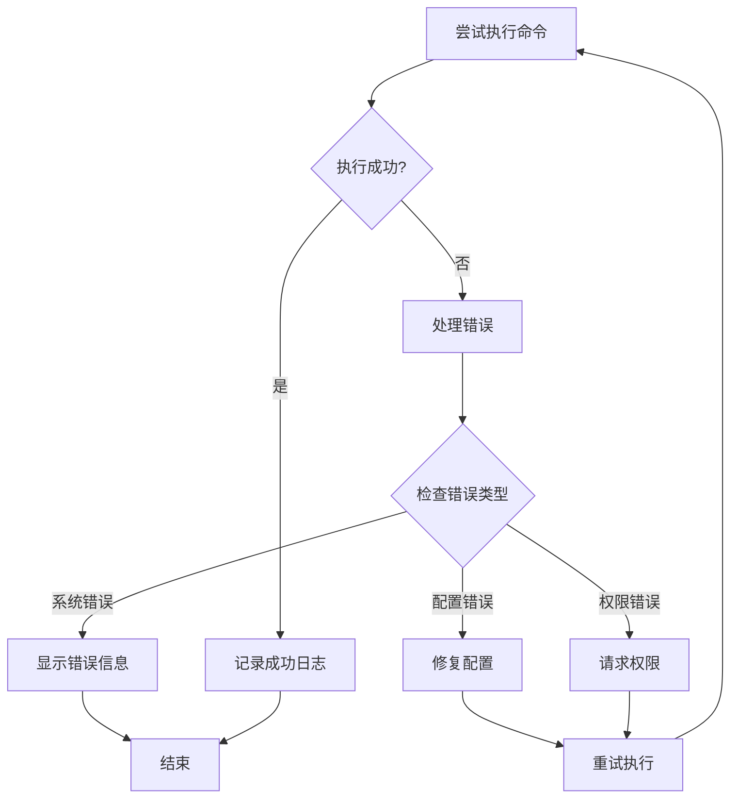

# 技术架构

<cite>
**本文档引用的文件**
- [package.json](file://hbuilderx-cli/package.json)
- [index.js](file://hbuilderx-cli/index.js)
- [README.md](file://hbuilderx-cli/README.md)
- [release.js](file://hbuilderx-cli/release.js)
</cite>

## 目录
1. [引言](#引言)
2. [项目结构](#项目结构)
3. [核心组件](#核心组件)
4. [架构概览](#架构概览)
5. [详细组件分析](#详细组件分析)
6. [依赖关系分析](#依赖关系分析)
7. [性能考虑](#性能考虑)
8. [故障排除指南](#故障排除指南)
9. [结论](#结论)

## 引言

HBuilderX CLI 是一个基于 Node.js 的命令行工具，旨在简化 HBuilderX 开发环境的操作流程。该工具通过提供直观的交互式界面，帮助开发者快速执行常见的开发任务，如运行 Web 项目、调试小程序、发布 H5 应用以及管理项目列表等。

该工具的核心设计理念是通过模块化设计和事件驱动架构，为开发者提供高效、可靠的命令行体验。系统采用异步处理机制和完善的错误处理策略，确保在各种环境下都能稳定运行。

## 项目结构

HBuilderX CLI 项目采用简洁的单文件架构设计，主要由以下核心文件组成：



**图表来源**
- [package.json:1-21](file://hbuilderx-cli/package.json#L1-L21)
- [index.js:1-248](file://hbuilderx-cli/index.js#L1-L248)

**章节来源**
- [package.json:1-21](file://hbuilderx-cli/package.json#L1-L21)
- [README.md:1-53](file://hbuilderx-cli/README.md#L1-L53)

## 核心组件

### 配置管理系统

配置管理系统负责管理用户设置和项目信息，采用本地文件存储的方式实现持久化配置。

**核心功能：**
- 自动检测 HBuilderX 安装路径
- 缓存 manifest.json 内容
- 用户自定义配置管理
- 跨平台兼容性支持

**配置文件结构：**
```json
{
  "hbxDir": "D:\\HBuilderX",
  "appid": "微信小程序AppID",
  "alipayAppid": "支付宝小程序AppID",
  "manifestName": "项目名称",
  "manifestVersion": "版本号",
  "manifestAppId": "应用ID"
}
```

### 命令执行引擎

命令执行引擎是系统的核心处理单元，负责协调各种开发任务的执行。

**主要职责：**
- 子进程管理
- 命令参数构建
- 执行状态监控
- 结果输出处理

### 用户界面模块

用户界面模块提供交互式菜单和可视化反馈，增强用户体验。

**功能特性：**
- 菜单驱动的用户界面
- 实时进度指示
- 错误信息提示
- 成功状态确认

**章节来源**
- [index.js:67-90](file://hbuilderx-cli/index.js#L67-L90)
- [index.js:118-138](file://hbuilderx-cli/index.js#L118-L138)
- [index.js:105-116](file://hbuilderx-cli/index.js#L105-L116)

## 架构概览

系统采用模块化的事件驱动架构，通过清晰的职责分离实现松耦合的设计。



**图表来源**
- [index.js:210-242](file://hbuilderx-cli/index.js#L210-L242)
- [index.js:92-95](file://hbuilderx-cli/index.js#L92-L95)
- [index.js:67-86](file://hbuilderx-cli/index.js#L67-L86)

### 数据流设计

系统的数据流从用户输入开始，经过多层处理最终到达外部系统：



**图表来源**
- [index.js:214-241](file://hbuilderx-cli/index.js#L214-L241)
- [index.js:118-138](file://hbuilderx-cli/index.js#L118-L138)

## 详细组件分析

### 配置管理组件

配置管理组件实现了智能的配置发现和缓存机制：



**图表来源**
- [index.js:31-86](file://hbuilderx-cli/index.js#L31-L86)
- [index.js:38-45](file://hbuilderx-cli/index.js#L38-L45)

**配置加载流程：**


**图表来源**
- [index.js:67-86](file://hbuilderx-cli/index.js#L67-L86)
- [index.js:31-36](file://hbuilderx-cli/index.js#L31-L36)

### 命令执行组件

命令执行组件提供了统一的进程管理和结果处理机制：



**图表来源**
- [index.js:118-153](file://hbuilderx-cli/index.js#L118-L153)
- [index.js:155-163](file://hbuilderx-cli/index.js#L155-L163)

**执行流程分析：**


**图表来源**
- [index.js:118-138](file://hbuilderx-cli/index.js#L118-L138)

### 用户界面组件

用户界面组件提供了丰富的交互体验和视觉反馈：



**图表来源**
- [index.js:105-116](file://hbuilderx-cli/index.js#L105-L116)
- [index.js:214-227](file://hbuilderx-cli/index.js#L214-L227)

**章节来源**
- [index.js:31-86](file://hbuilderx-cli/index.js#L31-L86)
- [index.js:118-153](file://hbuilderx-cli/index.js#L118-L153)
- [index.js:105-116](file://hbuilderx-cli/index.js#L105-L116)

## 依赖关系分析

系统依赖关系相对简单，主要依赖于 Node.js 核心模块和几个轻量级第三方库：

```mermaid
graph LR
subgraph "核心依赖"
NODE[Node.js 核心模块]
FS[fs 模块]
PATH[path 模块]
CHILD[child_process 模块]
OS[os 模块]
end
subgraph "第三方库"
CHALK[chalk@^4.1.2<br/>终端样式]
INQ[@inquirer/prompts@^3.0.0<br/>交互式界面]
BOXEN[boxen@^5.1.2<br/>边框容器]
ORA[ora@^5.4.1<br/>进度指示器]
end
subgraph "系统集成"
HBXCLI[HBuilderX CLI.exe]
end
NODE --> FS
NODE --> PATH
NODE --> CHILD
NODE --> OS
NODE --> CHALK
NODE --> INQ
NODE --> BOXEN
NODE --> ORA
FS --> HBXCLI
PATH --> HBXCLI
CHILD --> HBXCLI
```

**图表来源**
- [package.json:14-19](file://hbuilderx-cli/package.json#L14-L19)
- [index.js:1-9](file://hbuilderx-cli/index.js#L1-L9)

**依赖库选择分析：**

| 依赖库 | 版本 | 选择理由 | 使用场景 |
|--------|------|----------|----------|
| chalk | ^4.1.2 | 轻量级终端样式库，支持颜色和格式化 | 输出美化、状态指示 |
| @inquirer/prompts | ^3.0.0 | 现代化的交互式界面库 | 菜单选择、用户输入 |
| boxen | ^5.1.2 | 终端边框容器，提升视觉效果 | 信息面板展示 |
| ora | ^5.4.1 | 进度指示器，提供动画反馈 | 执行状态显示 |

**章节来源**
- [package.json:14-19](file://hbuilderx-cli/package.json#L14-L19)

## 性能考虑

### 异步处理机制

系统广泛采用异步编程模式，通过 Promise 和 async/await 提供非阻塞的用户体验：

**性能优化策略：**
- 使用 Promise 包装回调函数，避免回调地狱
- 采用 async/await 简化异步代码逻辑
- 合理使用 setTimeout 和定时器管理超时
- 缓存 manifest.json 内容减少文件读取开销

### 内存管理

**内存优化措施：**
- 清晰的垃圾回收时机控制
- 及时释放不再使用的变量引用
- 避免内存泄漏的闭包陷阱
- 合理使用全局缓存机制

### I/O 性能

**文件系统优化：**
- 批量文件操作减少系统调用次数
- 缓存配置文件内容避免重复读取
- 异步文件操作不阻塞主线程

## 故障排除指南

### 常见问题诊断

**配置相关问题：**
- HBuilderX 路径未找到：检查配置文件中的 hbxDir 字段
- manifest.json 文件缺失：确保项目根目录包含有效的配置文件
- 权限不足：检查用户权限和文件访问权限

**执行相关问题：**
- 进程启动失败：检查 HBuilderX CLI 是否正常安装
- 超时问题：调整系统超时设置或检查网络连接
- 权限错误：以管理员权限运行命令行工具

### 错误处理策略

系统采用多层次的错误处理机制：



**章节来源**
- [index.js:132-137](file://hbuilderx-cli/index.js#L132-L137)
- [index.js:244-247](file://hbuilderx-cli/index.js#L244-L247)

## 结论

HBuilderX CLI 工具展现了优秀的模块化设计和事件驱动架构实践。通过合理的职责分离、清晰的组件边界和高效的异步处理机制，系统为开发者提供了流畅的命令行体验。

**主要优势：**
- 模块化设计便于维护和扩展
- 事件驱动架构提供良好的响应性
- 完善的错误处理机制确保稳定性
- 跨平台兼容性支持广泛的使用场景

**未来改进方向：**
- 增加更详细的日志记录功能
- 实现配置文件的版本管理
- 添加更多自定义命令选项
- 优化性能监控和指标收集

该工具成功地将复杂的开发流程简化为直观的命令行操作，显著提升了 HBuilderX 开发者的生产力。