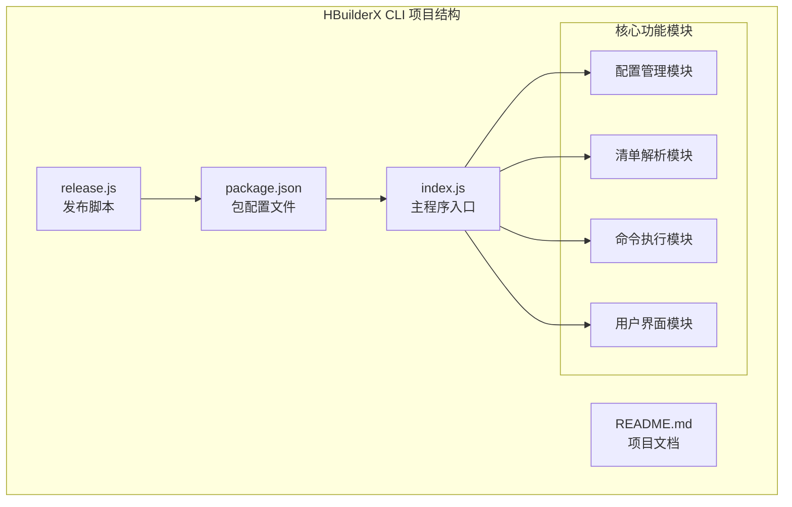
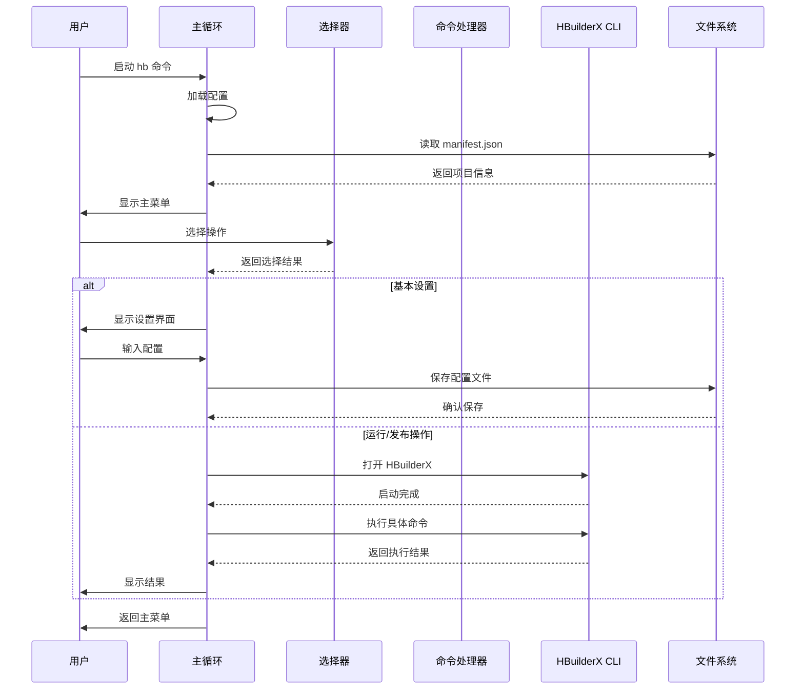
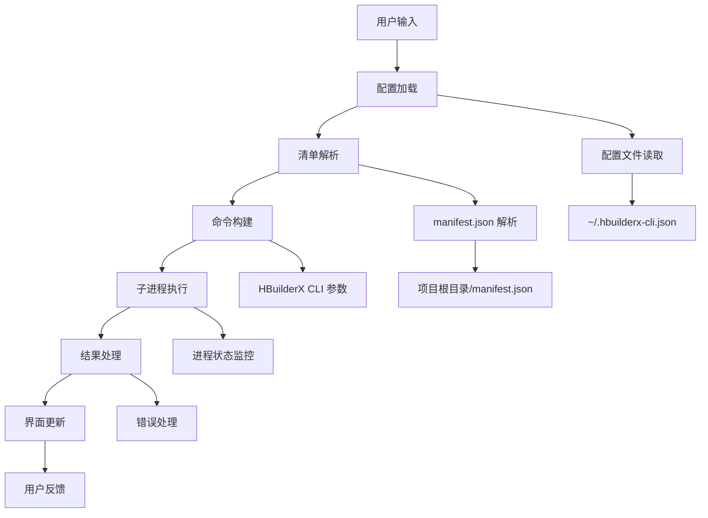
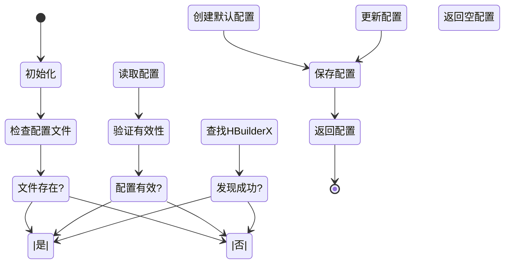
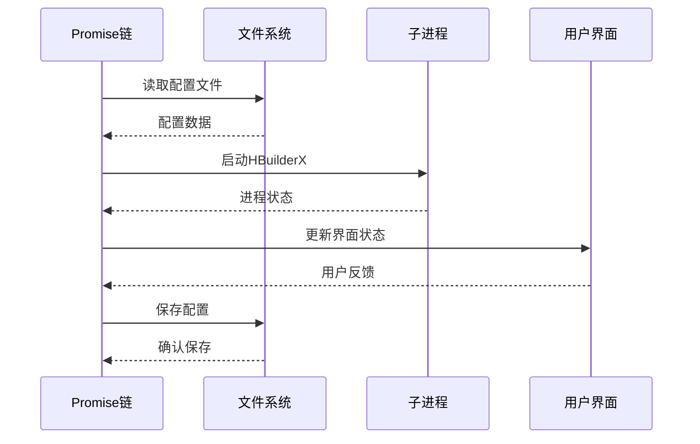
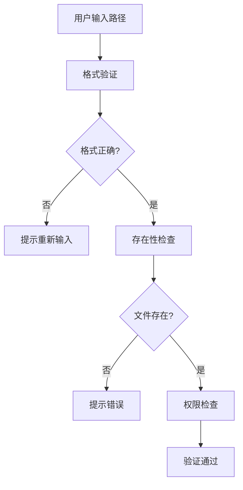
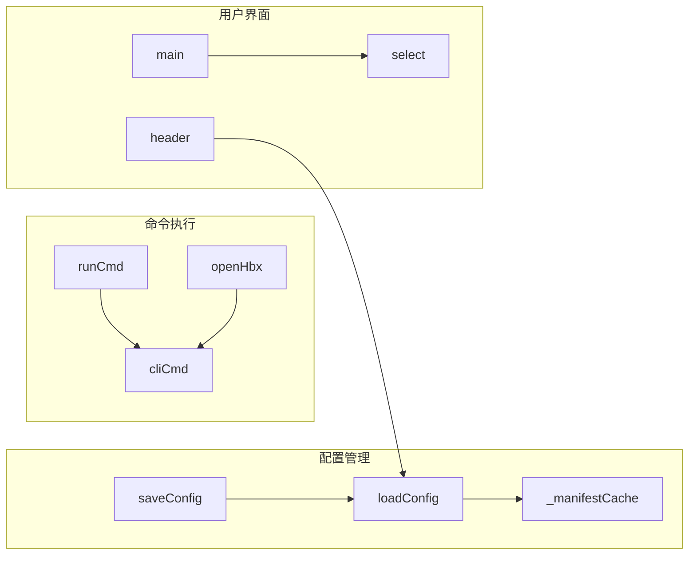

# 数据流设计

<cite>
**本文档引用的文件**
- [package.json](file://hbuilderx-cli/package.json)
- [index.js](file://hbuilderx-cli/index.js)
- [README.md](file://hbuilderx-cli/README.md)
- [release.js](file://hbuilderx-cli/release.js)
</cite>

## 目录
1. [简介](#简介)
2. [项目结构](#项目结构)
3. [核心组件](#核心组件)
4. [架构概览](#架构概览)
5. [详细组件分析](#详细组件分析)
6. [依赖分析](#依赖分析)
7. [性能考虑](#性能考虑)
8. [故障排除指南](#故障排除指南)
9. [结论](#结论)

## 简介

HBuilderX CLI 是一个用于管理 HBuilderX 开发环境的全局命令行工具。该工具通过命令行界面提供对 HBuilderX 功能的便捷访问，包括项目运行、发布、项目管理等功能。本文档深入分析了该工具从用户输入到最终结果展示的完整数据流转过程，包括用户选择解析、配置数据获取、命令参数构建、子进程执行、结果处理等各个环节。

## 项目结构

该项目采用简洁的单文件架构设计，主要包含以下核心文件：



**图表来源**
- [package.json:1-21](file://hbuilderx-cli/package.json#L1-L21)
- [index.js:1-248](file://hbuilderx-cli/index.js#L1-L248)

**章节来源**
- [package.json:1-21](file://hbuilderx-cli/package.json#L1-L21)
- [README.md:1-53](file://hbuilderx-cli/README.md#L1-L53)

## 核心组件

### 配置管理系统

配置管理系统负责管理用户设置和项目信息，采用本地文件存储机制：

- **配置文件位置**: 用户主目录下的 `.hbuilderx-cli.json`
- **配置内容**: HBuilderX 安装目录、微信小程序 AppID、支付宝小程序 AppID
- **缓存机制**: 内存缓存避免重复读取文件

### 清单解析模块

清单解析模块专门处理 HBuilderX 项目的 manifest.json 文件：

- **自动检测**: 检测项目根目录是否存在 manifest.json
- **应用信息提取**: 从清单文件中提取应用名称、版本、AppID 等信息
- **缓存优化**: 实现内存缓存机制提高性能

### 命令执行引擎

命令执行引擎负责与 HBuilderX CLI 工具进行交互：

- **跨平台支持**: 支持 Windows 和 Unix 系统
- **子进程管理**: 使用 child_process 模块管理外部进程
- **进度显示**: 集成 ora 库提供执行状态反馈

### 用户界面层

用户界面层提供交互式命令行体验：

- **选择菜单**: 使用 @inquirer/prompts 提供交互式选择
- **状态显示**: 使用 chalk 和 boxen 提供彩色输出
- **进度指示**: 集成 ora 库显示执行进度

**章节来源**
- [index.js:67-90](file://hbuilderx-cli/index.js#L67-L90)
- [index.js:38-65](file://hbuilderx-cli/index.js#L38-L65)
- [index.js:118-138](file://hbuilderx-cli/index.js#L118-L138)
- [index.js:210-242](file://hbuilderx-cli/index.js#L210-L242)

## 架构概览

HBuilderX CLI 采用事件驱动的异步架构，整个系统围绕用户交互循环展开：



**图表来源**
- [index.js:210-242](file://hbuilderx-cli/index.js#L210-L242)
- [index.js:165-207](file://hbuilderx-cli/index.js#L165-L207)

## 详细组件分析

### 数据流架构

系统采用分层数据流架构，数据在不同层次间传递和转换：



**图表来源**
- [index.js:67-90](file://hbuilderx-cli/index.js#L67-L90)
- [index.js:38-65](file://hbuilderx-cli/index.js#L38-L65)
- [index.js:92-95](file://hbuilderx-cli/index.js#L92-L95)

### 配置数据流

配置管理系统实现了完整的数据生命周期管理：



**图表来源**
- [index.js:67-90](file://hbuilderx-cli/index.js#L67-L90)
- [index.js:31-36](file://hbuilderx-cli/index.js#L31-L36)

### 异步数据流处理

系统采用多种异步处理策略确保响应性和可靠性：

#### Promise 链式调用



**图表来源**
- [index.js:118-138](file://hbuilderx-cli/index.js#L118-L138)
- [index.js:140-153](file://hbuilderx-cli/index.js#L140-L153)

#### 事件驱动模式

系统使用事件驱动模式处理各种异步操作：

- **进程事件**: 监听子进程的 close 和 error 事件
- **用户交互**: 使用 @inquirer/prompts 处理用户选择
- **定时器**: 使用 setTimeout 处理超时场景

### 数据验证和安全考虑

系统实施了多层数据验证和安全措施：

#### 路径验证



**图表来源**
- [index.js:76-79](file://hbuilderx-cli/index.js#L76-L79)

#### 权限验证

- **文件权限**: 检查配置文件和清单文件的读写权限
- **执行权限**: 验证 HBuilderX CLI 可执行文件的可执行权限
- **目录权限**: 确保项目目录具有适当的访问权限

#### 异常处理

系统采用渐进式错误处理策略：

- **配置错误**: 自动回退到默认配置
- **文件缺失**: 提供友好的错误提示和解决方案
- **进程错误**: 记录详细的错误信息并优雅降级

**章节来源**
- [index.js:17-20](file://hbuilderx-cli/index.js#L17-L20)
- [index.js:76-79](file://hbuilderx-cli/index.js#L76-L79)
- [index.js:132-137](file://hbuilderx-cli/index.js#L132-L137)

## 依赖分析

### 外部依赖关系

```mermaid
graph TB
subgraph "核心依赖"
CHALK[chalk<br/>彩色输出]
INQ[@inquirer/prompts<br/>交互式界面]
BOXEN[boxen<br/>边框输出]
ORA[ora<br/>进度指示]
end
subgraph "系统模块"
FS[fs<br/>文件系统]
PATH[path<br/>路径处理]
OS[os<br/>操作系统]
CP[child_process<br/>子进程]
end
IDX[index.js] --> CHALK
IDX --> INQ
IDX --> BOXEN
IDX --> ORA
IDX --> FS
IDX --> PATH
IDX --> OS
IDX --> CP
```

**图表来源**
- [package.json:14-19](file://hbuilderx-cli/package.json#L14-L19)
- [index.js:1-9](file://hbuilderx-cli/index.js#L1-L9)

### 内部模块依赖

系统内部模块之间的依赖关系相对简单，主要围绕配置管理和命令执行：



**图表来源**
- [index.js:67-90](file://hbuilderx-cli/index.js#L67-L90)
- [index.js:118-138](file://hbuilderx-cli/index.js#L118-L138)
- [index.js:210-242](file://hbuilderx-cli/index.js#L210-L242)

**章节来源**
- [package.json:14-19](file://hbuilderx-cli/package.json#L14-L19)
- [index.js:1-9](file://hbuilderx-cli/index.js#L1-L9)

## 性能考虑

### 缓存策略

系统实现了多层次的缓存机制以提升性能：

- **清单缓存**: `_manifestCache` 变量缓存解析后的清单数据
- **配置缓存**: 内存中保持配置对象，避免重复文件读取
- **路径缓存**: 缓存 HBuilderX 安装目录查找结果

### 异步优化

- **非阻塞 I/O**: 所有文件操作都是异步的
- **并发处理**: 用户界面和后台任务可以并行执行
- **资源管理**: 及时清理定时器和进程句柄

### 内存管理

- **垃圾回收**: 利用 JavaScript 的自动垃圾回收机制
- **缓存限制**: 清单缓存只保留最近一次解析结果
- **进程清理**: 子进程完成后及时释放资源

## 故障排除指南

### 常见问题诊断

#### 配置文件问题

**症状**: 首次运行时提示需要配置 HBuilderX 路径

**解决方法**:
1. 运行基本设置功能手动配置路径
2. 检查配置文件格式是否正确
3. 验证配置文件权限设置

#### 清单文件问题

**症状**: 程序提示当前目录不是 HBuilderX 项目

**解决方法**:
1. 确认项目根目录包含 manifest.json
2. 检查 manifest.json 文件格式是否正确
3. 验证项目文件完整性

#### 进程执行问题

**症状**: 命令执行失败但没有明确错误信息

**解决方法**:
1. 检查 HBuilderX 是否正常安装
2. 验证 HBuilderX CLI 可执行文件是否存在
3. 查看系统日志获取详细错误信息

### 调试技巧

#### 日志记录

系统提供了丰富的日志输出：
- 时间戳标记每个操作
- 彩色输出区分不同类型的信息
- 详细的错误描述

#### 状态监控

- **进程状态**: 监听子进程的退出码
- **文件状态**: 监控配置文件和清单文件的变化
- **网络状态**: 监听用户交互事件

**章节来源**
- [index.js:132-137](file://hbuilderx-cli/index.js#L132-L137)
- [index.js:17-20](file://hbuilderx-cli/index.js#L17-L20)

## 结论

HBuilderX CLI 工具展现了优秀的数据流设计原则：

### 设计优势

1. **清晰的分层架构**: 配置管理、数据解析、命令执行、用户界面各司其职
2. **高效的缓存机制**: 减少重复 I/O 操作，提升响应速度
3. **健壮的错误处理**: 多层保护确保系统稳定性
4. **优雅的异步处理**: Promise 和事件驱动模式提供流畅的用户体验

### 技术亮点

- **跨平台兼容**: 统一的接口适配不同操作系统
- **用户友好**: 交互式界面和详细的反馈信息
- **可扩展性**: 模块化设计便于功能扩展
- **可靠性**: 完善的错误处理和恢复机制

### 改进建议

1. **增加配置验证**: 在保存配置前进行更严格的验证
2. **增强日志系统**: 添加更详细的日志记录和分析功能
3. **优化性能**: 考虑实现更智能的缓存策略
4. **扩展功能**: 支持更多 HBuilderX 功能和平台

该工具为开发者提供了一个高效、可靠的 HBuilderX 管理解决方案，其精心设计的数据流架构确保了良好的用户体验和系统稳定性。