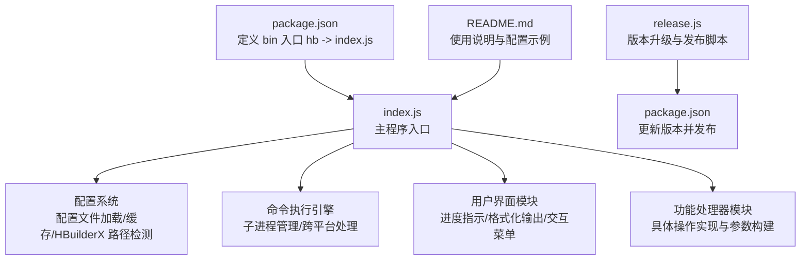
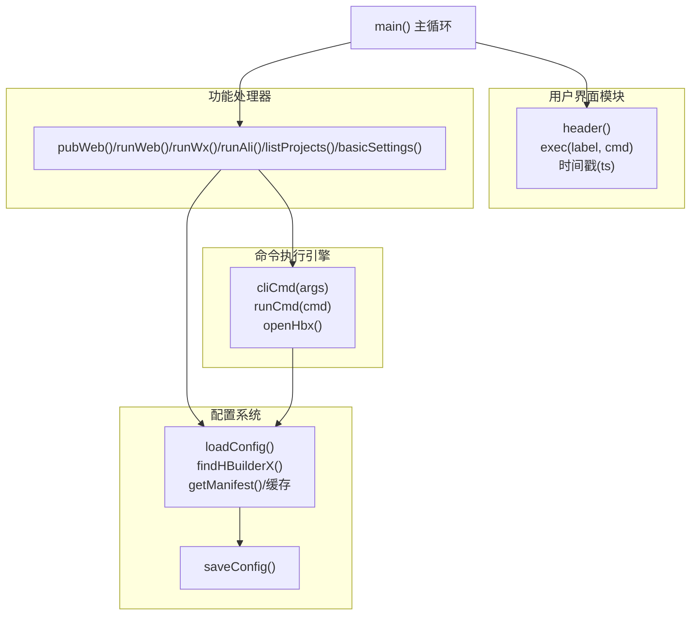
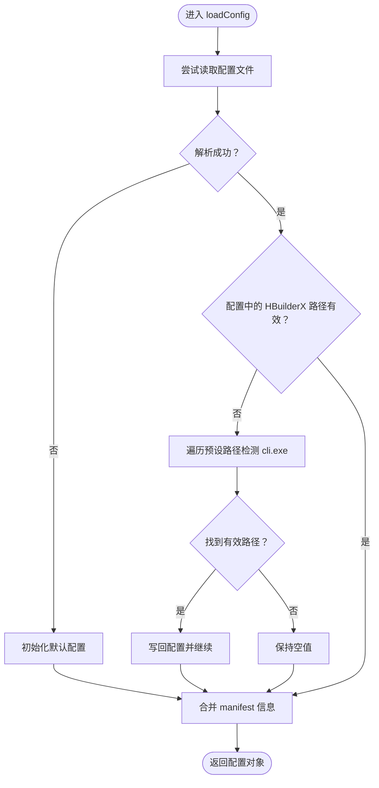
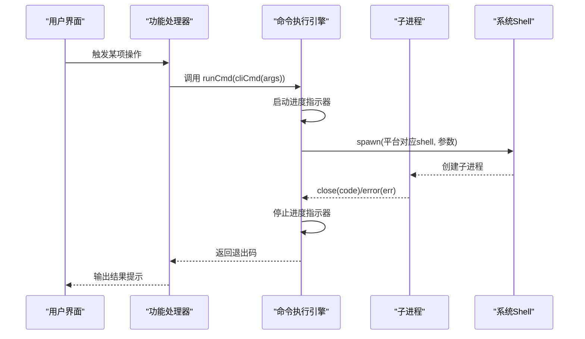
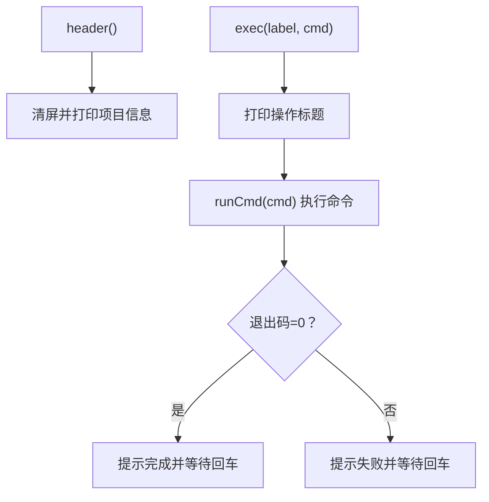
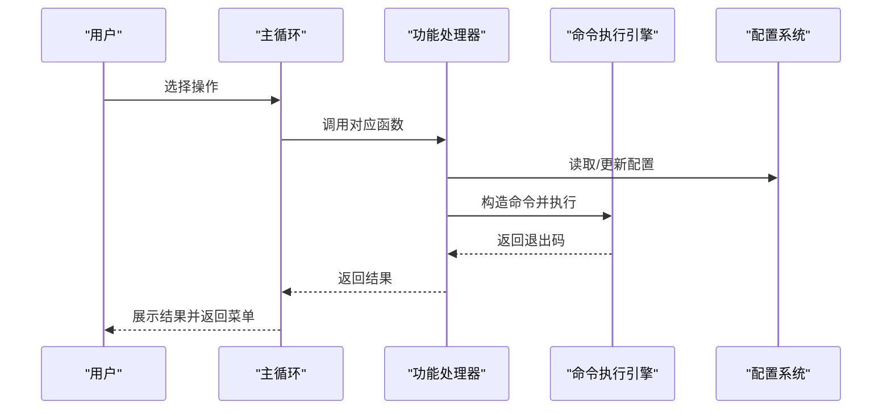
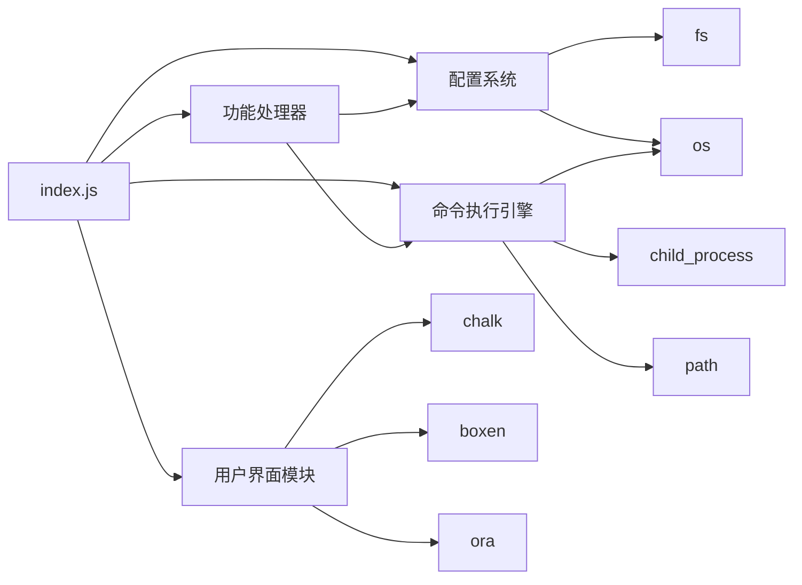

# 核心模块设计

<cite>
**本文档引用的文件**
- [index.js](file://index.js)
- [package.json](file://package.json)
- [README.md](file://README.md)
- [release.js](file://release.js)
</cite>

## 目录
1. [简介](#简介)
2. [项目结构](#项目结构)
3. [核心组件](#核心组件)
4. [架构总览](#架构总览)
5. [详细组件分析](#详细组件分析)
6. [依赖关系分析](#依赖关系分析)
7. [性能考虑](#性能考虑)
8. [故障排除指南](#故障排除指南)
9. [结论](#结论)

## 简介
本文件针对 HBuilderX CLI 工具的核心模块进行系统化设计文档编写，重点覆盖以下方面：
- 配置管理系统：配置文件加载、HBuilderX 安装路径检测、manifest.json 缓存机制
- 命令执行引擎：子进程管理、跨平台兼容性处理、错误处理策略
- 用户界面模块：进度指示器、格式化输出、交互式菜单
- 功能处理器模块：各操作的具体实现与参数构建
- 模块间依赖关系与协作模式，以及模块化设计的优势与扩展性

该工具通过全局命令行入口提供对 HBuilderX 的便捷操作，支持运行 Web、运行微信小程序、运行支付宝小程序、发布 H5、列出项目以及基本设置等功能，并具备自动配置与缓存优化能力。

## 项目结构
该项目采用单文件主程序 + 轻量级依赖的模块化设计，核心逻辑集中在 index.js 中，通过 npm 包配置暴露全局命令入口。README 提供使用说明与配置文件示例，release.js 用于版本升级与发布流程。

图表来源
- [package.json:5-19](file://package.json#L5-L19)
- [index.js:1-248](file://index.js#L1-L248)
- [README.md:1-53](file://README.md#L1-L53)
- [release.js:1-19](file://release.js#L1-L19)

章节来源
- [package.json:1-21](file://package.json#L1-L21)
- [README.md:1-53](file://README.md#L1-L53)
- [index.js:1-248](file://index.js#L1-L248)

## 核心组件
本节概述四个核心模块及其职责：
- 配置管理系统：负责读取/写入用户配置、自动检测 HBuilderX 安装路径、缓存 manifest.json 数据
- 命令执行引擎：封装子进程调用、跨平台 shell 适配、统一错误处理与结果反馈
- 用户界面模块：提供头部信息展示、进度指示器、格式化输出与交互式菜单
- 功能处理器模块：封装具体业务操作（运行/发布/列出项目），统一参数构建与命令拼接

章节来源
- [index.js:67-90](file://index.js#L67-L90)
- [index.js:92-138](file://index.js#L92-L138)
- [index.js:105-163](file://index.js#L105-L163)
- [index.js:165-207](file://index.js#L165-L207)

## 架构总览
下图展示了模块之间的协作关系与数据流：

图表来源
- [index.js:67-90](file://index.js#L67-L90)
- [index.js:92-138](file://index.js#L92-L138)
- [index.js:105-163](file://index.js#L105-L163)
- [index.js:165-207](file://index.js#L165-L207)
- [index.js:210-242](file://index.js#L210-L242)

## 详细组件分析

### 配置管理系统（第67-90行）
该模块负责：
- 读取用户配置文件（默认位于用户主目录下的 JSON 文件）
- 自动检测 HBuilderX 安装路径（预设常见路径并检查可执行文件存在性）
- 缓存 manifest.json 解析结果，避免重复 IO
- 将项目 manifest 中的 appid、应用名、版本等信息注入到配置对象中，便于 UI 展示与命令参数使用

关键实现要点：
- 配置文件加载与回退：若读取失败则初始化默认结构并填充 HBuilderX 安装目录
- 安装路径检测：遍历预设路径并验证可执行文件存在性，成功后写回配置
- manifest 缓存：首次解析后缓存结果，后续直接返回，提升性能
- 配置合并：将 manifest 中的微信/支付宝 appid、应用名、版本、应用 ID 合并到配置对象中

图表来源
- [index.js:67-90](file://index.js#L67-L90)

章节来源
- [index.js:67-90](file://index.js#L67-L90)

### 命令执行引擎（第92-138行）
该模块负责：
- 命令拼接：根据配置决定使用本地 HBuilderX 可执行文件还是系统 PATH 中的命令
- 子进程管理：跨平台选择 shell 并传递参数，继承标准输入输出
- 执行控制：统一的执行包装函数，提供进度提示、命令日志、错误处理与退出码反馈
- 启动辅助：提供打开 HBuilderX 的轻量封装，带超时与事件监听

关键实现要点：
- 跨平台适配：Windows 使用 cmd.exe /c，其他平台使用 sh -c
- 统一执行接口：runCmd 返回 Promise，便于在功能处理器中等待完成
- 错误处理：捕获子进程错误事件，输出友好提示并返回非零退出码
- 结果反馈：根据退出码输出成功或失败提示框，包含时间戳与命令摘要

图表来源
- [index.js:92-138](file://index.js#L92-L138)

章节来源
- [index.js:92-138](file://index.js#L92-L138)

### 用户界面模块（第105-163行）
该模块负责：
- 头部信息展示：清屏、显示项目名称、版本、微信/支付宝 appid、HBuilderX 工具状态
- 时间戳工具：生成带颜色的时间字符串，用于日志与提示
- 执行包装：统一的执行流程，先展示标题，再执行命令，最后根据结果提示并等待用户确认
- 交互式菜单：基于选择器提供操作选项，支持循环与分页

关键实现要点：
- 格式化输出：使用彩色文本与边框盒增强可读性
- 一致性体验：所有操作均通过统一的执行包装，确保日志风格一致
- 用户引导：执行完成后提示按回车返回菜单，提升交互友好度

图表来源
- [index.js:105-163](file://index.js#L105-L163)

章节来源
- [index.js:105-163](file://index.js#L105-L163)

### 功能处理器模块（第165-207行）
该模块封装了具体业务操作，每个函数负责：
- 打开 HBuilderX（必要时）
- 构建命令参数（项目名、平台、浏览器等）
- 调用执行包装函数并处理结果

典型操作包括：
- 发布 H5：打开 HBuilderX，执行发布命令
- 运行 Web：打开 HBuilderX，指定平台与浏览器
- 运行微信/支付宝：打开 HBuilderX，指定对应小程序平台
- 项目列表：打开 HBuilderX，列出项目
- 基本设置：交互式修改 HBuilderX 安装目录，保存配置并刷新缓存

图表来源
- [index.js:165-207](file://index.js#L165-L207)
- [index.js:92-138](file://index.js#L92-L138)
- [index.js:67-90](file://index.js#L67-L90)

章节来源
- [index.js:165-207](file://index.js#L165-L207)

## 依赖关系分析
模块间依赖关系如下：
- 主程序依赖配置系统进行路径检测与缓存；依赖命令执行引擎进行子进程管理；依赖用户界面模块进行展示与交互；依赖功能处理器实现具体业务
- 配置系统依赖文件系统读写与环境变量；命令执行引擎依赖 child_process、path、os；用户界面模块依赖 chalk、boxen、ora；功能处理器依赖配置系统与命令执行引擎
- 包管理层面，通过 package.json 暴露全局命令入口，依赖第三方库提供 UI 与交互能力

图表来源
- [index.js:1-10](file://index.js#L1-L10)
- [index.js:67-90](file://index.js#L67-L90)
- [index.js:92-138](file://index.js#L92-L138)
- [index.js:105-163](file://index.js#L105-L163)
- [index.js:165-207](file://index.js#L165-L207)
- [package.json:14-19](file://package.json#L14-L19)

章节来源
- [package.json:1-21](file://package.json#L1-L21)
- [index.js:1-10](file://index.js#L1-L10)

## 性能考虑
- 配置缓存：manifest.json 解析结果缓存，减少重复 IO，提升 UI 刷新与命令构建效率
- 路径检测：预设常见路径并快速验证，避免全盘扫描
- 子进程复用：命令执行引擎统一管理子进程生命周期，避免资源泄漏
- UI 渲染：清屏与格式化输出仅在必要时触发，降低终端渲染压力
- 错误早返回：遇到无效路径或配置错误时尽早失败，减少无意义的后续操作

## 故障排除指南
- 未找到 HBuilderX：检查安装目录是否正确，或在“基本设置”中重新配置
- 未找到 manifest.json：确认当前工作目录为 HBuilderX 项目根目录
- 命令执行失败：查看控制台输出的退出码与错误信息，确认项目配置与平台参数
- 跨平台问题：确保系统 shell 可用，Windows 使用 cmd.exe，其他平台使用 sh
- 权限问题：在某些环境下可能需要管理员权限运行 HBuilderX

章节来源
- [index.js:17-20](file://index.js#L17-L20)
- [index.js:132-137](file://index.js#L132-L137)
- [README.md:30-53](file://README.md#L30-L53)

## 结论
本项目通过清晰的模块划分与简洁的实现，提供了稳定高效的 HBuilderX CLI 工具。配置系统实现了自动路径检测与缓存优化，命令执行引擎保证了跨平台兼容与健壮的错误处理，用户界面模块提升了交互体验，功能处理器模块将复杂业务封装为易用的操作。模块化设计使得扩展新功能（如新增平台、更多项目类型）变得简单，同时保持了良好的可维护性与可移植性。