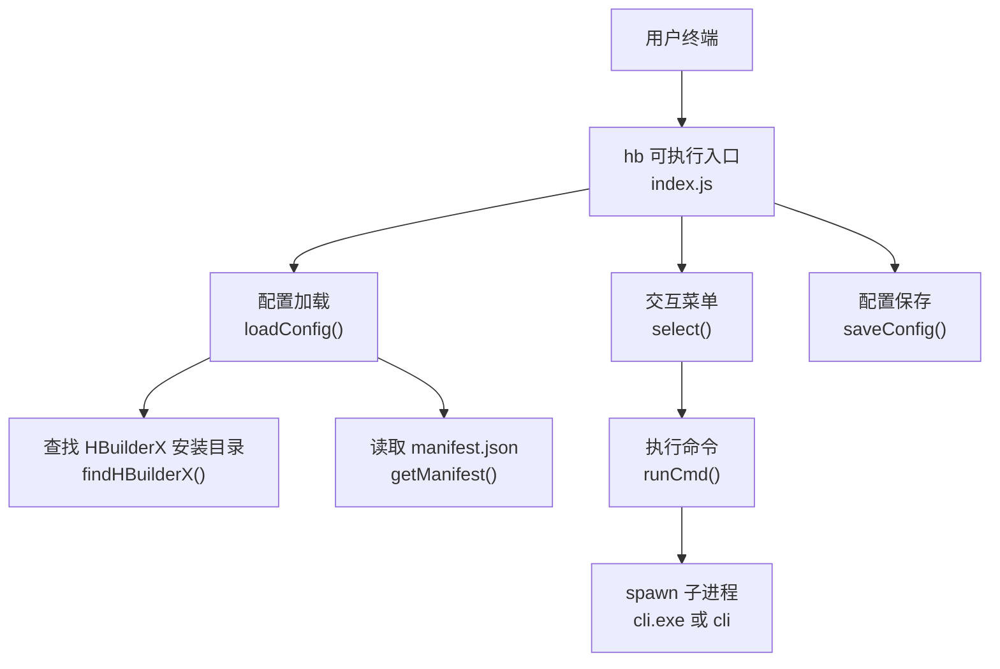
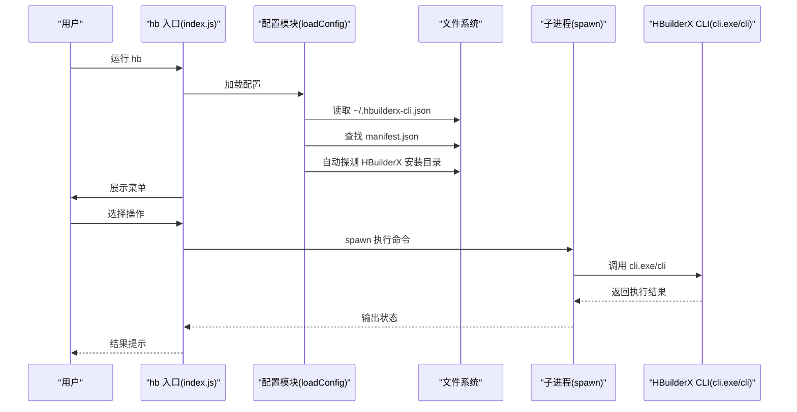
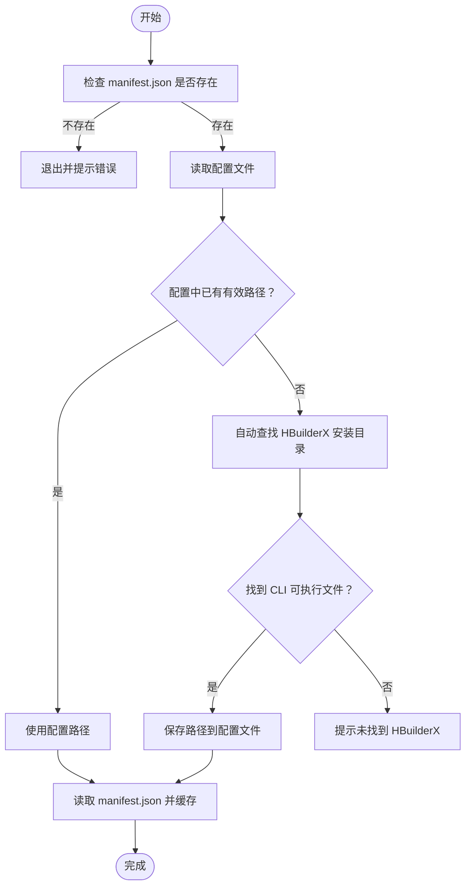
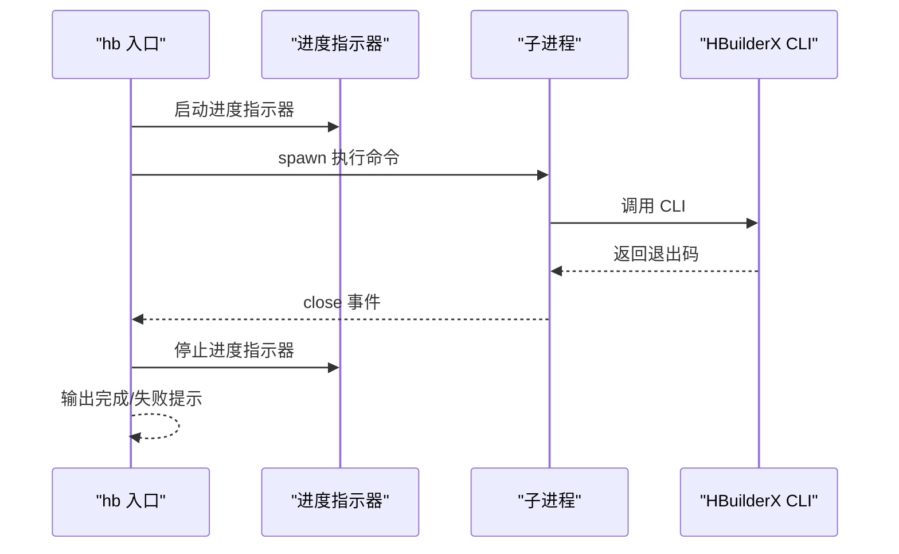
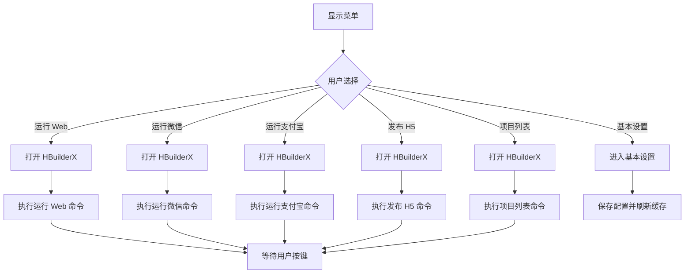
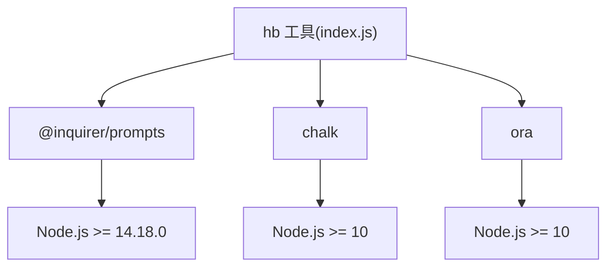

# 故障排除

<cite>
**本文引用的文件**
- [package.json](file://hbuilderx-cli/package.json)
- [index.js](file://hbuilderx-cli/index.js)
- [README.md](file://hbuilderx-cli/README.md)
- [release.js](file://hbuilderx-cli/release.js)
- [@inquirer/prompts 包信息](file://hbuilderx-cli/node_modules/@inquirer/prompts/package.json)
- [chalk 包信息](file://hbuilderx-cli/node_modules/chalk/package.json)
- [ora 包信息](file://hbuilderx-cli/node_modules/ora/package.json)
</cite>

## 目录
1. [简介](#简介)
2. [项目结构](#项目结构)
3. [核心组件](#核心组件)
4. [架构总览](#架构总览)
5. [详细组件分析](#详细组件分析)
6. [依赖关系分析](#依赖关系分析)
7. [性能考虑](#性能考虑)
8. [故障排除指南](#故障排除指南)
9. [结论](#结论)
10. [附录](#附录)

## 简介
本指南面向使用 HBuilderX CLI 工具的开发者，提供系统化的故障排除方法与调试技巧。内容覆盖安装问题、配置错误、权限问题、兼容性问题、日志分析与错误解读、环境诊断（Node.js 版本、HBuilderX 安装验证、manifest.json 校验）、性能排查与优化建议，以及问题报告与反馈流程。

## 项目结构
该工具为一个全局命令行工具，通过 npm 发布并提供可执行入口。核心逻辑集中在单文件入口脚本中，负责：
- 校验当前工作目录是否包含 HBuilderX 项目清单文件
- 查找并缓存 HBuilderX 安装目录
- 读取项目清单中的应用信息
- 提供交互式菜单，调用 HBuilderX CLI 执行运行/发布等任务
- 保存用户配置到用户主目录下的配置文件

图表来源
- [index.js:11-95](file://hbuilderx-cli/index.js#L11-L95)
- [index.js:165-242](file://hbuilderx-cli/index.js#L165-L242)

章节来源
- [package.json:1-21](file://hbuilderx-cli/package.json#L1-L21)
- [README.md:1-53](file://hbuilderx-cli/README.md#L1-L53)

## 核心组件
- 入口与控制流：命令行入口、主循环、菜单选择与分支处理
- 配置管理：配置文件读写、HBuilderX 路径自动发现、项目清单解析
- 命令执行：子进程调用、命令拼接、执行状态输出
- 用户界面：带样式的提示框、进度指示器、时间戳输出

章节来源
- [index.js:11-95](file://hbuilderx-cli/index.js#L11-L95)
- [index.js:165-242](file://hbuilderx-cli/index.js#L165-L242)

## 架构总览
该工具采用“入口脚本 + 子进程调用”的轻量架构。入口脚本负责交互与配置，实际业务由 HBuilderX CLI 完成，工具仅作为桥接层。

图表来源
- [index.js:67-95](file://hbuilderx-cli/index.js#L67-L95)
- [index.js:118-138](file://hbuilderx-cli/index.js#L118-L138)
- [index.js:165-189](file://hbuilderx-cli/index.js#L165-L189)

## 详细组件分析

### 配置与环境检测
- 配置文件位置：用户主目录下的 JSON 配置文件，用于保存 HBuilderX 安装目录与小程序 AppID 等信息
- HBuilderX 安装目录自动发现：在多个常见路径中查找 CLI 可执行文件
- 项目清单校验：要求当前目录存在项目清单文件，否则直接退出
- 项目信息读取：从清单中提取应用名、版本、各平台 AppID 等

图表来源
- [index.js:16-20](file://hbuilderx-cli/index.js#L16-L20)
- [index.js:67-95](file://hbuilderx-cli/index.js#L67-L95)
- [index.js:38-45](file://hbuilderx-cli/index.js#L38-L45)

章节来源
- [index.js:16-20](file://hbuilderx-cli/index.js#L16-L20)
- [index.js:67-95](file://hbuilderx-cli/index.js#L67-L95)
- [index.js:38-45](file://hbuilderx-cli/index.js#L38-L45)

### 命令执行与状态反馈
- 子进程调用：根据平台选择 shell 并执行命令，继承标准输入输出
- 进度与状态：使用进度指示器显示执行状态，完成后输出带颜色的时间戳提示
- 错误处理：捕获子进程错误事件，输出错误消息并返回非零退出码

图表来源
- [index.js:118-138](file://hbuilderx-cli/index.js#L118-L138)

章节来源
- [index.js:118-138](file://hbuilderx-cli/index.js#L118-L138)

### 交互式菜单与操作分支
- 菜单项：运行 Web、运行微信、运行支付宝、发布 H5、项目列表、基本设置
- 操作流程：先尝试打开 HBuilderX，再执行对应命令；成功后等待用户按键返回

图表来源
- [index.js:210-242](file://hbuilderx-cli/index.js#L210-L242)
- [index.js:165-189](file://hbuilderx-cli/index.js#L165-L189)

章节来源
- [index.js:210-242](file://hbuilderx-cli/index.js#L210-L242)
- [index.js:165-189](file://hbuilderx-cli/index.js#L165-L189)

## 依赖关系分析
- 依赖包与引擎要求：
  - @inquirer/prompts：交互式命令行界面，要求 Node.js 版本满足其引擎约束
  - chalk：终端文本样式，对 Node.js 版本有最低要求
  - ora：终端加载指示器，同样有最低 Node.js 版本要求
- 工具自身对 Node.js 的要求：在文档中明确要求 Node.js 版本不低于 14

图表来源
- [index.js:1-10](file://hbuilderx-cli/index.js#L1-L10)
- [@inquirer/prompts 包信息:62-64](file://hbuilderx-cli/node_modules/@inquirer/prompts/package.json#L62-L64)
- [chalk 包信息:9-11](file://hbuilderx-cli/node_modules/chalk/package.json#L9-L11)
- [ora 包信息:13-15](file://hbuilderx-cli/node_modules/ora/package.json#L13-L15)

章节来源
- [package.json:14-19](file://hbuilderx-cli/package.json#L14-L19)
- [README.md:30-34](file://hbuilderx-cli/README.md#L30-L34)
- [@inquirer/prompts 包信息:62-64](file://hbuilderx-cli/node_modules/@inquirer/prompts/package.json#L62-L64)
- [chalk 包信息:9-11](file://hbuilderx-cli/node_modules/chalk/package.json#L9-L11)
- [ora 包信息:13-15](file://hbuilderx-cli/node_modules/ora/package.json#L13-L15)

## 性能考虑
- 子进程开销：每次操作都会启动一个新的子进程，频繁操作会产生一定开销
- I/O 次数：读取配置文件、项目清单、自动查找 HBuilderX 安装目录均涉及磁盘访问
- 缓存策略：项目清单解析结果进行缓存，避免重复解析
- 建议：
  - 将常用操作合并或减少不必要的重复启动
  - 确保 HBuilderX 安装路径正确配置，避免每次自动查找
  - 在 CI 环境中预热配置，减少首次启动时的磁盘扫描

[本节为通用性能建议，不直接分析具体文件]

## 故障排除指南

### 一、安装与环境问题
- 症状：命令不可用或找不到可执行文件
  - 排查要点：
    - 确认已全局安装工具且可执行入口可用
    - 检查 Node.js 版本是否满足要求（>=14）
    - 确认 HBuilderX 已安装且 CLI 可执行文件存在
  - 解决方案：
    - 升级 Node.js 至满足要求的版本
    - 在“基本设置”中手动配置 HBuilderX 安装目录
    - 确认 CLI 可执行文件存在于安装目录中

章节来源
- [README.md:30-34](file://hbuilderx-cli/README.md#L30-L34)
- [index.js:16-20](file://hbuilderx-cli/index.js#L16-L20)
- [index.js:67-95](file://hbuilderx-cli/index.js#L67-L95)

### 二、配置错误
- 症状：提示未找到 HBuilderX 或无法执行命令
  - 排查要点：
    - 检查配置文件是否存在且格式正确
    - 确认配置中的安装目录指向有效路径
    - 验证项目清单文件是否存在且包含必要字段
  - 解决方案：
    - 使用“基本设置”重新配置安装目录
    - 重新生成或修复项目清单文件
    - 清理配置文件后重新配置

章节来源
- [index.js:67-95](file://hbuilderx-cli/index.js#L67-L95)
- [index.js:16-20](file://hbuilderx-cli/index.js#L16-L20)

### 三、权限问题
- 症状：无法启动 HBuilderX 或执行命令失败
  - 排查要点：
    - 确认当前用户对 HBuilderX 安装目录具有读取/执行权限
    - 确认当前工作目录对项目清单文件具有读取权限
  - 解决方案：
    - 以管理员身份运行终端或调整目录权限
    - 将项目移动到权限正常的目录

章节来源
- [index.js:118-138](file://hbuilderx-cli/index.js#L118-L138)

### 四、兼容性问题
- 症状：在某些操作系统或 Node.js 版本上行为异常
  - 排查要点：
    - 检查 Node.js 版本是否满足依赖包的引擎要求
    - 确认操作系统支持（Windows 为主）
  - 解决方案：
    - 升级 Node.js 至满足依赖包要求的版本
    - 在兼容的操作系统上运行

章节来源
- [@inquirer/prompts 包信息:62-64](file://hbuilderx-cli/node_modules/@inquirer/prompts/package.json#L62-L64)
- [index.js:118-138](file://hbuilderx-cli/index.js#L118-L138)

### 五、日志分析与错误信息解读
- 常见错误类型：
  - 项目目录校验失败：提示当前目录不是 HBuilderX 项目
  - 子进程错误：输出错误消息并返回非零退出码
  - 配置读取失败：默认回退到空配置并提示需要设置
- 分析方法：
  - 关注时间戳输出，定位具体执行点
  - 查看命令行输出的颜色提示，区分成功与失败
  - 检查配置文件与项目清单文件的完整性

章节来源
- [index.js:16-20](file://hbuilderx-cli/index.js#L16-L20)
- [index.js:118-138](file://hbuilderx-cli/index.js#L118-L138)
- [index.js:70-76](file://hbuilderx-cli/index.js#L70-L76)

### 六、环境诊断步骤
- Node.js 版本检查：确认版本满足工具与依赖包要求
- HBuilderX 安装验证：确认 CLI 可执行文件存在
- manifest.json 文件检查：确保项目清单存在且包含必要字段
- 配置文件检查：确认配置文件格式正确且路径有效

章节来源
- [README.md:30-34](file://hbuilderx-cli/README.md#L30-L34)
- [index.js:16-20](file://hbuilderx-cli/index.js#L16-L20)
- [index.js:67-95](file://hbuilderx-cli/index.js#L67-L95)

### 七、性能问题排查与优化
- 排查要点：
  - 观察子进程启动耗时与命令执行耗时
  - 检查磁盘 I/O 是否成为瓶颈
- 优化建议：
  - 预配置安装目录，避免每次自动查找
  - 减少不必要的重复启动
  - 在 CI 环境中复用配置，避免重复解析清单

章节来源
- [index.js:31-36](file://hbuilderx-cli/index.js#L31-L36)
- [index.js:118-138](file://hbuilderx-cli/index.js#L118-L138)

### 八、问题报告与反馈流程
- 收集信息：
  - Node.js 版本与平台信息
  - 工具版本与依赖包版本
  - 配置文件内容与项目清单内容
  - 详细的错误日志与截图
- 提交渠道：
  - 通过工具的发布信息或仓库链接提交问题
  - 描述问题现象、复现步骤与期望结果

章节来源
- [package.json:1-21](file://hbuilderx-cli/package.json#L1-L21)
- [README.md:1-53](file://hbuilderx-cli/README.md#L1-L53)

## 结论
本指南提供了针对 HBuilderX CLI 工具的系统化故障排除方法，涵盖安装、配置、权限、兼容性、日志分析与性能优化等方面。建议在日常使用中遵循“先诊断环境，再检查配置，最后分析日志”的顺序，结合本指南提供的流程快速定位并解决问题。

## 附录

### A. 常见问题速查表
- 问：为什么提示当前目录不是 HBuilderX 项目？
  - 答：请确认当前目录包含项目清单文件，并在项目根目录运行命令
- 问：如何配置 HBuilderX 安装目录？
  - 答：使用“基本设置”功能，或手动编辑配置文件
- 问：Node.js 版本过低会怎样？
  - 答：可能导致依赖包无法正常加载，建议升级至满足要求的版本

章节来源
- [index.js:16-20](file://hbuilderx-cli/index.js#L16-L20)
- [README.md:30-34](file://hbuilderx-cli/README.md#L30-L34)

### B. 配置文件参考
- 配置文件位置：用户主目录下的 JSON 文件
- 字段说明：安装目录、小程序 AppID 等

章节来源
- [README.md:36-46](file://hbuilderx-cli/README.md#L36-L46)