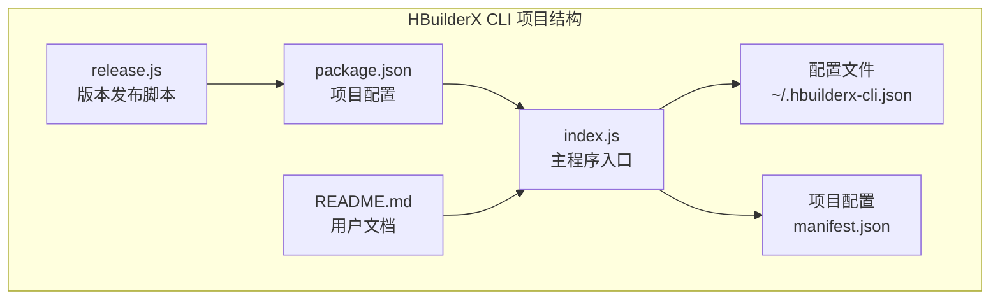
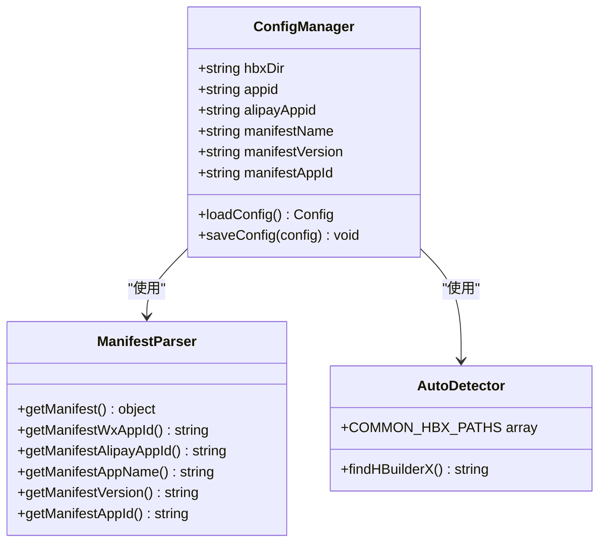
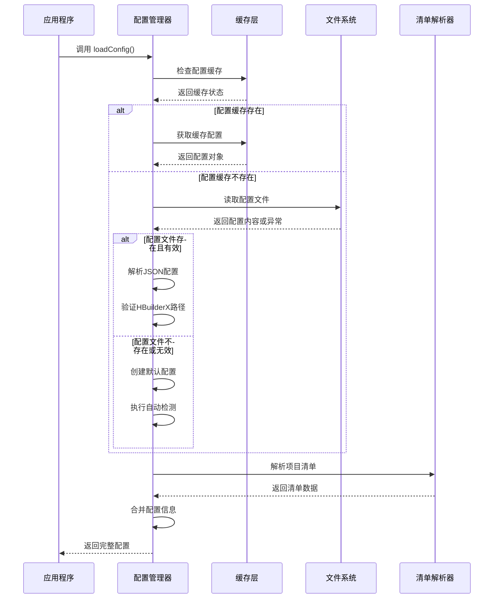
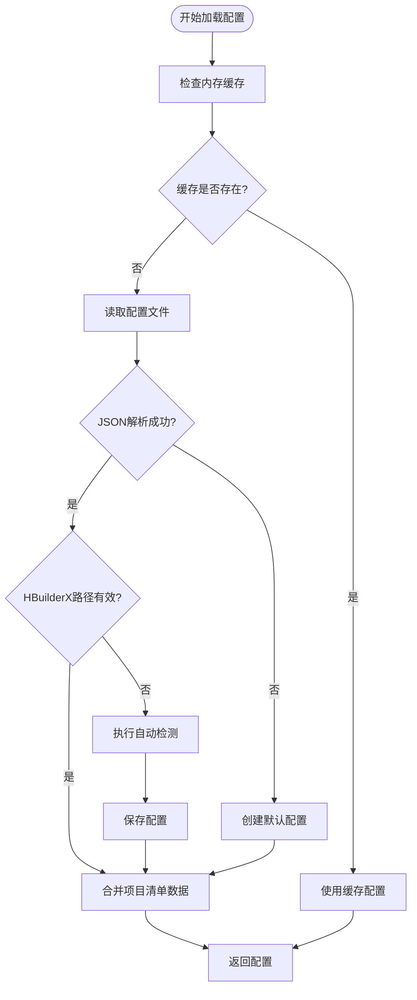
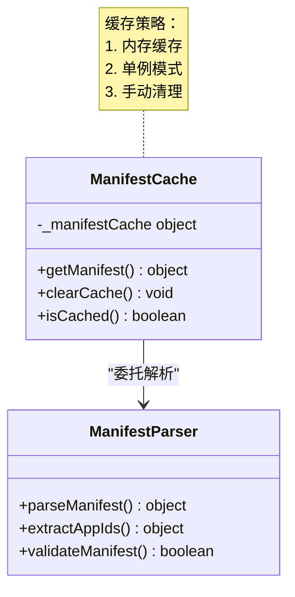
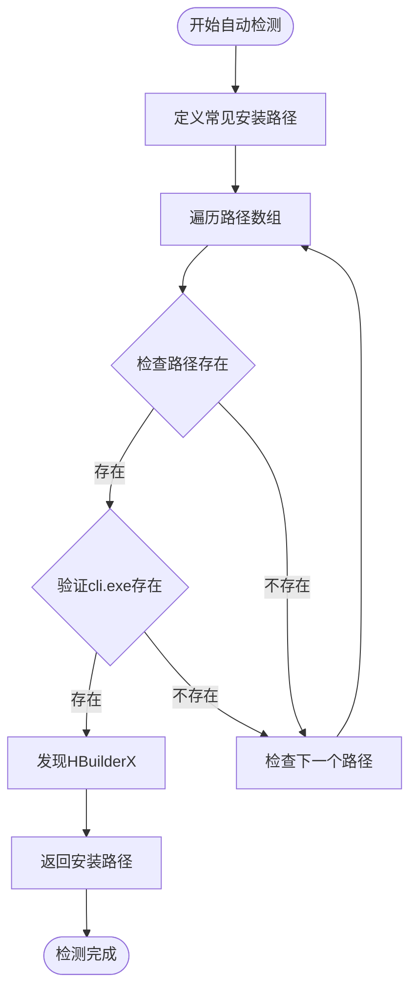
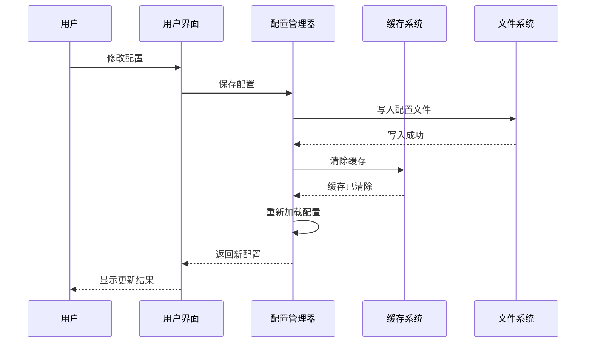
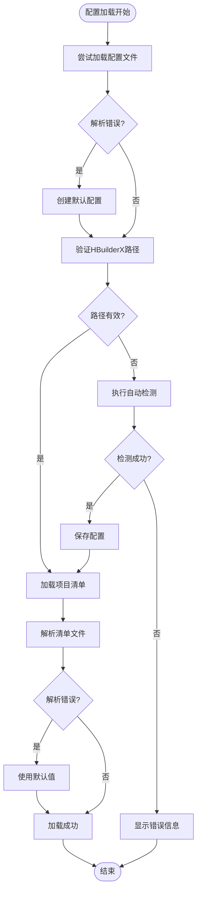
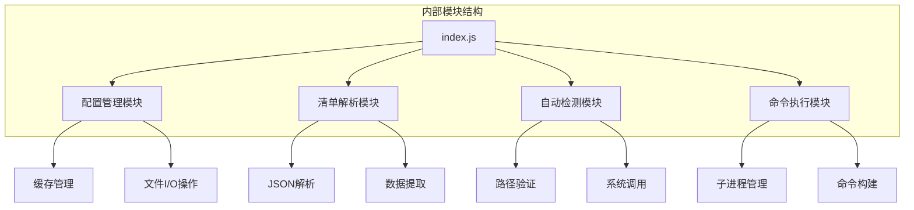

# 配置加载流程

<cite>
**本文档引用的文件**
- [package.json](file://hbuilderx-cli/package.json)
- [index.js](file://hbuilderx-cli/index.js)
- [README.md](file://hbuilderx-cli/README.md)
- [release.js](file://hbuilderx-cli/release.js)
</cite>

## 目录
1. [简介](#简介)
2. [项目结构](#项目结构)
3. [核心组件](#核心组件)
4. [架构概览](#架构概览)
5. [详细组件分析](#详细组件分析)
6. [依赖关系分析](#依赖关系分析)
7. [性能考虑](#性能考虑)
8. [故障排除指南](#故障排除指南)
9. [结论](#结论)

## 简介

HBuilderX CLI 是一个用于管理 HBuilderX 开发工具的全局命令行工具。该工具的核心功能是简化 HBuilderX 的配置管理和项目操作流程。本文档深入分析了配置加载流程，包括配置文件的加载机制、缓存策略、自动检测功能以及错误处理机制。

## 项目结构

该项目采用简洁的单文件架构设计，主要包含以下核心文件：



**图表来源**
- [package.json:1-21](file://hbuilderx-cli/package.json#L1-L21)
- [index.js:1-248](file://hbuilderx-cli/index.js#L1-L248)

**章节来源**
- [package.json:1-21](file://hbuilderx-cli/package.json#L1-L21)
- [README.md:1-53](file://hbuilderx-cli/README.md#L1-L53)

## 核心组件

### 配置管理系统

配置系统由三个主要组件构成：

1. **配置文件管理**：负责用户配置的持久化存储
2. **清单文件解析**：处理项目 manifest.json 文件
3. **自动检测机制**：自动查找 HBuilderX 安装路径

### 关键数据结构



**图表来源**
- [index.js:38-86](file://hbuilderx-cli/index.js#L38-L86)
- [index.js:22-36](file://hbuilderx-cli/index.js#L22-L36)

**章节来源**
- [index.js:38-86](file://hbuilderx-cli/index.js#L38-L86)
- [index.js:22-36](file://hbuilderx-cli/index.js#L22-L36)

## 架构概览

配置加载流程遵循"先缓存后文件"的优先级策略：



**图表来源**
- [index.js:67-86](file://hbuilderx-cli/index.js#L67-L86)
- [index.js:38-45](file://hbuilderx-cli/index.js#L38-L45)

## 详细组件分析

### 配置文件加载机制

配置文件采用 JSON 格式存储，位于用户主目录下的隐藏文件中：

#### 文件存在性检查流程



**图表来源**
- [index.js:67-86](file://hbuilderx-cli/index.js#L67-L86)
- [index.js:71-79](file://hbuilderx-cli/index.js#L71-L79)

#### 配置文件结构

配置文件包含以下字段：
- `hbxDir`: HBuilderX 安装目录路径
- `appid`: 微信小程序 AppID
- `alipayAppid`: 支付宝小程序 AppID

**章节来源**
- [index.js:67-86](file://hbuilderx-cli/index.js#L67-L86)
- [README.md:36-46](file://hbuilderx-cli/README.md#L36-L46)

### 清单文件缓存机制

项目清单文件的解析采用了智能缓存策略：

#### 缓存实现细节



**图表来源**
- [index.js:38-45](file://hbuilderx-cli/index.js#L38-L45)

#### 缓存生命周期管理

缓存在以下情况下会被清除：
1. 用户手动修改配置后
2. 项目清单文件发生变化时
3. 应用程序重启时

**章节来源**
- [index.js:38-45](file://hbuilderx-cli/index.js#L38-L45)
- [index.js:198](file://hbuilderx-cli/index.js#L198)

### 自动检测功能

HBuilderX 安装路径的自动检测实现了多路径并行扫描：

#### 检测算法实现



**图表来源**
- [index.js:31-36](file://hbuilderx-cli/index.js#L31-L36)
- [index.js:22-29](file://hbuilderx-cli/index.js#L22-L29)

#### 检测路径优先级

自动检测按照以下优先级顺序进行：

1. **D盘主目录**：`D:\HBuilderX`
2. **系统程序目录**：`C:\Program Files\HBuilderX`
3. **32位程序目录**：`C:\Program Files (x86)\HBuilderX`
4. **本地应用目录**：`%LOCALAPPDATA%\Programs\HBuilderX`
5. **环境变量程序目录**：`%ProgramFiles%\HBuilderX`
6. **64位环境变量目录**：`%ProgramFiles(x86)%\HBuilderX`

**章节来源**
- [index.js:31-36](file://hbuilderx-cli/index.js#L31-L36)
- [index.js:22-29](file://hbuilderx-cli/index.js#L22-L29)

### 配置更新机制

配置更新采用"即时生效+缓存同步"的策略：

#### 更新流程



**图表来源**
- [index.js:191-207](file://hbuilderx-cli/index.js#L191-L207)
- [index.js:88-90](file://hbuilderx-cli/index.js#L88-L90)

**章节来源**
- [index.js:191-207](file://hbuilderx-cli/index.js#L191-L207)
- [index.js:88-90](file://hbuilderx-cli/index.js#L88-L90)

### 错误处理与降级策略

系统实现了多层次的错误处理机制：

#### 错误处理层次



**图表来源**
- [index.js:67-86](file://hbuilderx-cli/index.js#L67-L86)
- [index.js:38-45](file://hbuilderx-cli/index.js#L38-L45)

#### 降级策略

当配置加载失败时，系统采用以下降级策略：

1. **配置文件降级**：创建默认配置对象，包含空的 HBuilderX 路径
2. **清单文件降级**：使用空对象作为默认清单，避免应用程序崩溃
3. **路径检测降级**：提示用户手动配置 HBuilderX 安装路径
4. **网络访问降级**：禁用需要网络的功能，保持本地功能可用

**章节来源**
- [index.js:67-86](file://hbuilderx-cli/index.js#L67-L86)
- [index.js:38-45](file://hbuilderx-cli/index.js#L38-L45)

## 依赖关系分析

### 外部依赖

项目依赖以下核心模块：

```mermaid
graph LR
subgraph "外部依赖"
A[chalk<br/>终端样式输出] --> D[index.js]
B[@inquirer/prompts<br/>交互式命令行] --> D
C[boxen<br/>终端边框输出] --> D
E[ora<br/>加载动画] --> D
end
subgraph "Node.js 核心模块"
F[child_process<br/>进程管理] --> D
G[fs<br/>文件系统] --> D
H[path<br/>路径处理] --> D
I[os<br/>操作系统] --> D
end
D --> F
D --> G
D --> H
D --> I
```

**图表来源**
- [package.json:14-19](file://hbuilderx-cli/package.json#L14-L19)
- [index.js:1-10](file://hbuilderx-cli/index.js#L1-L10)

### 内部模块依赖



**图表来源**
- [index.js:1-248](file://hbuilderx-cli/index.js#L1-L248)

**章节来源**
- [package.json:14-19](file://hbuilderx-cli/package.json#L14-L19)
- [index.js:1-248](file://hbuilderx-cli/index.js#L1-L248)

## 性能考虑

### 缓存优化策略

1. **内存缓存**：配置和清单数据在内存中缓存，避免重复文件读取
2. **懒加载机制**：只有在需要时才解析清单文件
3. **增量更新**：只在配置或清单发生变化时更新缓存

### I/O 操作优化

1. **异步文件操作**：使用异步 API 避免阻塞主线程
2. **批量操作**：在可能的情况下合并文件操作
3. **错误快速返回**：遇到错误立即停止不必要的操作

### 内存使用优化

1. **单例模式**：配置管理器采用单例模式，避免重复实例化
2. **及时清理**：在不需要时及时释放缓存资源
3. **最小化数据结构**：只存储必要的配置信息

## 故障排除指南

### 常见问题及解决方案

#### 配置文件加载失败

**问题症状**：
- 应用启动时报错
- 配置无法保存
- 设置页面显示异常

**诊断步骤**：
1. 检查配置文件权限
2. 验证 JSON 格式正确性
3. 确认文件编码为 UTF-8

**解决方法**：
1. 删除损坏的配置文件
2. 重新初始化配置
3. 检查磁盘空间

#### HBuilderX 路径检测失败

**问题症状**：
- "未找到"提示
- 无法执行 HBuilderX 命令
- 自动检测功能失效

**诊断步骤**：
1. 验证 HBuilderX 是否正确安装
2. 检查 cli.exe 文件是否存在
3. 确认安装路径权限

**解决方法**：
1. 手动输入正确的安装路径
2. 重新安装 HBuilderX
3. 检查防病毒软件拦截

#### 清单文件解析错误

**问题症状**：
- 项目信息显示为空
- 应用名称显示为默认值
- 版本号显示异常

**诊断步骤**：
1. 检查 manifest.json 格式
2. 验证必需字段完整性
3. 确认文件编码正确

**解决方法**：
1. 修复 JSON 格式错误
2. 补充缺失的必需字段
3. 重新生成清单文件

**章节来源**
- [index.js:132-137](file://hbuilderx-cli/index.js#L132-L137)
- [index.js:17-20](file://hbuilderx-cli/index.js#L17-L20)

### 调试技巧

1. **启用详细日志**：在开发环境中添加调试输出
2. **使用开发者工具**：利用 Node.js 调试器
3. **单元测试**：编写针对配置加载的测试用例
4. **性能监控**：监控文件 I/O 和内存使用情况

## 结论

HBuilderX CLI 的配置加载流程展现了现代 Node.js 应用的最佳实践：

### 设计优势

1. **模块化设计**：清晰的职责分离和模块边界
2. **缓存策略**：智能的内存缓存减少 I/O 操作
3. **错误处理**：完善的降级机制确保系统稳定性
4. **用户体验**：自动检测和配置向导提升易用性

### 技术亮点

1. **异步编程**：充分利用 Node.js 的异步特性
2. **文件系统抽象**：统一的文件操作接口
3. **跨平台兼容**：支持 Windows、macOS 和 Linux
4. **配置持久化**：可靠的用户配置存储机制

### 改进建议

1. **配置验证**：添加配置文件格式验证
2. **热重载**：实现配置文件变更的实时响应
3. **配置备份**：提供配置备份和恢复功能
4. **配置迁移**：支持配置版本升级和迁移

该配置加载系统为 HBuilderX CLI 提供了稳定可靠的基础，通过合理的架构设计和完善的错误处理机制，确保了用户在各种环境下的良好体验。