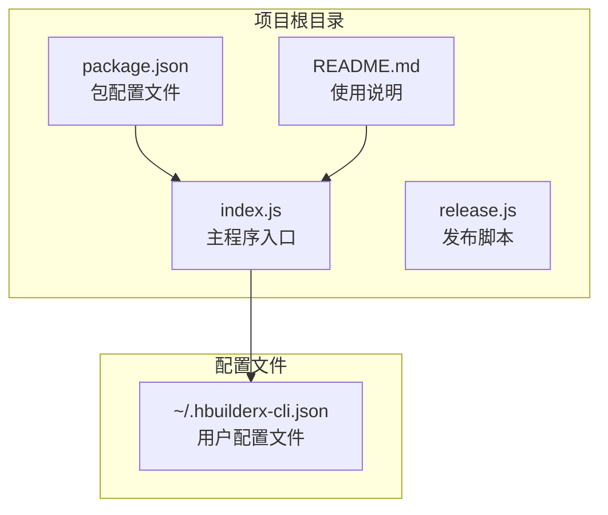
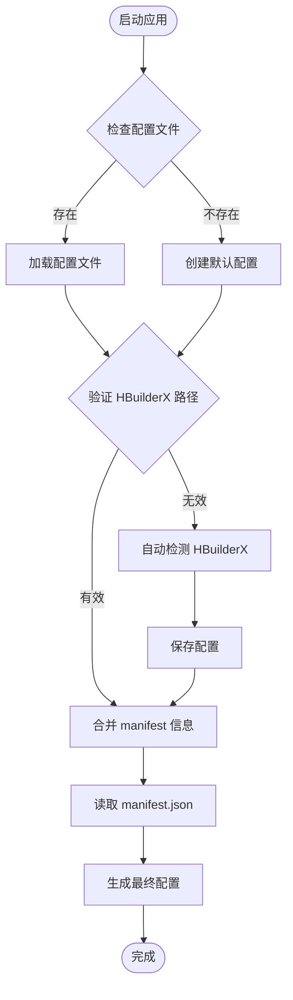
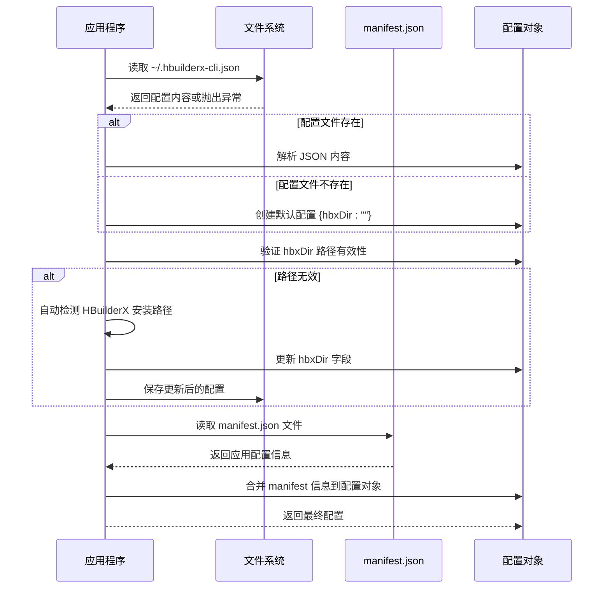
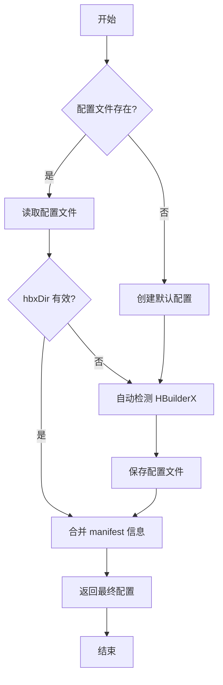

# 配置文件格式

<cite>
**本文档引用的文件**
- [package.json](file://package.json)
- [index.js](file://index.js)
- [README.md](file://README.md)
- [release.js](file://release.js)
</cite>

## 目录
1. [简介](#简介)
2. [项目结构](#项目结构)
3. [核心组件](#核心组件)
4. [架构概览](#架构概览)
5. [详细组件分析](#详细组件分析)
6. [依赖关系分析](#依赖关系分析)
7. [性能考虑](#性能考虑)
8. [故障排除指南](#故障排除指南)
9. [结论](#结论)

## 简介

HBuilderX CLI 是一个用于管理 HBuilderX 开发环境的全局命令行工具。该工具通过配置文件 `~/.hbuilderx-cli.json` 来存储用户的个性化设置，包括 HBuilderX 安装路径、小程序 AppID 等重要配置信息。

## 项目结构

HBuilderX CLI 项目采用简洁的单文件架构设计：



**图表来源**
- [package.json:1-21](file://package.json#L1-L21)
- [index.js:1-248](file://index.js#L1-L248)

**章节来源**
- [package.json:1-21](file://package.json#L1-L21)
- [index.js:1-248](file://index.js#L1-L248)

## 核心组件

### 配置文件存储位置

配置文件采用标准的用户配置文件格式，存储在用户的主目录下：

- **文件路径**: `~/.hbuilderx-cli.json`
- **操作系统支持**: Windows、macOS、Linux
- **文件格式**: JSON 格式

### 配置文件结构

配置文件采用 JSON 格式，包含以下字段：

| 字段名 | 数据类型 | 必填 | 默认值 | 作用范围 |
|--------|----------|------|--------|----------|
| hbxDir | string | 否 | "" | HBuilderX 安装目录路径 |
| appid | string | 否 | "" | 微信小程序 AppID |
| alipayAppid | string | 否 | "" | 支付宝小程序 AppID |
| manifestName | string | 否 | "" | 从 manifest.json 读取的应用名称 |
| manifestVersion | string | 否 | "" | 从 manifest.json 读取的应用版本 |
| manifestAppId | string | 否 | "" | 从 manifest.json 读取的应用 ID |

**章节来源**
- [index.js:67-86](file://index.js#L67-L86)
- [README.md:36-46](file://README.md#L36-L46)

## 架构概览

HBuilderX CLI 的配置系统采用"自动检测 + 用户配置"的双重机制：



**图表来源**
- [index.js:67-86](file://index.js#L67-L86)
- [index.js:31-36](file://index.js#L31-L36)

## 详细组件分析

### 配置文件加载机制

配置文件的加载过程遵循严格的优先级规则：



**图表来源**
- [index.js:67-86](file://index.js#L67-L86)
- [index.js:31-36](file://index.js#L31-L36)

### 字段详细说明

#### hbxDir 字段
- **用途**: 指定 HBuilderX 的安装目录路径
- **数据类型**: 字符串 (string)
- **默认值**: 空字符串 (`""`)
- **验证规则**: 必须包含 `cli.exe` 可执行文件
- **自动检测**: 支持多种常见安装路径的自动检测

#### appid 字段
- **用途**: 微信小程序的 AppID
- **数据类型**: 字符串 (string)
- **默认值**: 空字符串 (`""`)
- **来源**: 从 `manifest.json` 的 `mp-weixin` 配置中自动读取
- **优先级**: 如果配置文件中存在，则使用配置文件中的值；否则使用 manifest.json 中的值

#### alipayAppid 字段
- **用途**: 支付宝小程序的 AppID
- **数据类型**: 字符串 (string)
- **默认值**: 空字符串 (`""`)
- **来源**: 从 `manifest.json` 的 `mp-alipay` 配置中自动读取
- **优先级**: 如果配置文件中存在，则使用配置文件中的值；否则使用 manifest.json 中的值

#### manifestName 字段
- **用途**: 应用名称
- **数据类型**: 字符串 (string)
- **默认值**: 空字符串 (`""`)
- **来源**: 从 `manifest.json` 的 `name` 字段读取

#### manifestVersion 字段
- **用途**: 应用版本号
- **数据类型**: 字符串 (string)
- **默认值**: 空字符串 (`""`)
- **来源**: 从 `manifest.json` 的 `versionName` 字段读取

#### manifestAppId 字段
- **用途**: 应用 ID
- **数据类型**: 字符串 (string)
- **默认值**: 空字符串 (`""`)
- **来源**: 从 `manifest.json` 的 `appid` 字段读取

**章节来源**
- [index.js:47-65](file://index.js#L47-L65)
- [index.js:67-86](file://index.js#L67-L86)

### 配置文件示例

完整的配置文件示例如下：

```json
{
  "hbxDir": "D:\\HBuilderX",
  "appid": "wx1234567890abcdef",
  "alipayAppid": "2021000123456789",
  "manifestName": "我的应用",
  "manifestVersion": "1.0.0",
  "manifestAppId": "my-app-id"
}
```

**章节来源**
- [README.md:40-46](file://README.md#L40-L46)

### 读取顺序和优先级机制

配置系统的读取顺序遵循以下优先级规则：

1. **配置文件优先**: 配置文件中的设置具有最高优先级
2. **manifest.json 次之**: 当配置文件中缺少某些字段时，从 manifest.json 中读取
3. **自动检测再次**: 如果配置文件完全缺失，系统会自动检测 HBuilderX 安装路径
4. **默认值最后**: 所有其他情况下使用空字符串作为默认值



**图表来源**
- [index.js:67-86](file://index.js#L67-L86)

**章节来源**
- [index.js:67-86](file://index.js#L67-L86)

## 依赖关系分析

### 外部依赖

HBuilderX CLI 项目的主要外部依赖包括：

| 依赖包 | 版本 | 用途 |
|--------|------|------|
| chalk | ^4.1.2 | 控制台文本样式化 |
| @inquirer/prompts | ^3.0.0 | 交互式命令行界面 |
| boxen | ^5.1.2 | 创建带边框的文本框 |
| ora | ^5.4.1 | 加载状态指示器 |

### 内部模块依赖

```mermaid
graph LR
subgraph "核心模块"
FS[fs 模块<br/>文件系统操作]
PATH[path 模块<br/>路径处理]
OS[os 模块<br/>操作系统信息]
CHILD[child_process 模块<br/>进程管理]
end
subgraph "第三方模块"
CHALK[chalk<br/>文本样式]
INQ[@inquirer/prompts<br/>交互界面]
BOXEN[boxen<br/>边框文本]
ORA[ora<br/>加载指示器]
end
subgraph "业务逻辑"
LOADCFG[配置加载]
MANIFEST[manifest 处理]
CMD[命令执行]
end
FS --> LOADCFG
PATH --> LOADCFG
OS --> LOADCFG
CHILD --> CMD
CHALK --> LOADCFG
INQ --> LOADCFG
BOXEN --> LOADCFG
ORA --> LOADCFG
LOADCFG --> MANIFEST
MANIFEST --> CMD
```

**图表来源**
- [package.json:14-19](file://package.json#L14-L19)
- [index.js:1-10](file://index.js#L1-L10)

**章节来源**
- [package.json:14-19](file://package.json#L14-L19)
- [index.js:1-10](file://index.js#L1-L10)

## 性能考虑

### 缓存机制

配置系统实现了智能缓存机制以提高性能：

- **manifest 缓存**: 读取的 manifest.json 内容会被缓存，避免重复读取
- **配置缓存**: 加载的配置对象会在内存中缓存，减少磁盘 I/O 操作
- **路径检测缓存**: HBuilderX 安装路径的检测结果会被缓存

### 异步处理

所有文件操作都采用异步方式处理，确保用户界面的响应性：

- **配置文件读取**: 使用异步文件读取方法
- **命令执行**: 使用异步进程管理
- **用户交互**: 使用异步提示系统

## 故障排除指南

### 常见问题及解决方案

#### 配置文件无法读取

**问题描述**: 应用启动时报错，无法读取配置文件

**可能原因**:
- 配置文件格式不正确
- 文件权限不足
- 文件损坏

**解决方法**:
1. 检查配置文件格式是否为有效的 JSON
2. 确认用户对配置文件具有读取权限
3. 删除损坏的配置文件，让应用重新创建

#### HBuilderX 路径检测失败

**问题描述**: 应用无法自动检测到 HBuilderX 的安装路径

**可能原因**:
- HBuilderX 未正确安装
- 安装路径不在默认搜索范围内
- 权限不足

**解决方法**:
1. 手动在基本设置中指定 HBuilderX 安装路径
2. 确认 HBuilderX 已正确安装
3. 检查安装路径是否在默认搜索范围内

#### manifest.json 读取失败

**问题描述**: 应用无法读取项目根目录的 manifest.json 文件

**可能原因**:
- 项目根目录不存在 manifest.json
- manifest.json 格式不正确
- 文件权限不足

**解决方法**:
1. 确认当前目录为 HBuilderX 项目根目录
2. 检查 manifest.json 文件格式是否正确
3. 确认对 manifest.json 文件具有读取权限

**章节来源**
- [index.js:16-20](file://index.js#L16-L20)
- [index.js:71-75](file://index.js#L71-L75)

## 结论

HBuilderX CLI 的配置文件系统设计简洁而功能完整，通过合理的优先级机制和自动检测功能，为用户提供了便捷的使用体验。配置文件采用标准的 JSON 格式，易于理解和维护，同时支持多种平台的兼容性。

该系统的核心优势在于：
- **简单易用**: 配置文件结构清晰，字段含义明确
- **智能检测**: 自动检测 HBuilderX 安装路径，减少手动配置
- **灵活优先级**: 支持多层配置覆盖，满足不同使用场景
- **跨平台兼容**: 支持 Windows、macOS、Linux 等主流操作系统

通过合理使用这些配置选项，用户可以充分利用 HBuilderX CLI 的功能，提高开发效率和工作流程的自动化程度。