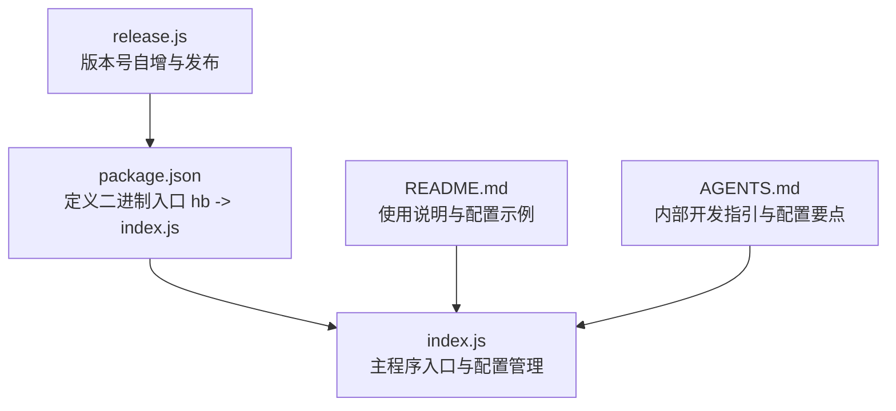
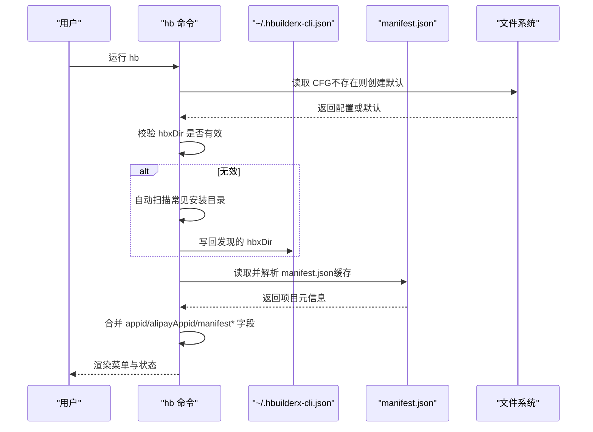
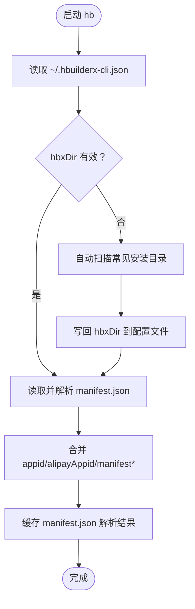
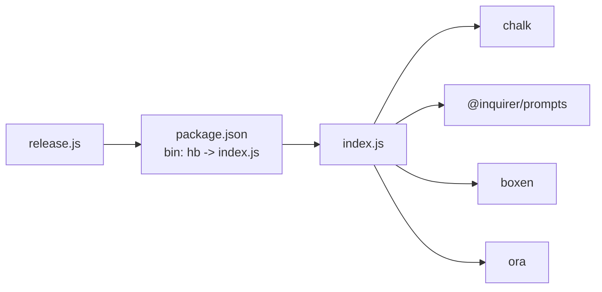

# 配置管理

<cite>
**本文引用的文件**
- [package.json](file://package.json)
- [index.js](file://index.js)
- [README.md](file://README.md)
- [AGENTS.md](file://AGENTS.md)
- [release.js](file://release.js)
</cite>

## 目录
1. [简介](#简介)
2. [项目结构](#项目结构)
3. [核心组件](#核心组件)
4. [架构总览](#架构总览)
5. [详细组件分析](#详细组件分析)
6. [依赖分析](#依赖分析)
7. [性能考虑](#性能考虑)
8. [故障排除指南](#故障排除指南)
9. [结论](#结论)
10. [附录](#附录)

## 简介
本文件面向 HBuilderX CLI 工具的配置管理，围绕配置文件结构、字段含义与配置方法展开，重点覆盖以下关键配置项：
- hbxDir：HBuilderX 安装路径
- appid：微信小程序 AppID
- alipayAppid：支付宝小程序 AppID
- manifestName、manifestVersion、manifestAppId：来自项目 manifest.json 的元信息缓存

同时，文档解释配置文件的存储位置、加载机制、缓存策略、优先级与继承关系、更新机制、迁移与备份恢复最佳实践，并提供配置验证与故障排除方法。

## 项目结构
该工具为单文件入口的 CLI 应用，核心逻辑集中在 index.js，其他文件提供包元信息、使用说明、发布脚本与内部开发指引。

图表来源
- [package.json:1-21](file://package.json#L1-L21)
- [index.js:1-248](file://index.js#L1-L248)
- [README.md:1-53](file://README.md#L1-L53)
- [AGENTS.md:1-76](file://AGENTS.md#L1-L76)
- [release.js:1-19](file://release.js#L1-L19)

章节来源
- [package.json:1-21](file://package.json#L1-L21)
- [index.js:1-248](file://index.js#L1-L248)
- [README.md:1-53](file://README.md#L1-L53)
- [AGENTS.md:1-76](file://AGENTS.md#L1-L76)
- [release.js:1-19](file://release.js#L1-L19)

## 核心组件
- 配置文件与路径
  - 存储位置：用户主目录下的隐藏文件 ~/.hbuilderx-cli.json
  - 加载与写入：启动时读取，必要时自动补全 hbxDir 并写回
- 配置项
  - hbxDir：HBuilderX 安装目录，用于定位 cli.exe
  - appid：微信小程序 AppID，来源于 manifest.json 的 mp-weixin.appid
  - alipayAppid：支付宝小程序 AppID，来源于 manifest.json 的 mp-alipay.appid
  - manifestName、manifestVersion、manifestAppId：项目名、版本名、应用 AppID（来自 manifest.json），作为 UI 展示与缓存使用
- 缓存策略
  - manifest.json 解析结果采用进程内缓存，避免重复 IO；当用户在“基本设置”中修改配置后，会重置缓存并重新读取 manifest.json
- 加载与优先级
  - 优先使用 ~/.hbuilderx-cli.json 中的 hbxDir
  - 若缺失或无效，则自动扫描常见安装路径，命中后写回配置
  - appid/alipayAppid 优先取 manifest.json，其次保留配置文件中的值
- 更新机制
  - “基本设置”允许用户手动修改 hbxDir
  - 保存后刷新缓存并同步 manifest.json 中的最新值

章节来源
- [index.js:13-14](file://index.js#L13-L14)
- [index.js:66-86](file://index.js#L66-L86)
- [index.js:87-90](file://index.js#L87-L90)
- [index.js:38-45](file://index.js#L38-L45)
- [index.js:191-207](file://index.js#L191-L207)
- [README.md:36-46](file://README.md#L36-L46)
- [AGENTS.md:31-42](file://AGENTS.md#L31-L42)

## 架构总览
下图展示配置管理在启动阶段的加载与合并流程，以及与 manifest.json 的关系。

图表来源
- [index.js:66-86](file://index.js#L66-L86)
- [index.js:38-45](file://index.js#L38-L45)
- [index.js:22-29](file://index.js#L22-L29)
- [index.js:13-14](file://index.js#L13-L14)

## 详细组件分析

### 配置文件结构与字段
- 文件位置：用户主目录下的隐藏文件 ~/.hbuilderx-cli.json
- 结构示例（来自文档）：
  - hbxDir：HBuilderX 安装路径
  - appid：微信小程序 AppID
  - alipayAppid：支付宝小程序 AppID
- 字段含义
  - hbxDir：决定 cli.exe 的绝对路径，用于执行 HBuilderX CLI 命令
  - appid：微信小程序 AppID，用于运行/发布微信小程序场景
  - alipayAppid：支付宝小程序 AppID，用于运行/发布支付宝小程序场景
  - manifestName、manifestVersion、manifestAppId：项目名、版本名、应用 AppID，用于界面展示与缓存

章节来源
- [README.md:36-46](file://README.md#L36-L46)
- [AGENTS.md:31-35](file://AGENTS.md#L31-L35)
- [index.js:66-86](file://index.js#L66-L86)

### 配置加载与缓存策略
- 加载流程
  - 读取 ~/.hbuilderx-cli.json；若不存在则初始化默认配置（hbxDir 空字符串）
  - 校验 hbxDir 是否指向有效的 cli.exe；若无效则自动扫描常见安装目录并写回
  - 读取 manifest.json 并解析，缓存结果
  - 合并 appid/alipayAppid/manifest* 字段：优先取 manifest.json 的值，否则保留配置文件中的值
- 缓存策略
  - manifest.json 解析结果在进程内缓存，避免重复 IO
  - 用户在“基本设置”中修改配置后，重置缓存并重新读取 manifest.json

图表来源
- [index.js:66-86](file://index.js#L66-L86)
- [index.js:38-45](file://index.js#L38-L45)
- [index.js:22-29](file://index.js#L22-L29)

章节来源
- [index.js:66-86](file://index.js#L66-L86)
- [index.js:38-45](file://index.js#L38-L45)

### 配置优先级与继承关系
- hbxDir 优先级
  - 配置文件中的 hbxDir 优先
  - 若无效或缺失，自动扫描常见安装目录并写回
- appid/alipayAppid 优先级
  - 优先取 manifest.json 中的对应值
  - 若 manifest.json 中不存在，则保留配置文件中的值
- 继承关系
  - 配置文件中的 appid/alipayAppid 可作为默认值，但会被 manifest.json 覆盖
  - manifestName/manifestVersion/manifestAppId 由 manifest.json 提供，作为 UI 展示与缓存使用

章节来源
- [index.js:66-86](file://index.js#L66-L86)
- [AGENTS.md:31-35](file://AGENTS.md#L31-L35)

### 配置更新机制
- 手动更新
  - “基本设置”菜单允许用户修改 hbxDir
  - 保存后重置缓存并重新读取 manifest.json，确保 UI 与配置一致
- 自动更新
  - 首次加载时若检测到 hbxDir 无效，会自动扫描并写回

章节来源
- [index.js:191-207](file://index.js#L191-L207)
- [index.js:66-86](file://index.js#L66-L86)

### 配置验证与故障排除
- 常见问题与诊断
  - 未找到 manifest.json：当前目录必须包含 manifest.json，否则直接退出
  - 未找到 HBuilderX：若 hbxDir 无效或缺失，工具会尝试自动扫描常见安装目录；如仍失败，请在“基本设置”中手动指定
  - appid/alipayAppid 未设置：工具会提示未设置；请在 manifest.json 中正确配置对应小程序 AppID
- 故障排除步骤
  - 确认项目根目录存在 manifest.json
  - 在“基本设置”中检查并修正 hbxDir
  - 确认 manifest.json 中 mp-weixin 或 mp-alipay 对应的 appid 字段正确
  - 如需重置配置，删除 ~/.hbuilderx-cli.json 后重新运行 hb，让工具重建默认配置并自动扫描 hbxDir

章节来源
- [index.js:17-20](file://index.js#L17-L20)
- [index.js:66-86](file://index.js#L66-L86)
- [README.md:48-53](file://README.md#L48-L53)

### 配置迁移与备份恢复
- 迁移建议
  - 将旧配置文件 ~/.hbuilderx-cli.json 备份至安全位置
  - 在新环境中安装 HBuilderX 并确保 cli.exe 可用
  - 运行 hb，若 hbxDir 无效，工具会自动扫描；如仍失败，请在“基本设置”中手动指定
- 备份恢复
  - 备份：复制 ~/.hbuilderx-cli.json 至安全位置
  - 恢复：将备份文件覆盖到 ~/.hbuilderx-cli.json，重启 hb 即可生效

章节来源
- [README.md:36-46](file://README.md#L36-L46)
- [index.js:66-86](file://index.js#L66-L86)

## 依赖分析
- 包定义与二进制入口
  - package.json 定义了二进制入口 hb 指向 index.js
- 运行时依赖
  - chalk：终端颜色输出
  - @inquirer/prompts：交互式输入（select、input）
  - boxen：边框盒子样式
  - ora：loading spinner
- 开发与发布
  - release.js 负责版本号自增与发布

图表来源
- [package.json:5-7](file://package.json#L5-L7)
- [package.json:14-19](file://package.json#L14-L19)
- [index.js:6-9](file://index.js#L6-L9)
- [release.js:1-19](file://release.js#L1-L19)

章节来源
- [package.json:1-21](file://package.json#L1-L21)
- [index.js:1-248](file://index.js#L1-L248)
- [release.js:1-19](file://release.js#L1-L19)

## 性能考虑
- 缓存策略
  - manifest.json 解析结果在进程内缓存，减少重复 IO，提升启动与菜单渲染速度
- 文件访问
  - 配置文件与 manifest.json 的读取次数较少，且在启动阶段集中完成
- I/O 优化
  - 仅在“基本设置”保存或首次加载时进行写入操作，避免频繁写盘

章节来源
- [index.js:38-45](file://index.js#L38-L45)
- [index.js:87-90](file://index.js#L87-L90)

## 故障排除指南
- 无法找到 HBuilderX
  - 现象：工具提示未找到 HBuilderX
  - 处理：在“基本设置”中手动输入正确的安装目录；或确保 HBuilderX 已安装在常见目录之一
- 未找到 manifest.json
  - 现象：直接退出并提示当前目录不是 HBuilderX 项目
  - 处理：切换到包含 manifest.json 的项目根目录
- appid/alipayAppid 未设置
  - 现象：界面显示未设置
  - 处理：在 manifest.json 中为 mp-weixin 或 mp-alipay 添加对应的 appid 字段
- 配置文件损坏
  - 现象：JSON 解析失败或字段缺失
  - 处理：删除 ~/.hbuilderx-cli.json，重新运行 hb 让其重建默认配置并自动扫描 hbxDir

章节来源
- [index.js:17-20](file://index.js#L17-L20)
- [index.js:66-86](file://index.js#L66-L86)
- [README.md:48-53](file://README.md#L48-L53)

## 结论
HBuilderX CLI 的配置管理以单文件为核心，通过用户主目录下的隐藏配置文件与项目 manifest.json 协同工作，实现最小化维护成本与高可用性。其设计强调：
- 明确的配置文件结构与字段语义
- 启动时的自动扫描与写回机制
- 基于 manifest.json 的优先级覆盖
- 进程内缓存与必要的重置策略
- 简洁的交互式设置流程与清晰的故障排除路径

## 附录
- 使用与安装
  - 安装：通过 npm 全局安装 hb-cli
  - 使用：在包含 manifest.json 的项目根目录运行 hb
- 发布流程
  - 通过 npm run release 实现版本号自增与发布

章节来源
- [README.md:5-17](file://README.md#L5-L17)
- [AGENTS.md:63-70](file://AGENTS.md#L63-L70)
- [release.js:1-19](file://release.js#L1-L19)