# 配置管理操作

<cite>
**本文档引用的文件**
- [package.json](file://hbuilderx-cli/package.json)
- [index.js](file://hbuilderx-cli/index.js)
- [README.md](file://hbuilderx-cli/README.md)
- [release.js](file://hbuilderx-cli/release.js)
</cite>

## 目录
1. [简介](#简介)
2. [项目结构](#项目结构)
3. [核心组件](#核心组件)
4. [架构概览](#架构概览)
5. [详细组件分析](#详细组件分析)
6. [配置管理详解](#配置管理详解)
7. [配置备份与恢复](#配置备份与恢复)
8. [配置迁移最佳实践](#配置迁移最佳实践)
9. [性能考虑](#性能考虑)
10. [故障排除指南](#故障排除指南)
11. [结论](#结论)

## 简介

HBuilderX CLI 配置管理操作是一个基于 Node.js 的全局命令行工具，专门用于管理 HBuilderX 开发环境的配置。该工具提供了直观的交互式界面，支持 HBuilderX 安装目录配置、小程序 AppID 设置以及项目信息同步等功能。通过简单的命令行操作，开发者可以快速配置和管理 HBuilderX 的各种设置。

## 项目结构

该项目采用简洁的单文件架构设计，主要包含以下核心文件：

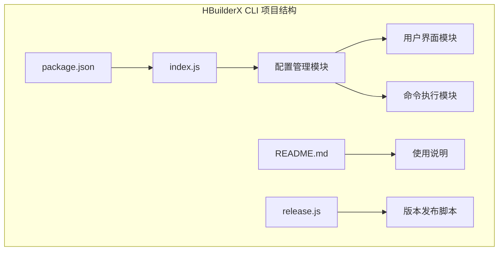

**图表来源**
- [package.json:1-21](file://hbuilderx-cli/package.json#L1-L21)
- [index.js:1-248](file://hbuilderx-cli/index.js#L1-L248)

**章节来源**
- [package.json:1-21](file://hbuilderx-cli/package.json#L1-L21)
- [README.md:1-53](file://hbuilderx-cli/README.md#L1-L53)

## 核心组件

### 主要依赖库

项目使用了四个核心依赖库来实现完整的功能：

| 依赖库 | 版本 | 用途 |
|--------|------|------|
| chalk | ^4.1.2 | 控制台文本样式和颜色输出 |
| @inquirer/prompts | ^3.0.0 | 提供交互式命令行界面 |
| boxen | ^5.1.2 | 创建带边框的文本框显示 |
| ora | ^5.4.1 | 显示加载动画和状态指示 |

### 配置文件结构

配置文件采用 JSON 格式存储，位于用户主目录下的隐藏文件中：

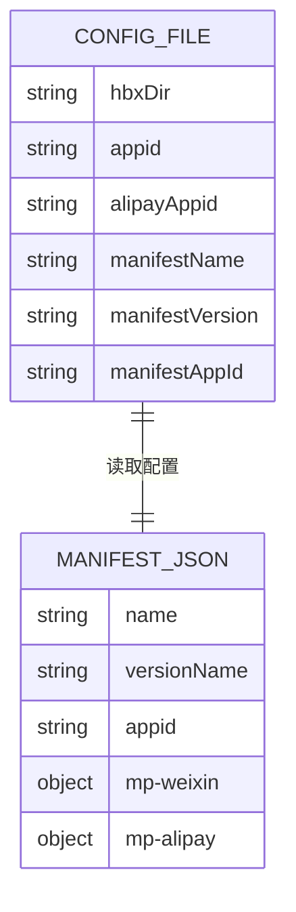

**图表来源**
- [index.js:67-90](file://hbuilderx-cli/index.js#L67-L90)
- [index.js:39-65](file://hbuilderx-cli/index.js#L39-L65)

**章节来源**
- [package.json:14-19](file://hbuilderx-cli/package.json#L14-L19)
- [index.js:14-86](file://hbuilderx-cli/index.js#L14-L86)

## 架构概览

系统采用模块化设计，将功能分为多个独立的模块：

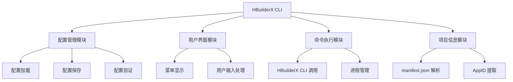

**图表来源**
- [index.js:67-95](file://hbuilderx-cli/index.js#L67-L95)
- [index.js:105-163](file://hbuilderx-cli/index.js#L105-L163)
- [index.js:118-138](file://hbuilderx-cli/index.js#L118-L138)

## 详细组件分析

### 配置管理模块

配置管理模块是整个系统的核心，负责处理所有配置相关的操作：

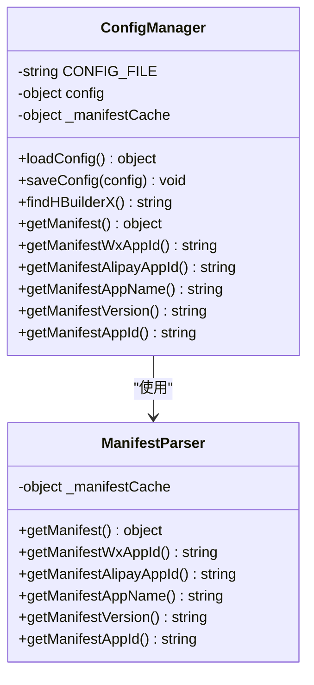

**图表来源**
- [index.js:67-86](file://hbuilderx-cli/index.js#L67-L86)
- [index.js:39-65](file://hbuilderx-cli/index.js#L39-L65)

#### 配置加载流程

配置加载过程遵循以下步骤：

1. **初始化配置**：从配置文件读取现有配置
2. **自动检测**：如果未找到有效配置，自动搜索 HBuilderX 安装目录
3. **项目信息同步**：从 manifest.json 中提取项目相关信息
4. **默认值设置**：为缺失的配置项设置默认值

**章节来源**
- [index.js:67-86](file://hbuilderx-cli/index.js#L67-L86)
- [index.js:31-36](file://hbuilderx-cli/index.js#L31-L36)

### 用户界面模块

用户界面模块提供了一个交互式的菜单系统：

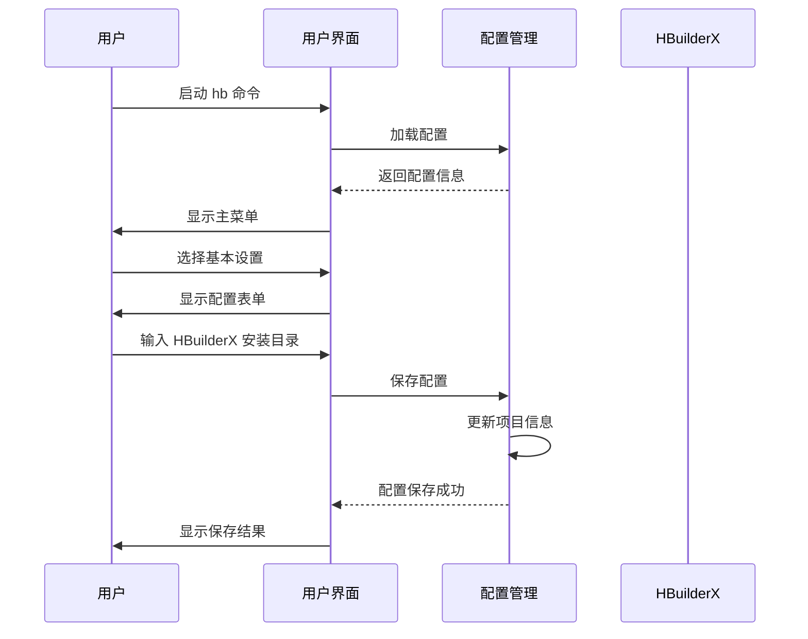

**图表来源**
- [index.js:191-207](file://hbuilderx-cli/index.js#L191-L207)
- [index.js:214-236](file://hbuilderx-cli/index.js#L214-L236)

**章节来源**
- [index.js:105-163](file://hbuilderx-cli/index.js#L105-L163)
- [index.js:214-242](file://hbuilderx-cli/index.js#L214-L242)

### 命令执行模块

命令执行模块负责与 HBuilderX CLI 进行交互：

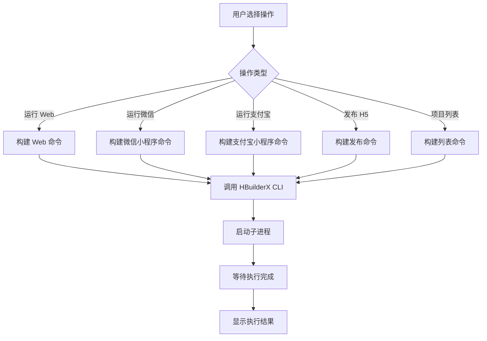

**图表来源**
- [index.js:166-189](file://hbuilderx-cli/index.js#L166-L189)
- [index.js:92-95](file://hbuilderx-cli/index.js#L92-L95)

**章节来源**
- [index.js:118-138](file://hbuilderx-cli/index.js#L118-L138)
- [index.js:166-189](file://hbuilderx-cli/index.js#L166-L189)

## 配置管理详解

### 基本设置功能

基本设置功能允许用户配置 HBuilderX 的安装目录：

#### 配置项说明

| 配置项 | 类型 | 描述 | 默认值 |
|--------|------|------|--------|
| hbxDir | string | HBuilderX 安装目录路径 | "" |
| appid | string | 微信小程序 AppID | 从 manifest.json 读取 |
| alipayAppid | string | 支付宝小程序 AppID | 从 manifest.json 读取 |
| manifestName | string | 项目名称 | 从 manifest.json 读取 |
| manifestVersion | string | 项目版本 | 从 manifest.json 读取 |
| manifestAppId | string | 项目 AppID | 从 manifest.json 读取 |

#### 编辑流程

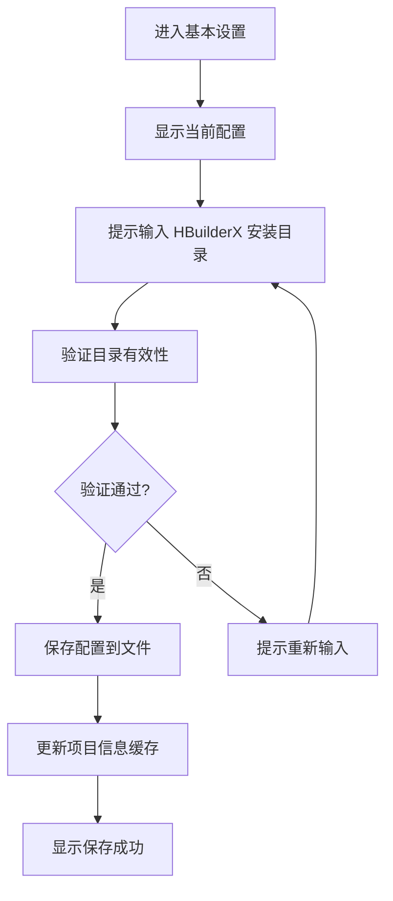

**图表来源**
- [index.js:191-207](file://hbuilderx-cli/index.js#L191-L207)

#### 验证规则

配置验证遵循以下规则：

1. **目录存在性验证**：确保指定的目录包含 HBuilderX CLI 可执行文件
2. **可访问性验证**：验证目录具有适当的读写权限
3. **格式验证**：确保路径字符串不为空且符合文件系统规范

#### 保存机制

配置保存采用以下机制：

1. **原子写入**：使用 JSON 序列化后一次性写入文件
2. **错误处理**：捕获并处理文件写入异常
3. **缓存更新**：更新内存中的配置缓存

**章节来源**
- [index.js:67-90](file://hbuilderx-cli/index.js#L67-L90)
- [index.js:191-207](file://hbuilderx-cli/index.js#L191-L207)

### 项目信息同步

系统会自动从项目配置文件中提取相关信息：

#### 同步内容

| 信息类型 | 来源 | 同步方式 |
|----------|------|----------|
| 项目名称 | manifest.json | 自动读取 |
| 项目版本 | manifest.json | 自动读取 |
| 微信 AppID | manifest.json | 自动读取 |
| 支付宝 AppID | manifest.json | 自动读取 |
| 项目 AppID | manifest.json | 自动读取 |

#### 同步流程

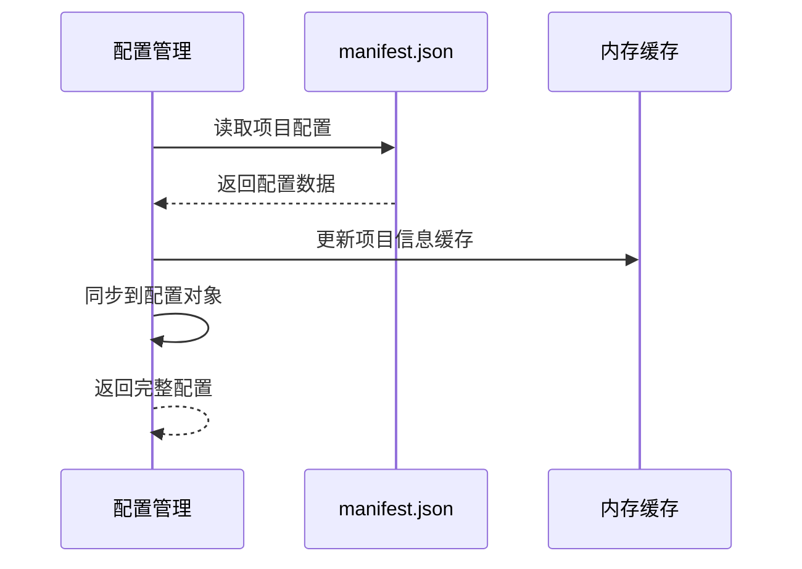

**图表来源**
- [index.js:39-65](file://hbuilderx-cli/index.js#L39-L65)
- [index.js:67-86](file://hbuilderx-cli/index.js#L67-L86)

**章节来源**
- [index.js:39-65](file://hbuilderx-cli/index.js#L39-L65)
- [index.js:67-86](file://hbuilderx-cli/index.js#L67-L86)

## 配置备份与恢复

### 手动备份方法

配置文件位于用户主目录下的隐藏文件中，可以通过以下方式进行手动备份：

#### 备份位置

配置文件路径：`~/.hbuilderx-cli.json`

#### 备份步骤

1. **定位配置文件**：打开文件资源管理器，导航到用户主目录
2. **启用隐藏文件显示**：在文件浏览器中启用显示隐藏文件选项
3. **复制配置文件**：将 `.hbuilderx-cli.json` 文件复制到安全位置
4. **验证备份**：确认备份文件的完整性

### 批量导出功能

系统提供了版本发布脚本，可以用于批量导出和管理配置：

#### 发布脚本功能

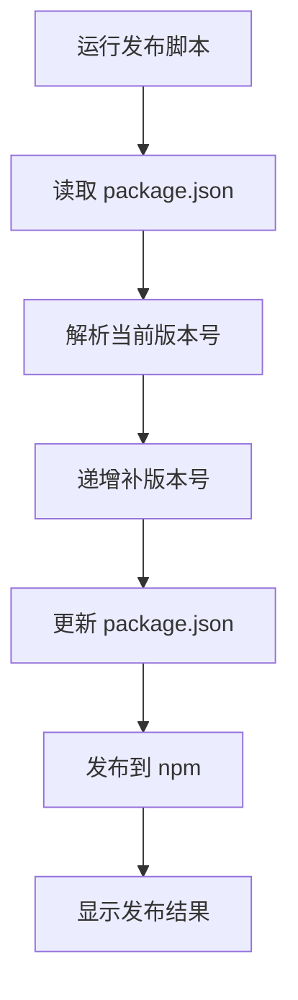

**图表来源**
- [release.js:1-19](file://hbuilderx-cli/release.js#L1-L19)

**章节来源**
- [release.js:1-19](file://hbuilderx-cli/release.js#L1-L19)

## 配置迁移最佳实践

### 版本间兼容性处理

当从旧版本迁移到新版本时，应遵循以下最佳实践：

#### 迁移策略

1. **备份现有配置**：在进行任何迁移之前，务必备份当前的配置文件
2. **检查配置格式**：确认新版本支持的配置格式
3. **逐步迁移**：分步骤应用配置更改，避免一次性大改动
4. **测试验证**：在开发环境中测试迁移后的配置

#### 升级策略

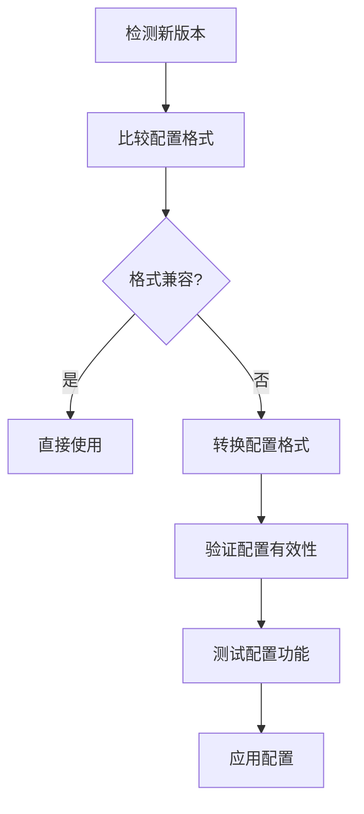

**图表来源**
- [release.js:8-16](file://hbuilderx-cli/release.js#L8-L16)

**章节来源**
- [release.js:8-16](file://hbuilderx-cli/release.js#L8-L16)

### 配置重置和清理

#### 重置配置

如果需要完全重置配置，可以删除配置文件并重新设置：

1. **删除配置文件**：删除 `~/.hbuilderx-cli.json` 文件
2. **重新配置**：运行基本设置功能重新配置
3. **验证设置**：确认所有配置项正确设置

#### 清理缓存

系统会在配置更改时自动清理缓存，但也可以手动清理：

1. **重启应用程序**：重新启动 HBuilderX CLI
2. **清除临时文件**：删除项目目录中的临时文件
3. **重新加载配置**：重新加载配置文件

## 性能考虑

### 配置加载优化

系统采用了多种优化策略来提高配置加载性能：

1. **缓存机制**：项目配置信息会被缓存，避免重复读取
2. **延迟加载**：配置文件只在需要时才被读取
3. **异步处理**：使用异步操作避免阻塞用户界面

### 内存管理

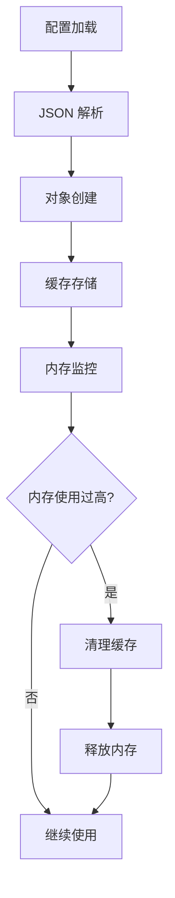

**图表来源**
- [index.js:38-45](file://hbuilderx-cli/index.js#L38-L45)

## 故障排除指南

### 常见问题及解决方案

#### 配置文件无法读取

**问题描述**：系统无法读取配置文件

**可能原因**：
1. 配置文件权限不足
2. 配置文件格式损坏
3. 配置文件被其他程序占用

**解决方法**：
1. 检查文件权限设置
2. 验证 JSON 格式有效性
3. 关闭占用文件的程序

#### HBuilderX 安装目录未找到

**问题描述**：系统无法找到 HBuilderX 安装目录

**可能原因**：
1. HBuilderX 未正确安装
2. 安装目录不在默认位置
3. 系统环境变量未正确设置

**解决方法**：
1. 手动指定正确的安装目录
2. 确认 HBuilderX 已正确安装
3. 检查系统 PATH 环境变量

#### 项目信息同步失败

**问题描述**：无法从 manifest.json 中读取项目信息

**可能原因**：
1. 项目根目录缺少 manifest.json
2. manifest.json 格式不正确
3. 文件编码问题

**解决方法**：
1. 确认项目根目录包含 manifest.json
2. 验证 manifest.json 的 JSON 格式
3. 检查文件编码是否为 UTF-8

**章节来源**
- [index.js:17-20](file://hbuilderx-cli/index.js#L17-L20)
- [index.js:31-36](file://hbuilderx-cli/index.js#L31-L36)

## 结论

HBuilderX CLI 配置管理操作提供了一个功能完整、易于使用的配置管理解决方案。通过模块化的架构设计和直观的用户界面，开发者可以轻松地管理 HBuilderX 的各种配置选项。

### 主要优势

1. **简单易用**：提供直观的交互式界面
2. **自动配置**：支持自动检测和配置 HBuilderX 安装目录
3. **项目同步**：自动从 manifest.json 中提取项目信息
4. **灵活备份**：支持手动备份和批量导出功能
5. **版本管理**：内置版本发布和升级机制

### 未来改进方向

1. **配置模板**：提供预定义的配置模板
2. **批量操作**：支持多项目配置批量管理
3. **配置导入**：支持从其他工具导入配置
4. **配置审计**：记录配置变更历史

该工具为 HBuilderX 开发者提供了一个可靠的配置管理解决方案，简化了开发环境的配置和维护工作。