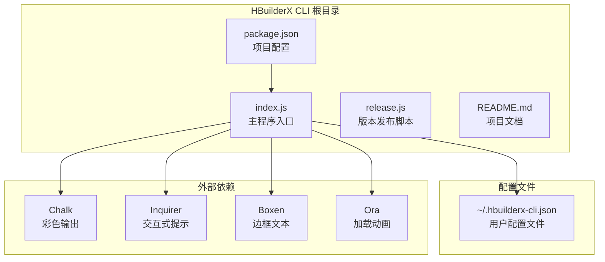
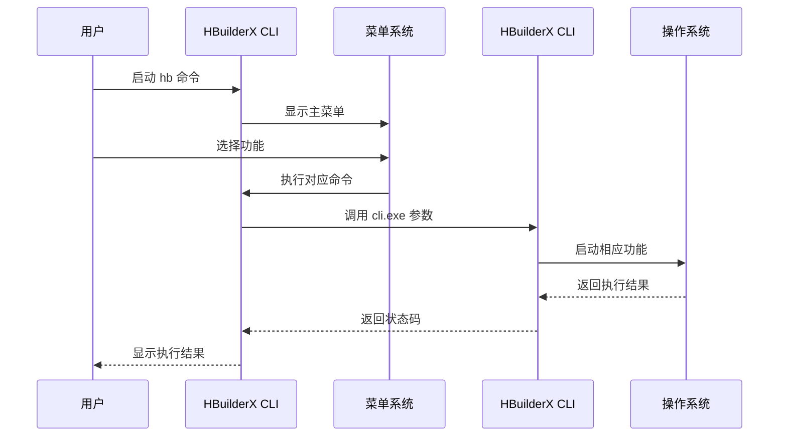
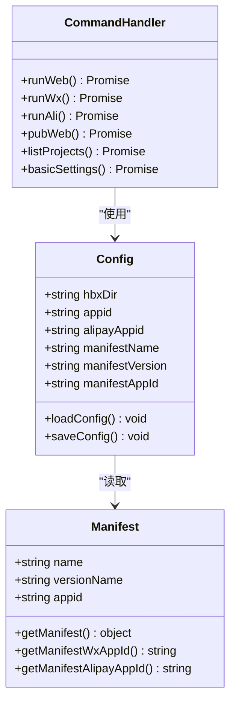
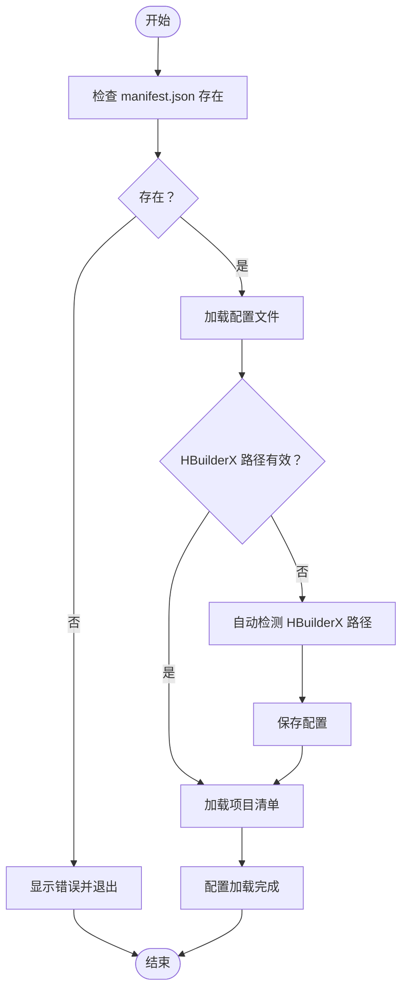
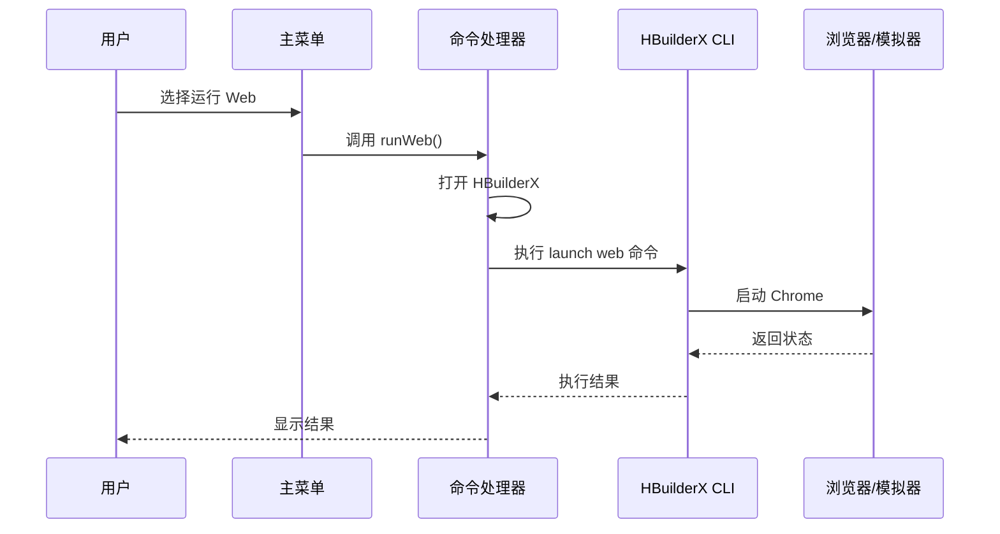
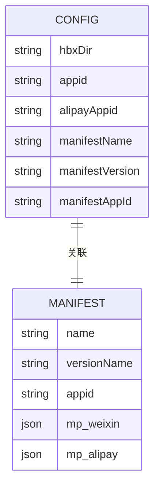
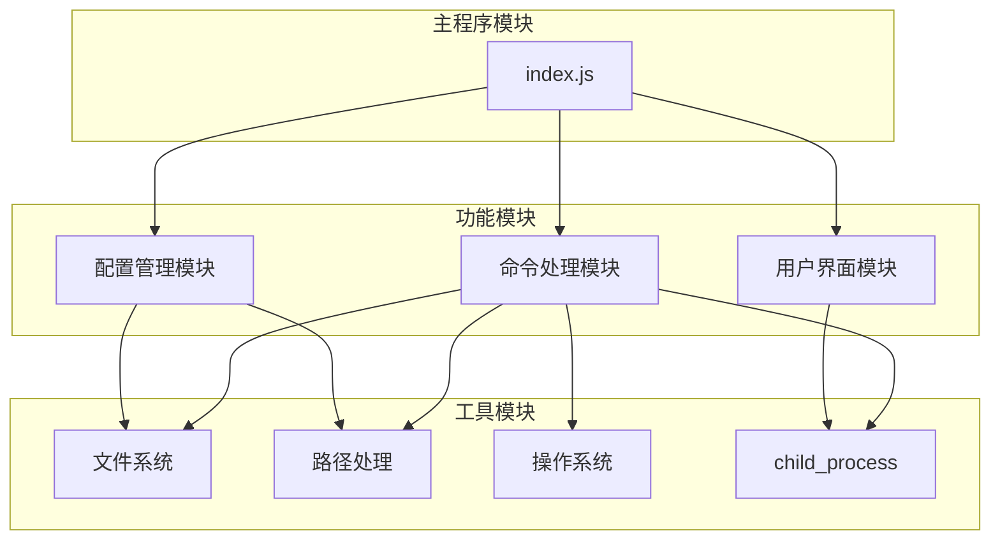

# 项目概述

<cite>
**本文档引用的文件**
- [package.json](file://hbuilderx-cli/package.json)
- [README.md](file://hbuilderx-cli/README.md)
- [index.js](file://hbuilderx-cli/index.js)
- [release.js](file://hbuilderx-cli/release.js)
</cite>

## 目录
1. [简介](#简介)
2. [项目结构](#项目结构)
3. [核心组件](#核心组件)
4. [架构概览](#架构概览)
5. [详细组件分析](#详细组件分析)
6. [依赖分析](#依赖分析)
7. [性能考虑](#性能考虑)
8. [故障排除指南](#故障排除指南)
9. [结论](#结论)

## 简介

HBuilderX CLI 管理工具是一个专为 HBuilderX 开发者设计的全局命令行管理工具。该工具旨在简化 HBuilderX 项目的日常开发工作流程，通过提供直观的命令行界面来执行项目运行、发布和管理等核心功能。

### 核心价值主张

- **提升开发效率**：通过命令行快速执行常见开发任务，减少手动操作步骤
- **统一管理入口**：集中管理多个 HBuilderX 项目，提供统一的操作界面
- **跨平台支持**：支持 Windows、macOS 和 Linux 系统，确保开发环境一致性
- **智能配置管理**：自动检测和配置 HBuilderX 安装路径，简化初始设置

### 目标用户群体

- **HBuilderX 开发者**：需要频繁进行项目运行、调试和发布的前端开发者
- **小程序开发者**：专注于微信小程序、支付宝小程序等多端开发的团队
- **企业开发团队**：需要标准化开发流程和工具链的企业级开发团队
- **自动化集成**：希望将 HBuilderX 集成到 CI/CD 流水线的 DevOps 工程师

### 在 HBuilderX 生态系统中的定位

HBuilderX CLI 管理工具作为 HBuilderX IDE 的命令行扩展，填补了传统图形界面操作的不足，为开发者提供了更加灵活和高效的工具选择。它既保持了 HBuilderX IDE 的强大功能，又增加了命令行操作的便利性。

## 项目结构

该项目采用简洁明了的模块化结构，主要包含以下核心文件：



**图表来源**
- [package.json:1-21](file://hbuilderx-cli/package.json#L1-L21)
- [index.js:1-248](file://hbuilderx-cli/index.js#L1-L248)

**章节来源**
- [package.json:1-21](file://hbuilderx-cli/package.json#L1-L21)
- [README.md:1-53](file://hbuilderx-cli/README.md#L1-L53)

## 核心组件

### 主要功能特性

HBuilderX CLI 提供了六大核心功能模块，每个模块都针对特定的开发场景进行了优化：

#### 1. 项目运行功能
- **Web 项目运行**：一键启动 Chrome 浏览器运行项目
- **微信小程序运行**：直接启动微信小程序模拟器
- **支付宝小程序运行**：启动支付宝小程序调试环境

#### 2. 项目发布功能
- **H5 版本发布**：将项目构建为可部署的 H5 应用

#### 3. 项目管理功能
- **项目列表显示**：查看所有已安装的 HBuilderX 项目
- **基本设置配置**：管理 HBuilderX 安装路径和其他配置

#### 4. 智能配置管理
- **自动路径检测**：自动扫描常见 HBuilderX 安装位置
- **配置文件持久化**：将用户设置保存到本地配置文件

**章节来源**
- [README.md:19-29](file://hbuilderx-cli/README.md#L19-L29)
- [index.js:165-207](file://hbuilderx-cli/index.js#L165-L207)

## 架构概览

### 整体架构设计

HBuilderX CLI 采用了事件驱动的循环架构，通过主菜单循环实现用户交互，每个功能模块都是独立的异步函数，通过命令行参数传递给 HBuilderX CLI 工具。



**图表来源**
- [index.js:210-242](file://hbuilderx-cli/index.js#L210-L242)
- [index.js:92-95](file://hbuilderx-cli/index.js#L92-L95)

### 技术选型考量

#### 核心技术栈

| 组件 | 版本 | 用途 | 选型理由 |
|------|------|------|----------|
| Node.js | >= 14 | 运行时环境 | 支持现代 JavaScript 特性，长期支持版本 |
| Chalk | ^4.1.2 | 彩色输出 | 提供丰富的终端样式支持 |
| @inquirer/prompts | ^3.0.0 | 交互式界面 | 现代化的命令行界面库 |
| Boxen | ^5.1.2 | 边框文本 | 创建美观的控制台界面 |
| Ora | ^5.4.1 | 加载动画 | 提供流畅的用户体验 |

#### 架构设计原则

1. **模块化设计**：每个功能模块独立封装，便于维护和扩展
2. **异步处理**：使用 Promise 和 async/await 处理异步操作
3. **错误处理**：完善的异常捕获和错误提示机制
4. **配置管理**：智能配置检测和持久化存储

**章节来源**
- [package.json:14-19](file://hbuilderx-cli/package.json#L14-L19)
- [index.js:1-10](file://hbuilderx-cli/index.js#L1-L10)

## 详细组件分析

### 主程序入口组件

主程序入口负责初始化整个 CLI 应用，包括环境检查、配置加载和主菜单循环。

#### 核心数据结构



**图表来源**
- [index.js:67-90](file://hbuilderx-cli/index.js#L67-L90)
- [index.js:38-65](file://hbuilderx-cli/index.js#L38-L65)
- [index.js:165-207](file://hbuilderx-cli/index.js#L165-L207)

#### 关键处理流程

##### 配置加载流程



**图表来源**
- [index.js:67-86](file://hbuilderx-cli/index.js#L67-L86)
- [index.js:31-36](file://hbuilderx-cli/index.js#L31-L36)

**章节来源**
- [index.js:11-90](file://hbuilderx-cli/index.js#L11-L90)

### 命令执行组件

命令执行组件负责处理各种开发任务，包括项目运行、发布和管理操作。

#### 命令执行流程



**图表来源**
- [index.js:171-174](file://hbuilderx-cli/index.js#L171-L174)
- [index.js:140-153](file://hbuilderx-cli/index.js#L140-L153)

#### 功能实现细节

每个命令都遵循相同的执行模式：
1. **预处理**：打开 HBuilderX 并显示进度指示
2. **执行**：调用相应的 HBuilderX CLI 命令
3. **反馈**：显示执行结果和状态信息
4. **清理**：等待用户确认后返回菜单

**章节来源**
- [index.js:165-207](file://hbuilderx-cli/index.js#L165-L207)

### 配置管理系统

配置管理系统负责管理用户设置和项目信息，包括 HBuilderX 安装路径、小程序 AppID 等配置。

#### 配置文件结构



**图表来源**
- [index.js:67-86](file://hbuilderx-cli/index.js#L67-L86)
- [index.js:38-65](file://hbuilderx-cli/index.js#L38-L65)

**章节来源**
- [README.md:36-46](file://hbuilderx-cli/README.md#L36-L46)

## 依赖分析

### 外部依赖关系

项目依赖于四个核心第三方库，每个库都有明确的功能分工：

```mermaid
graph LR
subgraph "核心依赖"
A[Chalk] --> B[彩色输出]
C[@inquirer/prompts] --> D[交互式界面]
E[Boxen] --> F[边框文本]
G[Ora] --> H[加载动画]
end
subgraph "应用层"
I[HBuilderX CLI]
end
A --> I
C --> I
E --> I
G --> I
```

**图表来源**
- [package.json:14-19](file://hbuilderx-cli/package.json#L14-L19)

### 内部模块依赖



**图表来源**
- [index.js:1-10](file://hbuilderx-cli/index.js#L1-L10)
- [index.js:118-138](file://hbuilderx-cli/index.js#L118-L138)

**章节来源**
- [package.json:14-19](file://hbuilderx-cli/package.json#L14-L19)

## 性能考虑

### 执行效率优化

1. **异步操作**：所有 I/O 操作都采用异步方式，避免阻塞主线程
2. **缓存机制**：项目清单信息缓存在内存中，减少重复读取
3. **进程管理**：合理管理子进程生命周期，及时释放资源

### 内存使用优化

- **配置缓存**：配置信息只在内存中缓存，避免频繁磁盘访问
- **模块加载**：按需加载模块，减少初始内存占用
- **垃圾回收**：及时清理不再使用的变量和对象

### 网络和 I/O 优化

- **批量操作**：将相关的命令操作合并执行，减少启动成本
- **错误重试**：对临时性错误提供有限的重试机制
- **超时控制**：为长时间运行的操作设置合理的超时时间

## 故障排除指南

### 常见问题及解决方案

#### 1. HBuilderX 路径检测失败

**问题描述**：工具无法自动检测到 HBuilderX 安装路径

**解决方法**：
1. 手动配置 HBuilderX 安装路径
2. 确认 HBuilderX CLI 可执行文件存在
3. 检查文件权限和路径有效性

#### 2. 项目清单文件缺失

**问题描述**：当前目录不是有效的 HBuilderX 项目

**解决方法**：
1. 确保项目根目录包含 `manifest.json` 文件
2. 检查项目结构是否完整
3. 验证项目文件权限

#### 3. 权限相关错误

**问题描述**：执行命令时出现权限不足错误

**解决方法**：
1. 以管理员权限运行命令行
2. 检查文件和目录的读写权限
3. 确认用户账户具有必要的系统权限

### 调试和诊断

#### 日志记录机制

工具提供了完整的日志记录功能，包括：
- **时间戳记录**：每个操作都有精确的时间标记
- **状态反馈**：实时显示操作进度和结果
- **错误追踪**：详细的错误信息和堆栈跟踪

#### 性能监控

- **执行时间统计**：记录关键操作的执行耗时
- **内存使用监控**：跟踪内存分配和使用情况
- **资源占用分析**：监控 CPU 和 I/O 使用情况

**章节来源**
- [index.js:118-138](file://hbuilderx-cli/index.js#L118-L138)
- [index.js:244-247](file://hbuilderx-cli/index.js#L244-L247)

## 结论

HBuilderX CLI 管理工具是一个设计精良、功能完备的命令行开发辅助工具。它成功地将复杂的 HBuilderX 功能简化为直观易用的命令行接口，显著提升了开发效率和工作流程的标准化程度。

### 主要优势

1. **用户友好**：简洁的菜单界面和清晰的提示信息
2. **功能完整**：覆盖了 HBuilderX 开发的各个环节
3. **扩展性强**：模块化设计便于功能扩展和定制
4. **稳定性高**：完善的错误处理和异常恢复机制

### 技术特色

- **现代化技术栈**：采用最新的 Node.js 特性和最佳实践
- **跨平台兼容**：支持主流操作系统和开发环境
- **智能配置**：自动检测和配置，减少用户干预
- **可视化反馈**：丰富的终端界面和状态指示

### 发展前景

随着 HBuilderX 生态系统的不断发展，该工具将继续演进以满足开发者的需求。未来可能的功能扩展包括：
- 更多平台和框架的支持
- 集成更多开发工具和流程
- 增强的自动化和批处理能力
- 更好的团队协作和共享功能

该工具为 HBuilderX 开发者提供了一个强大而灵活的命令行解决方案，是现代前端开发工作流中不可或缺的重要工具。